# Тема 1. Введение в Python

Отчет по Теме #1 выполнил(а):
- Пономарев Никита Сергеевич
- ИВТ-23-2

| Задание | Лаб_раб |
|---------|---------|
| Задание 1 | + |
| Задание 2 | + |
| Задание 3 | + |
| Задание 4 | + |
| Задание 5 | + |
| Задание 6 | + |
| Задание 7 | + |
| Задание 8 | + |
| Задание 9 | + |
| Задание 10 | + |
| Задание 11 | + |
| Задание 12 | + |
| Задание 13 | + |
| Задание 14 | + |
| Задание 15 | + |

знак "+" - задание выполнено; знак "-" - задание не выполнено;

###Работу проверили:
- к.э.н., доцент Панов М.А.

## Лабораторная работа №1
### Установка
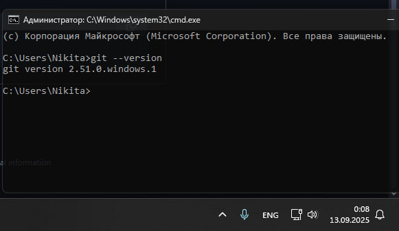

**Вывод:** Установлен Git на локальную машину.

## Лабораторная работа №2  
### Настройка
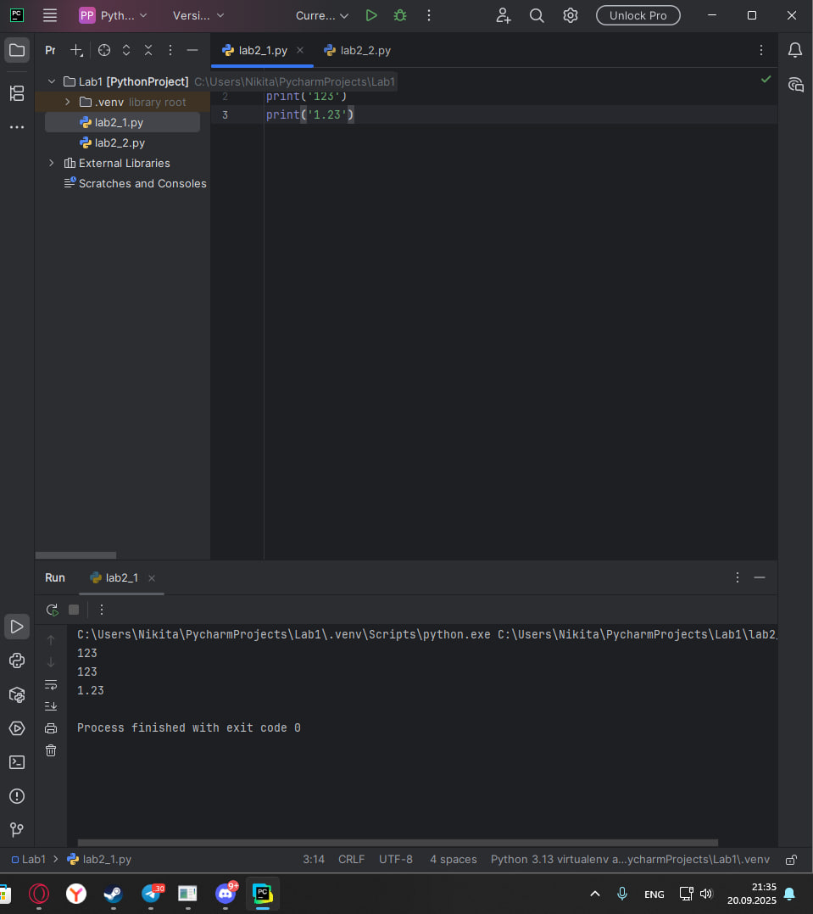

**Вывод:** Произведена базовая настройка Git, включая установку редактора по умолчанию. Изучены команды конфигурации и проверки текущих настроек.

## Лабораторная работа №3
### Создание нового репозитория
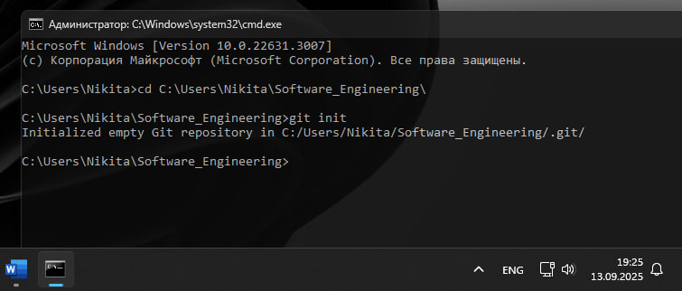

**Вывод:** Создан локальный Git-репозиторий, изучена команда `git init`. Понимание структуры скрытой папки .git и её назначения.

## Лабораторная работа №4
### Подготовка файлов
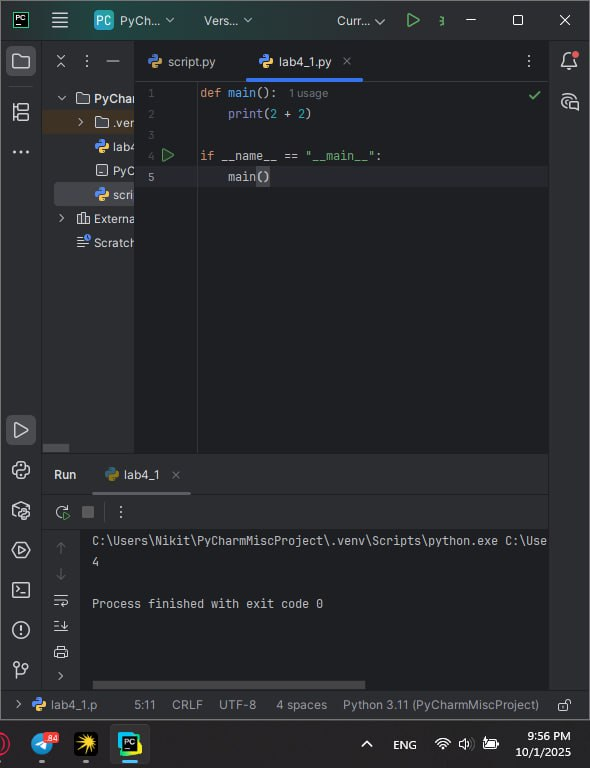

**Вывод:** Освоено добавление файлов в staging area с помощью `git add`. Изучен процесс подготовки изменений перед коммитом.

## Лабораторная работа №5
### Фиксация изменений
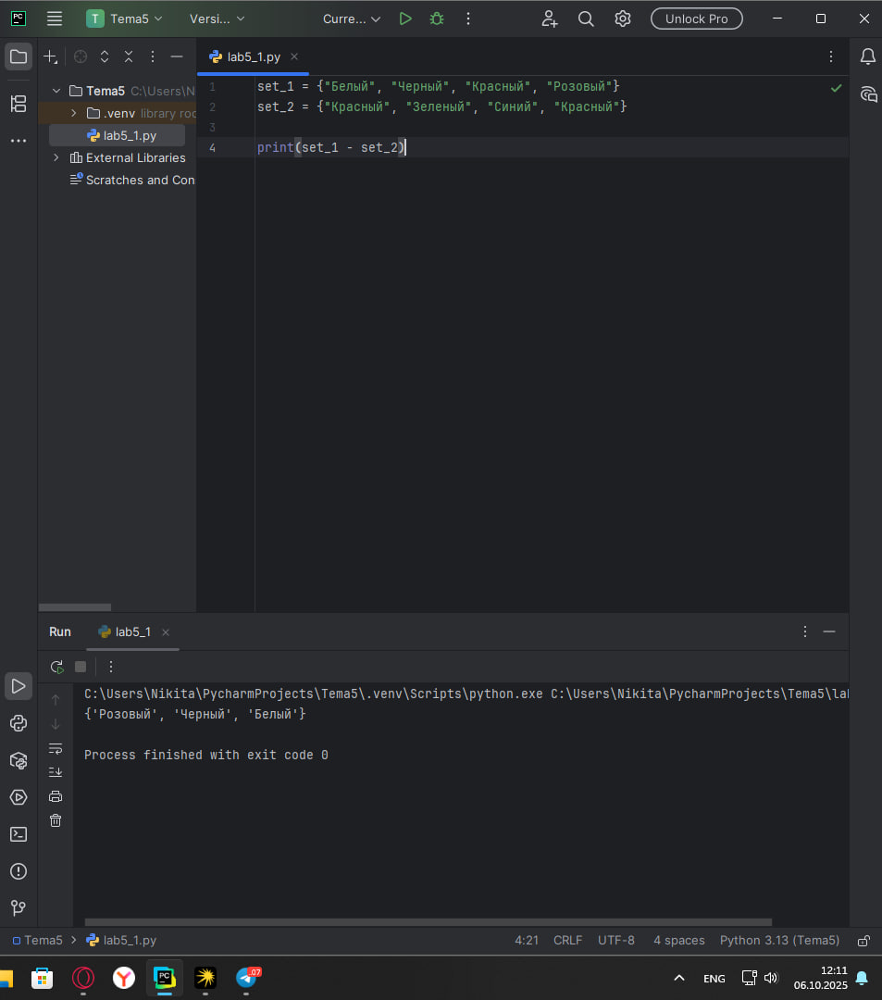

**Вывод:** Создан первый коммит, изучены основные параметры команды `git commit`. Понимание структуры коммита и его назначения.

## Лабораторная работа №6
### Подключение к удаленному репозиторию
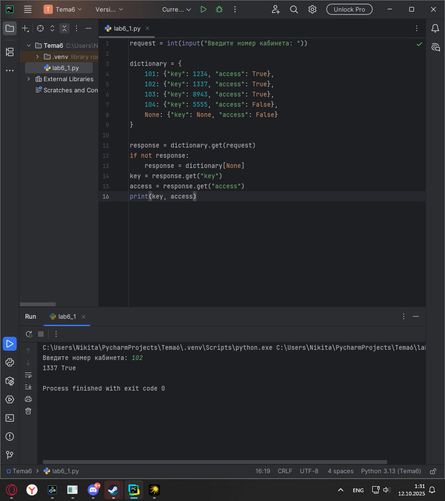

**Вывод:** Настроена связь с удаленным репозиторием на GitHub. Освоены команды `git remote` и `git push` для синхронизации локальных и удаленных изменений.

## Лабораторная работа №7
### Ветвление
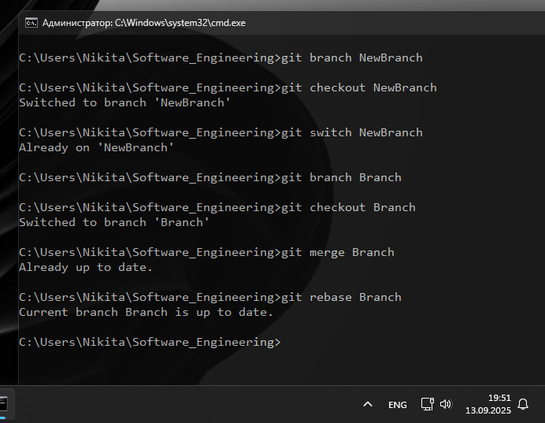

**Вывод:** Изучено создание и переключение между ветками. Понимание преимуществ ветвления для параллельной разработки.

## Лабораторная работа №8
### Особенности применения "Фетч"
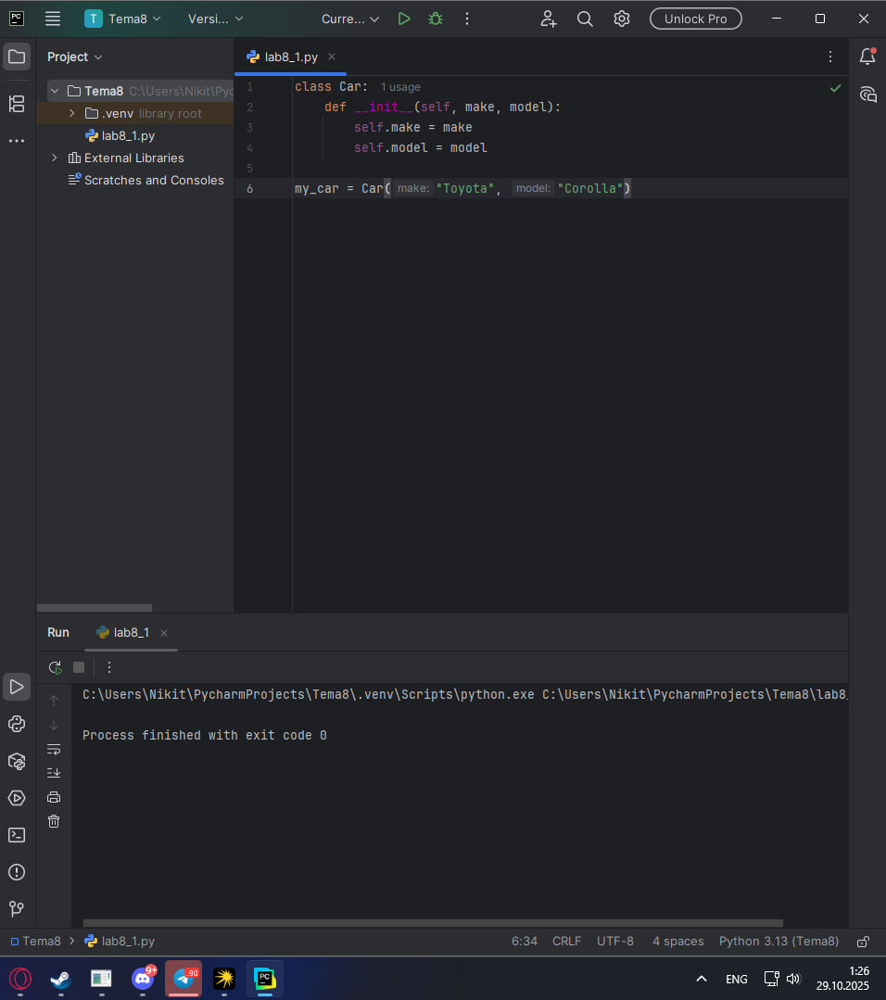

**Вывод:** Освоена команда `git fetch` для получения изменений с удаленного репозитория без автоматического слияния. Понимание различий между fetch и pull.

## Лабораторная работа №9
### Удаление файлов, веток, локальных и удалённых репозиториев
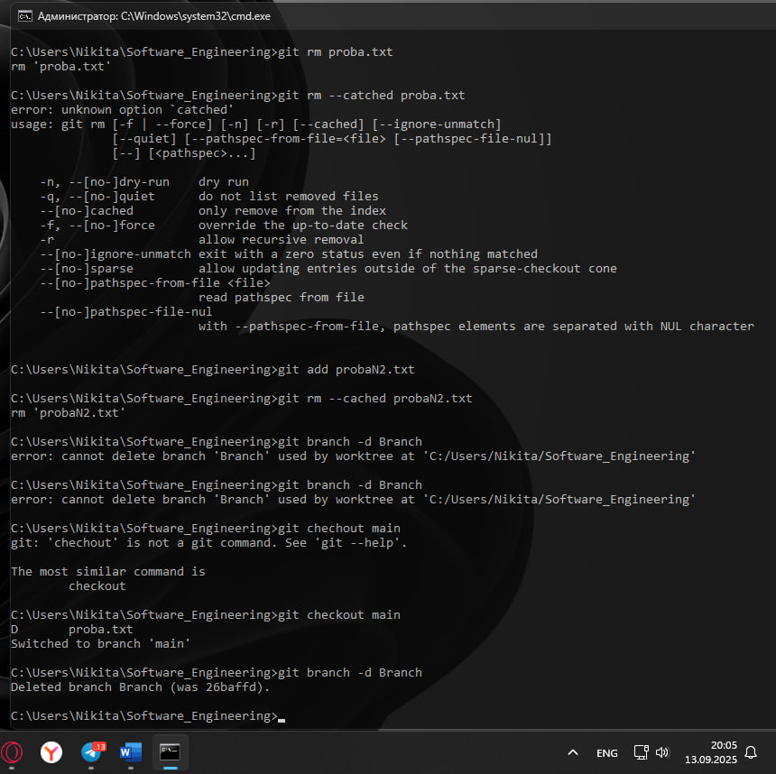

**Вывод:** Изучены методы безопасного удаления файлов и веток. Освоены команды `git rm`, `git branch -d`, `git push --delete`.

## Лабораторная работа №10
### Отслеживание изменений в коммитах

**Вывод:** Освоены команды `git log` и `git diff` для анализа истории изменений и сравнения различных версий файлов.

## Лабораторная работа №11
### Возвращение файла к предыдущему (определенному) состоянию
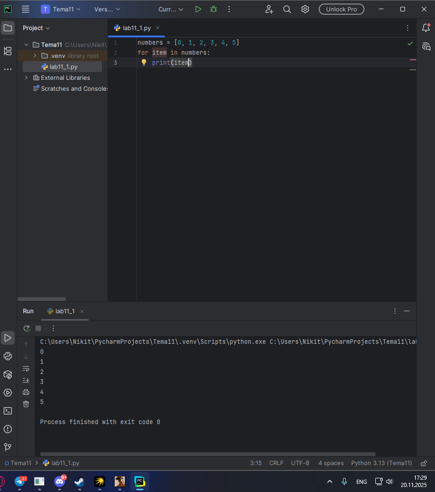

**Вывод:** Изучена команда `git checkout` для восстановления отдельных файлов из предыдущих коммитов. Понимание механизма отслеживания изменений.

## Лабораторная работа №12
### Возвращение к предыдущему коммиту
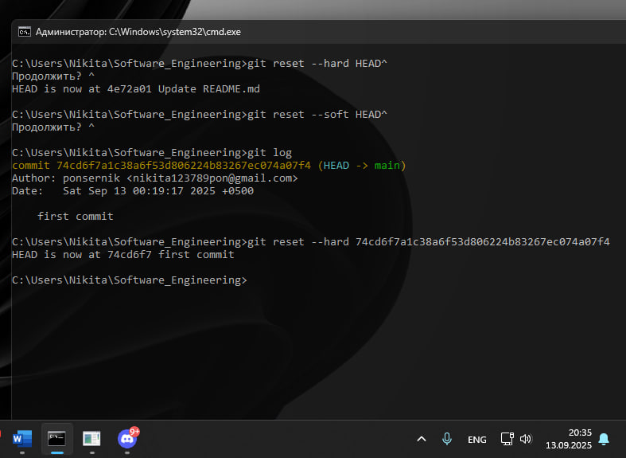

**Вывод:** Освоены различные методы reset (`--soft`, `--mixed`, `--hard`) для управления историей коммитов и отката изменений.

## Лабораторная работа №13
### Исправление коммита
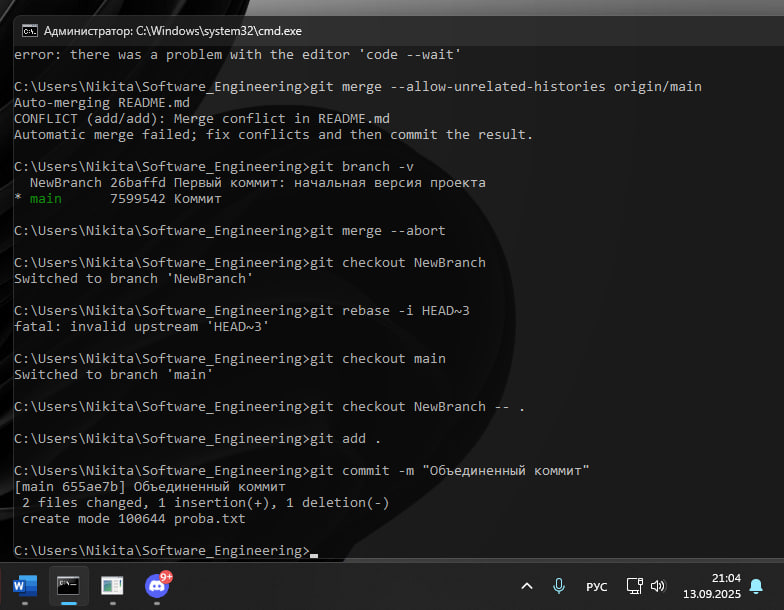

**Вывод:** Изучены команды `git commit --amend` и `git rebase -i` для редактирования истории коммитов. Понимание важности аккуратной работы с историей.

## Лабораторная работа №14
### Разрешение конфликтов при слиянии
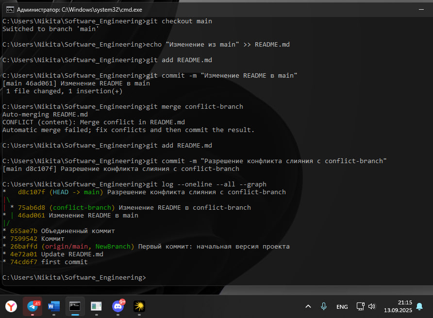

**Вывод:** Приобретен практический опыт разрешения конфликтов слияния. Освоен процесс ручного редактирования конфликтующих файлов.

## Лабораторная работа №15
### Настройка .gitignore
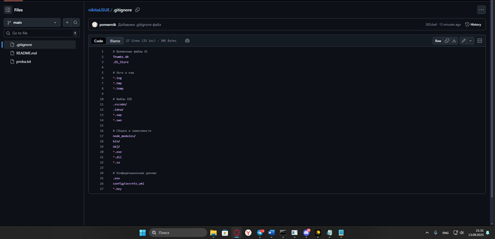

**Вывод:** Создан и настроен файл .gitignore для исключения временных и системных файлов. Понимание важности чистоты репозитория.

## Общие выводы по теме

В процессе выполнения лабораторных работ были получены следующие практические навыки:

### Основные преимущества Git:
- **Контроль версий** - возможность фиксировать изменения на каждом этапе работы
- **Ветвление** - параллельная разработка без interference с основной версией
- **Откат изменений** - быстрое восстановление рабочей версии при ошибках
- **Совместная работа** - эффективное взаимодействие в команде через удаленные репозитории

### Практическая ценность:
- Освоены основные команды: add, commit, push, pull, merge, rebase
- На практике изучено разрешение конфликтов слияния
- Приобретен опыт работы с удаленными репозиториями (GitHub)
- Освоена работа с файлом .gitignore для исключения временных файлов

### Применение в учебном процессе:
Полученные навыки будут применяться для выполнения последующих лабораторных работ и, возможно, каких-то проектных деятельностей.