# Тема 10. Декораторы и исключения
Отчет по Теме #10 выполнил(а):
- Пономарев Никита Сергеевич
- ИВТ-23-2

| Задание | Лаб_раб | Сам_раб |
| ------ | ------ | ------ |
| Задание 1 | + | + |
| Задание 2 | + | + |
| Задание 3 | + | + |
| Задание 4 | + | + |
| Задание 5 | + | + |

знак "+" - задание выполнено; знак "-" - задание не выполнено;

Работу проверили:
- к.э.н., доцент Панов М.А.

## Лабораторная работа №1
### Наверняка вы думаете, что декораторы – это какая-то бесполезная вещь, которая вам никогда не пригодится, но тут вдруг на паре по математике преподаватель просит всех посчитать число Фибоначчи для 100. Кто-то будет считать вручную (так точно не нужно), кто-то посчитает на калькуляторе, а кто-то подумает, что он самый крутой и напишет рекурсивную программу на Python и немного огорчится, потому что данная программа будет достаточно долго считаться, если ее просто так запускать. Но именно тут к вам на помощь приходят декораторы, например @lru_cache (он предназначен для решения задач динамическим программированием, если простыми словами, то этот декоратор запоминает промежуточные результаты и при рекурсивном вызове функции программа не будет считать одни и те же значения, а просто "возьмёт их из этого декоратора"). Вам нужно написать программу, которая будет считать числа Фибоначчи для 100 и запустить ее без этого декоратора и с ним, посмотреть на разницу во времени решения поставленной задачи.
P.S. при запуске без декоратора можете долго не ждать, для наглядности хватит 10 секунд ожидания.
```python
from functools import lru_cache

@lru_cache(None)
def fibonacci(n):
    if n == 0:
        return 0
    elif n == 1:
        return 1
    return fibonacci(n - 1) + fibonacci(n - 2)

if __name__ == "__main__":
    print(fibonacci(100))
```
### Результат.
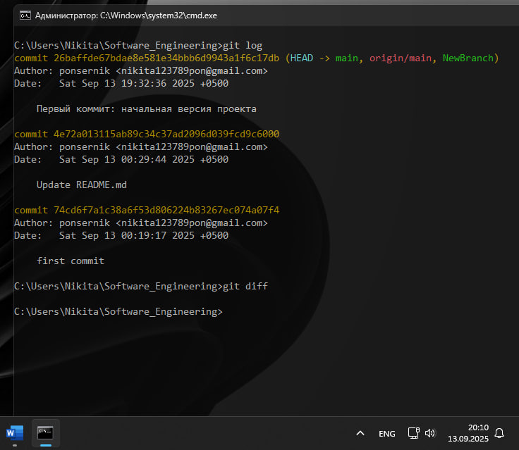

## Вывод
Продемонстрирована эффективность использования декоратора @lru_cache для оптимизации рекурсивных вычислений. Без декоратора вычисление числа Фибоначчи для n=100 занимает неприемлемо долгое время, тогда как с декоратором результат получается мгновенно за счет мемоизации промежуточных результатов.

## Лабораторная работа №2
### Илья пишет свой сайт и ему необходимо сделать минимальную проверку ввода данных пользователя при регистрации. Для этого он реализовал функцию, которая выводит данные пользователя на экран и решил, что будет проверять правильность введённых данных при помощи декоратора, но в этом ему потребовалась ваша помощь. Напишите декоратор для функции, который будет принимать все параметры вызываемой функции (имя, возраст) и проверять чтобы возраст был больше 0 и меньше 130. Причем заметьте, что неважно сколько пользователь введет данных на сайт к Илье, будут обрабатываться только первые 2 аргумента.
```python
def check(input_func):
    def output_func(*args):
        name, age = args[0], args[1]

        if age < 0 or age > 130:
            age = 'Недопустимый возраст'
        input_func(name, age)

    return output_func

@check
def personal_info(name, age):
    print(f"Name: {name} Age: {age}")

if __name__ == '__main__':
    personal_info('Владимир', 38)
    personal_info('Александр', -5)
    personal_info('Петр', 138, 15, 48, 2)
```
### Результат.
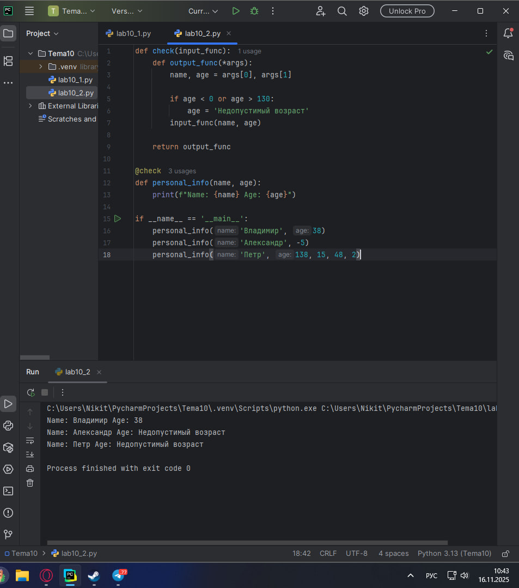

## Вывод
Реализован декоратор для валидации входных данных пользователя. Декоратор проверяет корректность возраста и обрабатывает только первые два аргумента, что обеспечивает гибкость при работе с функциями с переменным количеством параметров.

## Лабораторная работа №3
### Вам понравилась идея Ильи с сайтом, и вы решили дальше работать вместе с ним. Но вот в вашем проекте появилась проблема, кто-то пытается сломать вашу функцию с получением данных для сайта. Эта функция работает только с данными integer, а какой-то недохакер пытается все сломать и вместо нужного типа данных отправляет string. Воспользуйтесь исключениями, чтобы неподходящий тип данных не ломал ваш сайт. Также дополнительно можете обернуть весь код функции в try/except/finally для того, чтобы программа вас оповестила о том, что выявлена какая-то ошибка или программа успешно выполнена.
```python
def data(*args):
    try:
        for i in range(len(*args)):
            try:
                result = (args[0][i] * 15) // 10
                print(result)
            except Exception as ex:
                print(ex)
    except Exception as ex:
        print(ex)
    finally:
        print('Вся информация обработана')

if __name__ == '__main__':
    data([1, 15, 'Hello', 'i', 'try', 'to', 'crash', 'your', 'site', 38, 45])
```
### Результат.
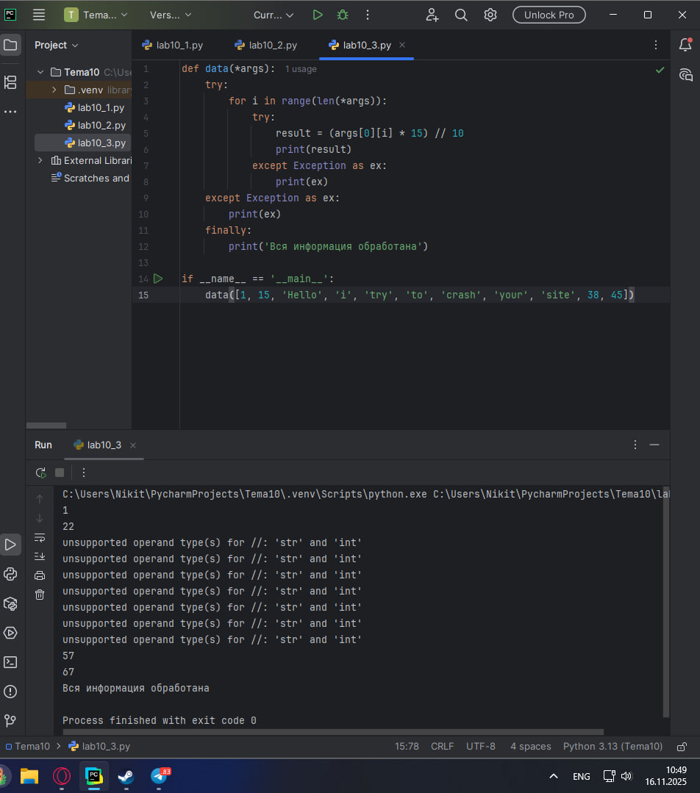

## Вывод
Применен механизм обработки исключений для защиты программы от некорректных входных данных. Использование блоков try/except/finally обеспечивает стабильную работу приложения и информативное логирование ошибок без прерывания выполнения программы.

## Лабораторная работа №4
### Продолжая работу над сайтом, вы решили написать собственное исключение, которое будет вызываться в случае, если в функцию проверки имени при регистрации передана строка длиннее десяти символов, а если имя имеет допустимую длину, то в консоль выводиться "Успешная регистрация"
```python
class NegativeValueException(Exception):
    pass

def check_name(name):
    if len(name) > 10:
        raise NegativeValueException('Длина более 10 символов')
    else:
        print('Успешная регистрация')

if __name__ == '__main__':
    name = '12345678910'
    check_name(name)
```
### Результат.
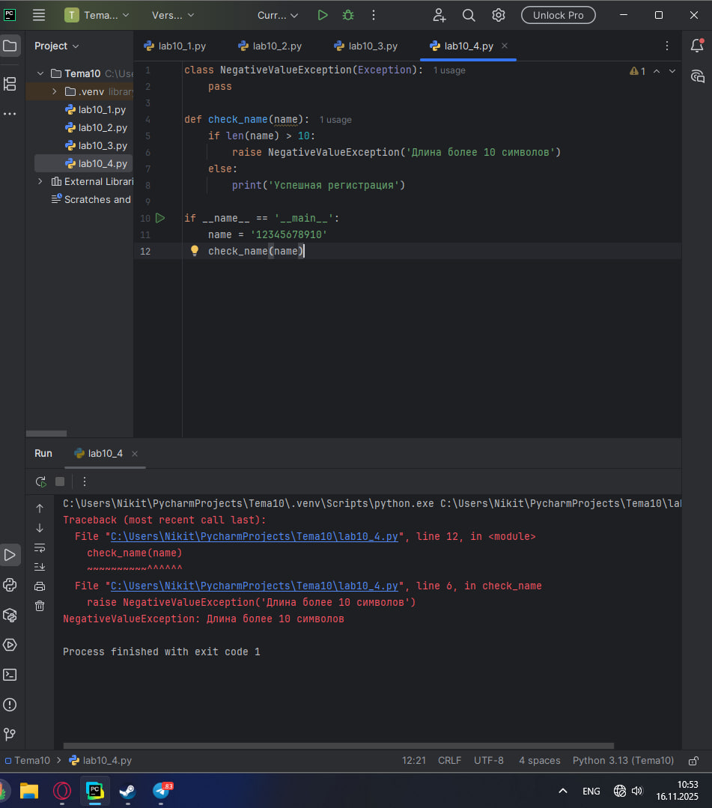

## Вывод
Создано пользовательское исключение для валидации длины имени пользователя. Исключение вызывается при превышении максимально допустимой длины строки. Такой подход позволяет более точно контролировать валидацию данных и предоставлять понятные сообщения об ошибках, соответствующие предметной области.

## Лабораторная работа №5
### После запуска сайта вы поняли, что вам необходимо добавить логгер, для отслеживания его работы. Готовыми вариантами вы не захотели пользоваться, и поэтому решили создать очень простую пародию. Для этого создали две функции: ___init___() (вызывается при создании класса декоратора в программе) и	___call___() (вызывается при вызове декоратора). Создайте необходимый вам декоратор. Выведите все логи в консоль.
```python
class SiteChecker:
    def __init__(self, func):
        print('> Класс SiteChecker метод __init__ успешный запуск')
        self.func = func

    def __call__(self):
        print('> Проверка перед запусков', self.func.__name__)
        self.func()
        print('> Проверка безопасного выключения')

@SiteChecker
def site():
    print('Усердная работа сайта')

if __name__ == '__main__':
    print('>> Сайт запущен')
    site()
    print('>> Сайт выключен')
```
### Результат.
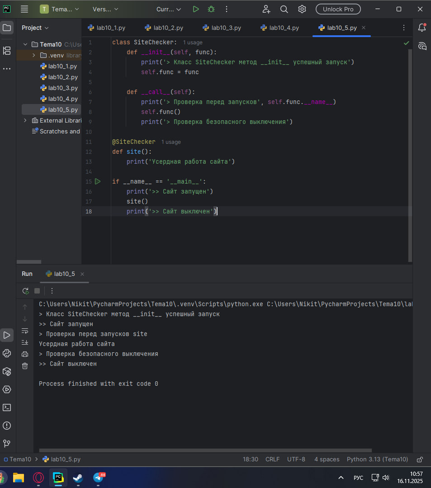

## Вывод
Реализован класс-декоратор для логирования работы функций. Использование методов __init__ и __call__ позволяет создавать гибкие декораторы с состоянием, которые могут отслеживать различные этапы выполнения программы.

## Самостоятельная работа №1
### Вовочка решил заняться спортивным программированием на python, но для этого он должен знать за какое время выполняется его программа. Он решил, что для этого ему идеально подойдет декоратор для функции, который будет выяснять за какое время выполняется та или иная функция. Помогите Вовочке в его начинаниях и напишите такой декоратор. Подсказка: необходимо использовать модуль time Декоратор необходимо использовать для этой функции:
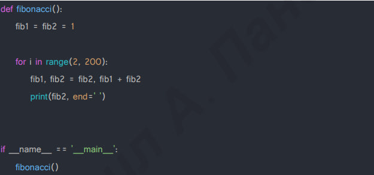
Результатом вашей работы будет листинг кода и скриншот консоли, в котором будет выполненная функция Фибоначчи и время выполнения программы. Также на этом примере можете посмотреть, что решение задач через рекурсию не всегда является хорошей идеей. Поскольку решение Фибоначчи для 100 с использованием рекурсии и без динамического программирования решается более десяти секунд, а решение точно такой же задачи, но через цикл for еще и для 200, занимает меньше 1 секунды.
```python
import time


def timer_decorator(func):
    def wrapper():
        start_time = time.time()
        result = func()
        end_time = time.time()
        execution_time = end_time - start_time
        print(f"\nВремя выполнения функции: {execution_time:.6f} секунд")
        return result

    return wrapper


@timer_decorator
def fibonacci():
    fib1 = fib2 = 1
    print(fib1, fib2, end=' ')

    for i in range(2, 200):
        fib1, fib2 = fib2, fib1 + fib2
        print(fib2, end=' ')


if __name__ == '__main__':
    fibonacci()
```
### Результат.
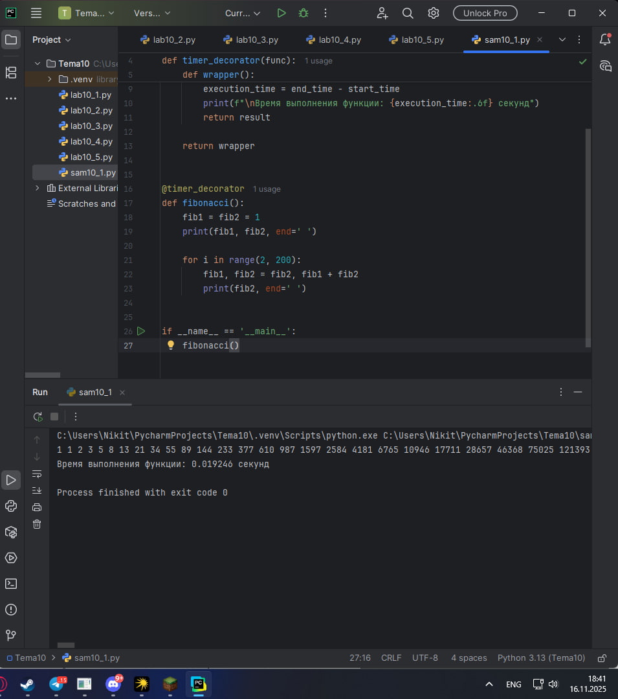

## Вывод
Создан универсальный декоратор для измерения времени выполнения функций. На примере вычисления чисел Фибоначчи показано преимущество итеративного подхода перед рекурсивным для задач с большой вычислительной сложностью.

## Самостоятельная работа №2
### Посмотрев на Вовочку, вы также загорелись идеей спортивного программирования, начав тренировки вы узнали, что для решения некоторых задач необходимо считывать данные из файлов. Но через некоторое время вы столкнулись с проблемой что файлы бывают пустыми, и вы не получаете вводные данные для решения задачи. После этого вы решили не просто считывать данные из файла, а всю конструкцию оборачивать в исключения, чтобы избежать такой проблемы. Создайте пустой файл и файл, в котором есть какая-то информация. Напишите код программы. Если файл пустой, то, нужно вызвать исключение ("бросить исключение") и вывести в консоль "файл пустой", а если он не пустой, то вывести информацию из файла.
```python
def read_file_safe(filename):
    try:
        with open(filename, 'r', encoding='utf-8') as file:
            content = file.read().strip()

            if not content:
                raise ValueError("файл пустой")
            else:
                print(f"Содержимое файла: {content}")

    except FileNotFoundError:
        print(f"Файл {filename} не найден")
    except ValueError as e:
        print(e)
    except Exception as e:
        print(f"Произошла ошибка: {e}")

if __name__ == '__main__':
    with open('empty_file.txt', 'w', encoding='utf-8') as f:
        pass

    with open('data_file.txt', 'w', encoding='utf-8') as f:
        f.write("Тестовые данные для проверки")

    print("Тест с пустым файлом:")
    read_file_safe('empty_file.txt')

    print("\nТест с файлом, содержащим данные:")
    read_file_safe('data_file.txt')
```
### Результат.
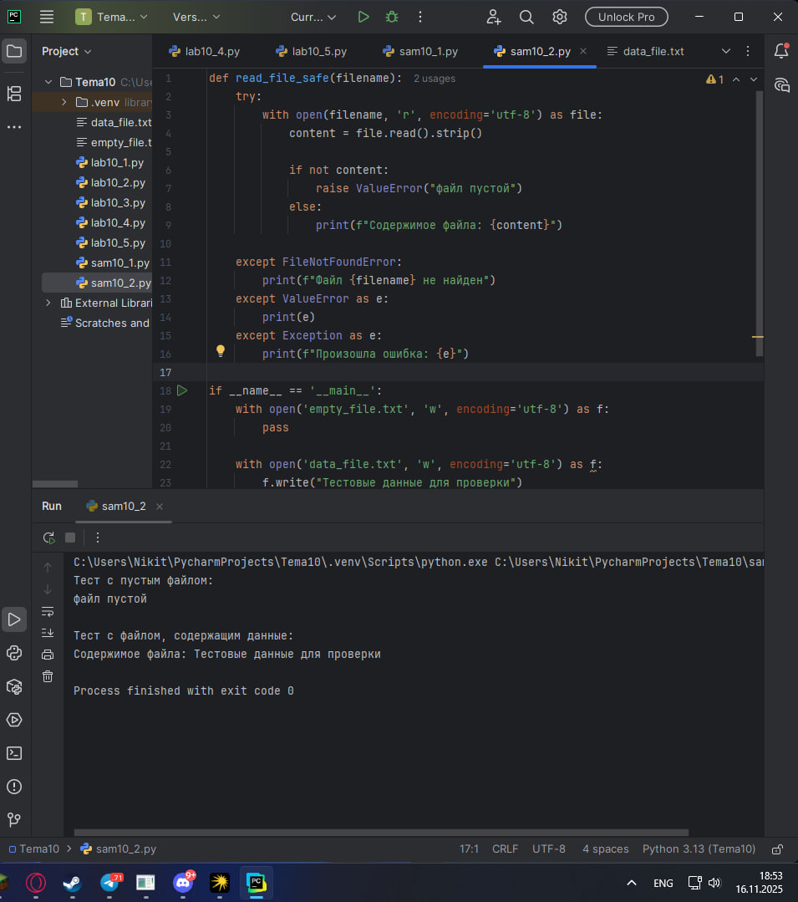

## Вывод
Реализована надежная система обработки файлов с использованием исключений. Подход гарантирует, что программа корректно обрабатывает различные сценарии, включая отсутствие файла, пустой файл и файлы с данными, обеспечивая устойчивость приложения к ошибкам ввода-вывода.

## Самостоятельная работа №3
### Напишите функцию, которая будет складывать 2 и введенное пользователем число, но если пользователь введет строку или другой неподходящий тип данных, то в консоль выведется ошибка "Неподходящий тип данных. Ожидалось число.". Реализовать функционал программы необходимо через try/except и подобрать правильный тип исключения. Создавать собственное исключение нельзя. Проведите несколько тестов, в которых исключение вызывается и нет. Результатом выполнения задачи будет листинг кода и получившийся вывод в консоль
```python
def add_two():
    try:
        user_input = input("Введите число для сложения с 2: ")
        number = float(user_input)
        result = 2 + number
        print(f"Результат: 2 + {number} = {result}")

    except ValueError:
        print("Неподходящий тип данных. Ожидалось число.")

if __name__ == '__main__':
    print("Тест 1 - корректный ввод:")
    add_two()

    print("\nТест 2 - ввод строки:")
    add_two()

    print("\nТест 3 - ввод дробного числа:")
    add_two()
```
### Результат.
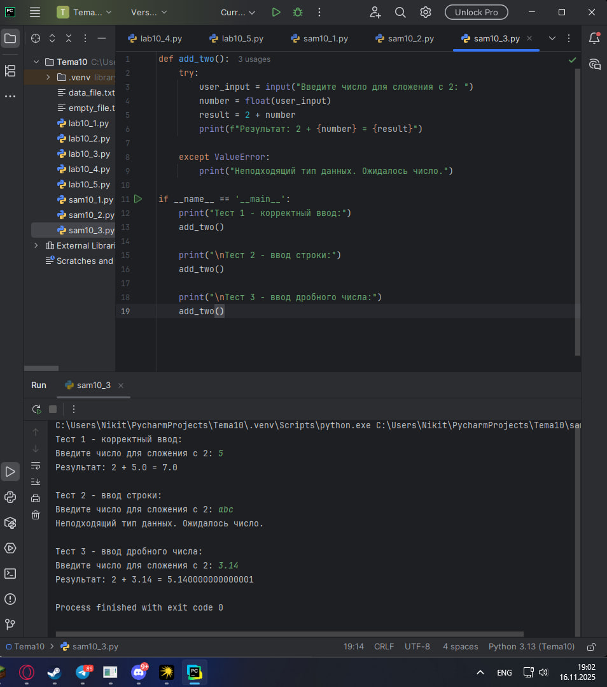

## Вывод
Продемонстрирована обработка исключений при взаимодействии с пользовательским вводом. Использование ValueError для обработки некорректного преобразования типов данных обеспечивает информативные сообщения об ошибках и стабильную работу программы.

## Самостоятельная работа №4
### Создайте собственный декоратор, который будет использоваться для двух любых вами придуманных функций. Декораторы, которые использовались ранее в работе нельзя воссоздавать. Результатом выполнения задачи будет: класс декоратора, две как-то связанными с ним функциями, скриншот консоли с выполненной программой и подробные комментарии, которые будут описывать работу вашего кода.
```python
class Repeat:
    def __init__(self, n=1):
        self.n = n

    def __call__(self, func):
        def wrapper(*args, **kwargs):
            for i in range(self.n):
                result = func(*args, **kwargs)
            return result

        return wrapper

@Repeat(3)
def say_hello():
    print("Привет!")

@Repeat(2)
def calculate():
    print("5 * 5 = 25")

say_hello()
calculate()
```
### Результат.
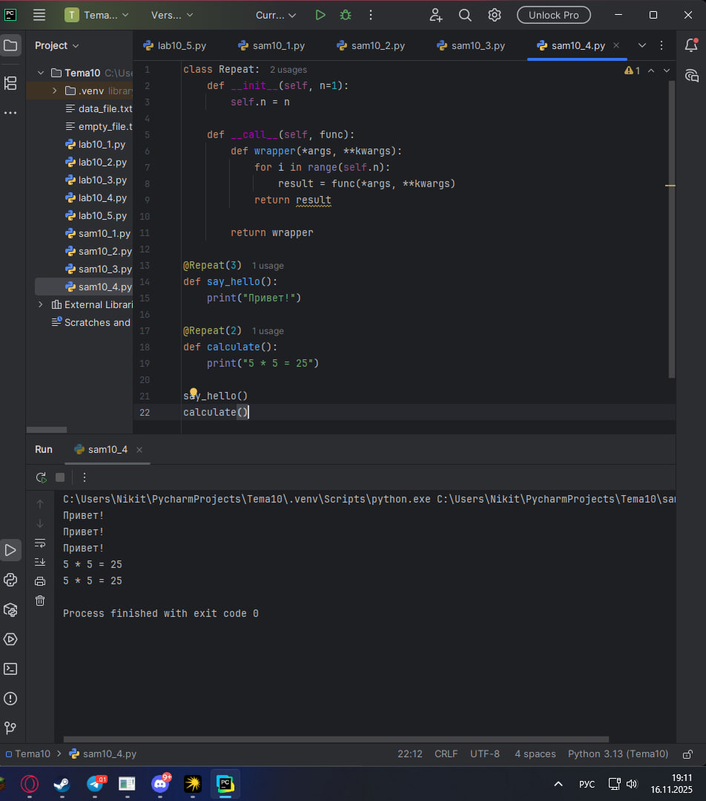

## Вывод
Создан декоратор для многократного выполнения функций. Декоратор демонстрирует использование параметризованных декораторов классов с методами __init__ и __call__.

## Самостоятельная работа №5
### Создайте собственное исключение, которое будет использоваться в двух любых фрагментах кода. Исключения, которые использовались ранее в работе нельзя воссоздавать. Результатом выполнения задачи будет: класс исключения, код к котором в двух местах используется это исключение, скриншот консоли с выполненной программой и подробные комментарии, которые будут описывать работу вашего кода.
```python
class NegativeBalanceError(Exception):
    pass

# Первое использование
def check_balance(amount):
    if amount < 0:
        raise NegativeBalanceError("Баланс отрицательный")
    print("Баланс корректен")

# Второе использование
def transfer_money(from_acc, to_acc, amount):
    if amount < 0:
        raise NegativeBalanceError("Сумма перевода не может быть отрицательной")
    print(f"Перевод {amount} с {from_acc} на {to_acc}")

# Тестирование
try:
    check_balance(-100)
except NegativeBalanceError as e:
    print(f"Ошибка 1: {e}")

try:
    transfer_money("счет1", "счет2", -50)
except NegativeBalanceError as e:
    print(f"Ошибка 2: {e}")
```
### Результат.
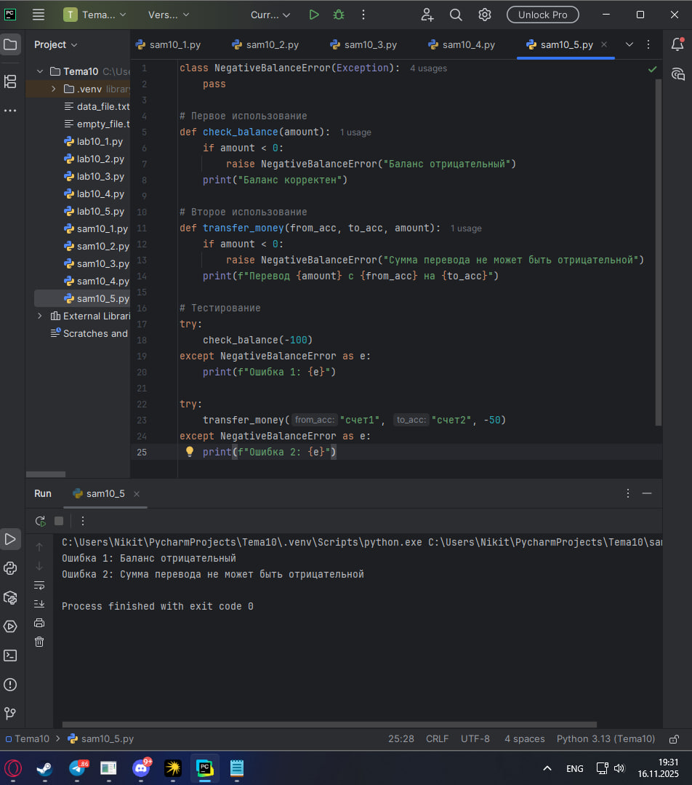

## Вывод
Создано пользовательское исключение для валидации финансовых операций. Исключение используется для проверки корректности баланса и сумм переводов.

## Общие выводы по теме
Декораторы и исключения являются мощными инструментами Python для создания надежного и поддерживаемого кода. Декораторы позволяют расширять функциональность функций без изменения их исходного кода, а исключения обеспечивают обработку ошибок и нештатных ситуаций. Освоение этих механизмов критически важно для разработки профессиональных приложений.