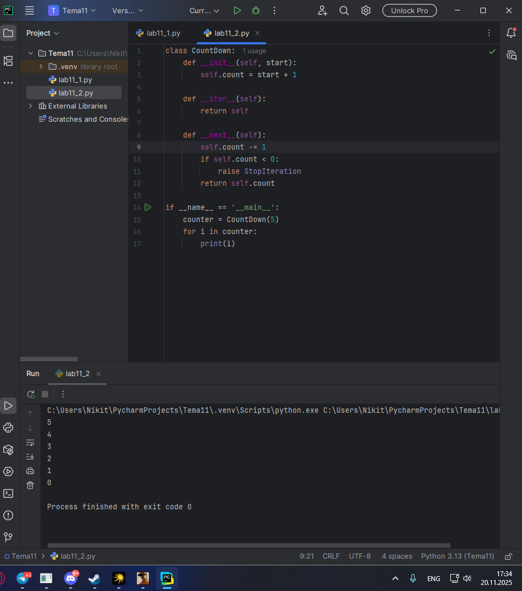
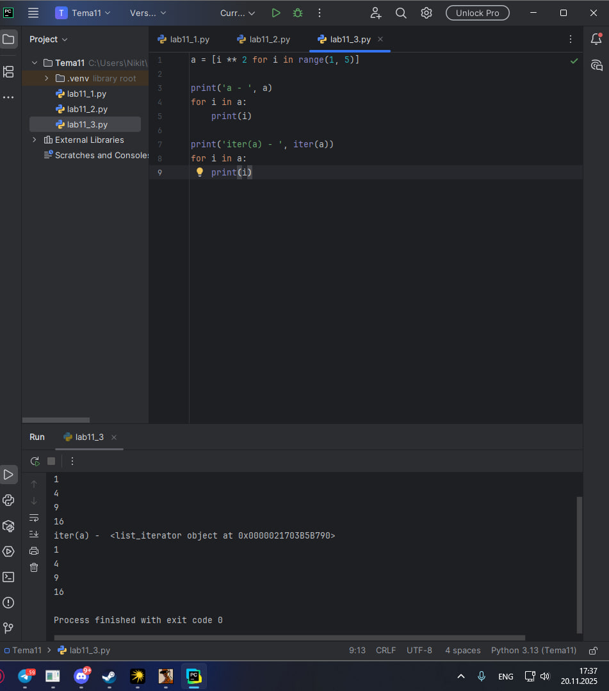
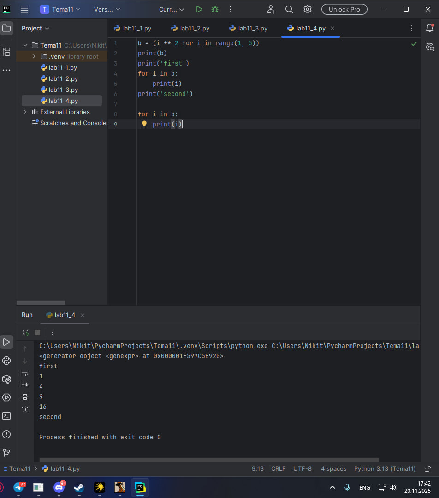
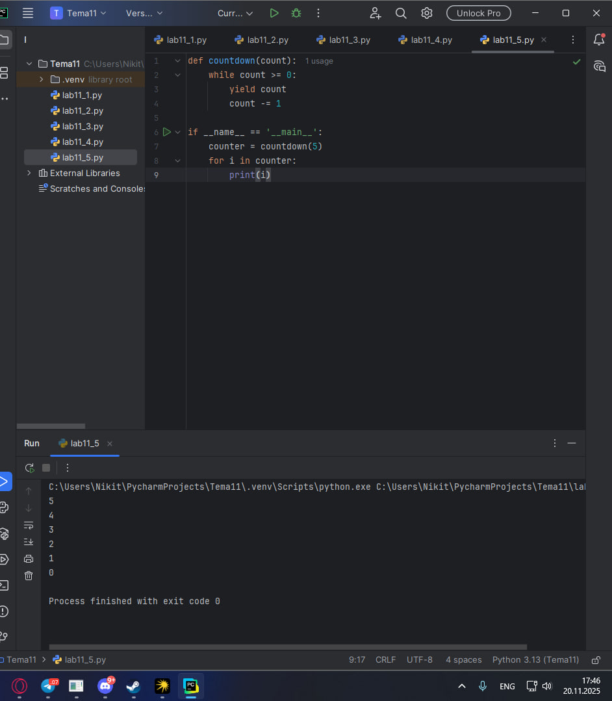
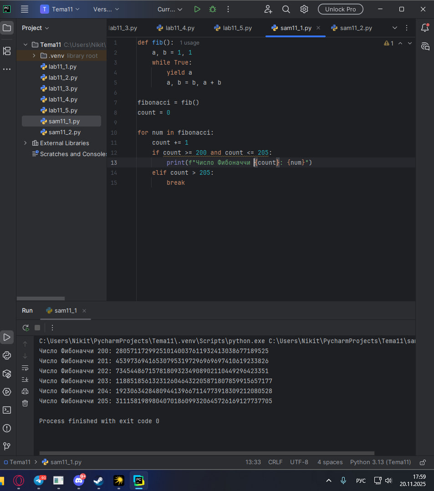
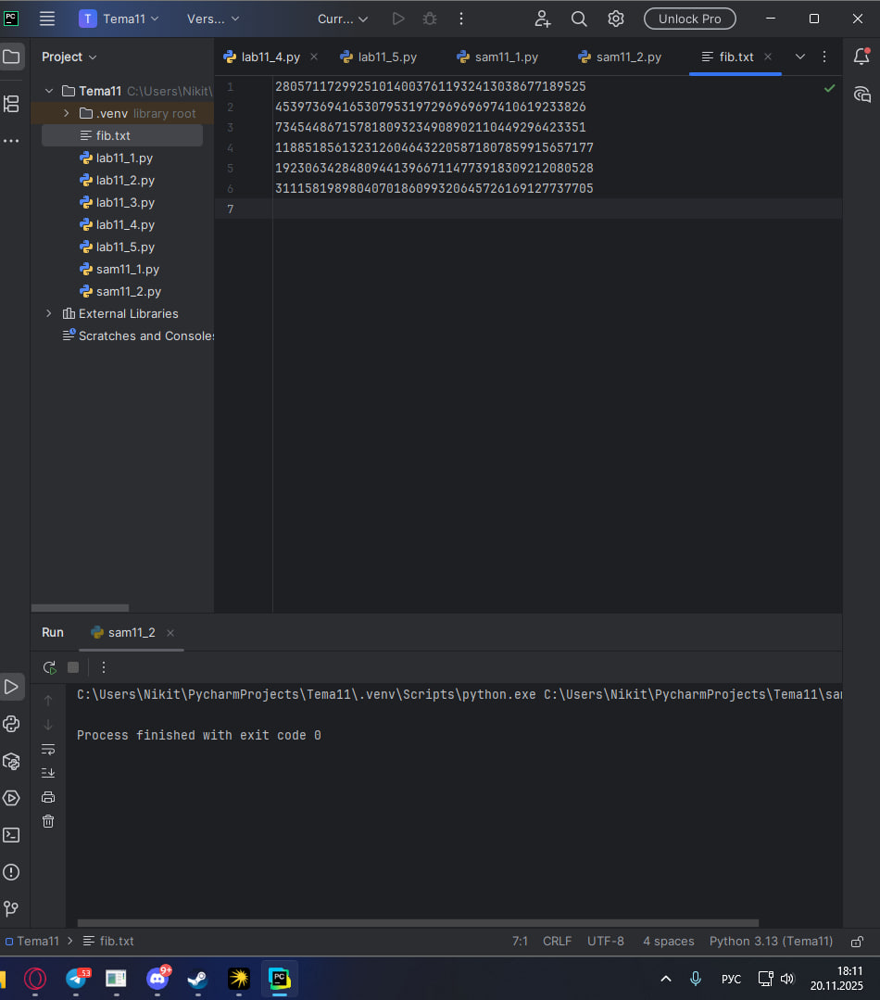

# Тема 11. Итераторы и генераторы
Отчет по Теме #11 выполнил(а):
- Пономарев Никита Сергеевич
- ИВТ-23-2

| Задание | Лаб_раб | Сам_раб |
| ------ | ------ | ------ |
| Задание 1 | + | + |
| Задание 2 | + | + |
| Задание 3 | + |  |
| Задание 4 | + |  |
| Задание 5 | + |  |

знак "+" - задание выполнено; знак "-" - задание не выполнено;

Работу проверили:
- к.э.н., доцент Панов М.А.

## Лабораторная работа №1
### Простой итератор, но у него нет гибкой настройки, например его нельзя развернуть. Он работает просто как next(), но нет prev()
```python
numbers = [0, 1, 2, 3, 4, 5]
for item in numbers:
    print(item)
```
### Результат.


## Вывод

Продемонстрирован базовый принцип работы итератора в Python. Использование цикла for для перебора элементов списка автоматически создает итератор, который последовательно возвращает элементы коллекции. Такой подход прост в использовании, но обладает ограниченной функциональностью.

## Лабораторная работа №2
### Класс итератор с гибкой настройкой и удобными применением
```python
class CountDown:
    def __init__(self, start):
        self.count = start + 1

    def __iter__(self):
        return self

    def __next__(self):
        self.count -= 1
        if self.count < 0:
            raise StopIteration
        return self.count

if __name__ == '__main__':
    counter = CountDown(5)
    for i in counter:
        print(i)
```
### Результат.


## Вывод

Реализован пользовательский итератор в виде класса с методами __iter__ и __next__. Такой подход предоставляет полный контроль над процессом итерации и позволяет создавать сложные последовательности с кастомной логикой.

## Лабораторная работа №3
### Генератор списка
```python
a = [i ** 2 for i in range(1, 5)]

print('a - ', a)
for i in a:
    print(i)

print('iter(a) - ', iter(a))
for i in a:
    print(i)
```
### Результат.


## Вывод

Использовано списковое включение для создания итератора. Данный подход сочетает компактность синтаксиса с эффективностью работы с памятью, позволяя генерировать коллекции на лету.

## Лабораторная работа №4
### Выражения генераторы
```python
b = (i ** 2 for i in range(1, 5))
print(b)
print('first')
for i in b:
    print(i)
print('second')

for i in b:
    print(i)
```
### Результат.


## Вывод

Продемонстрированы генераторные выражения, которые создают объекты-генераторы. Основное преимущество - экономия памяти, так как элементы генерируются по требованию, а не хранятся все сразу.

## Лабораторная работа №5
### Такой же счетчик, как и в первом задании, только это генератор и использует yield
```python
def countdown(count):
    while count >= 0:
        yield count
        count -= 1

if __name__ == '__main__':
    counter = countdown(5)
    for i in counter:
        print(i)
```
### Результат.


## Вывод

Создана функция-генератор с использованием ключевого слова yield. Такой подход позволяет создавать эффективные итераторы без необходимости написания классов, сохраняя состояние между вызовами.

## Самостоятельная работа №1
### Вас никак не могут оставить числа Фибоначчи, очень уж они вас заинтересовали. Изучив новые возможности Python вы решили реализовать программу, которая считает числа Фибоначчи при помощи итераторов. Расчет начинается с чисел 1 и 1. Создайте функцию fib(n), генерирующую n чисел Фибоначчи с минимальными затратами ресурсов. Для реализации этой функции потребуется обратиться к инструкции yield (Она не сохраняет в оперативной памяти огромную последовательность, а дает возможность “доставать” промежуточные результаты по одному). Результатом решения задачи будет листинг кода и вывод в консоль с числом Фибоначчи от 200.
```python
def fib():
    a, b = 1, 1
    while True:
        yield a
        a, b = b, a + b

fibonacci = fib()
count = 0

for num in fibonacci:
    count += 1
    if count >= 200 and count <= 205:
        print(f"Число Фибоначчи {count}: {num}")
    elif count > 205:
        break
```
### Результат.


## Вывод

Реализован эффективный генератор чисел Фибоначчи с использованием yield. Подход позволяет генерировать сколь угодно большие последовательности без значительных затрат памяти, вычисляя каждый элемент по мере необходимости.

## Самостоятельная работа №2
### К коду предыдущей задачи добавьте запоминание каждого числа Фибоначчи в файл “fib.txt”, при этом каждое число должно находиться на отдельной строчке. Результатом выполнения задачи будет листинг кода и скриншот получившегося файла
```python
def fib():
    a, b = 1, 1
    while True:
        yield a
        a, b = b, a + b

fibonacci = fib()
count = 0

with open("fib.txt", "w", encoding="utf-8") as file:
    for num in fibonacci:
        count += 1
        if count >= 200 and count <= 205:
            file.write(f"{num}\n")
        elif count > 205:
            break
```
### Результат.


## Вывод

Расширена функциональность генератора Фибоначчи добавлением записи результатов в файл. Комбинация генераторов и работы с файлами демонстрирует эффективный подход к обработке больших объемов данных с минимальным потреблением памяти.

## Общие выводы по теме
Итераторы и генераторы представляют мощный механизм для работы с последовательностями данных в Python. Их основное преимущество - отложенное вычисление элементов, что позволяет эффективно работать с большими объемами данных. Генераторы особенно полезны при обработке потоковых данных и создании бесконечных последовательностей.