# Тема 2. Базовые операции языка Python
Отчет по Теме #2 выполнил(а):
- Пономарев Никита Сергеевич
- ИВТ-23-2

| Задание | Лаб_раб | Сам_раб |
| ------ | ------ | ------ |
| Задание 1 | + | + |
| Задание 2 | + | + |
| Задание 3 | + | + |
| Задание 4 | + | + |
| Задание 5 | + | + |
| Задание 6 | + | + |
| Задание 7 | + | + |
| Задание 8 | + | + |
| Задание 9 | + | + |
| Задание 10 | + | + |

знак "+" - задание выполнено; знак "-" - задание не выполнено;

Работу проверили:
- к.э.н., доцент Панов М.А.

## Лабораторная работа №1
### Выведите в консоль три строки. Первая – любое число. Вторая – любое число в виде строки. Третья – любое число с плавающей точкой.

```python
print(123)
print('123')
print('1.23')
```

### Результат.


## Выводы
В ходе выполнения работы были продемонстрированы различные способы вывода данных. Первая строка выводит целочисленное значение (int), вторая - строковое представление числа (str), а третья - число с плавающей точкой (float). Это показывает базовые типы данных и их прямое отображение в Python.

## Лабораторная работа №2
### Выведите в консоль три строки. Первая – результат сложения или вычитания минимум двух переменных типа int. Вторая – результат сложения или вычитания минимум двух переменных типа float. Третья – результат сложения или вычитания минимум двух переменных типа int и float.

```python
print(1823 - 486)
print(5.1 + 8.27)
print(3 + 7.04 + 1 + 2.33)
```

### Результат.
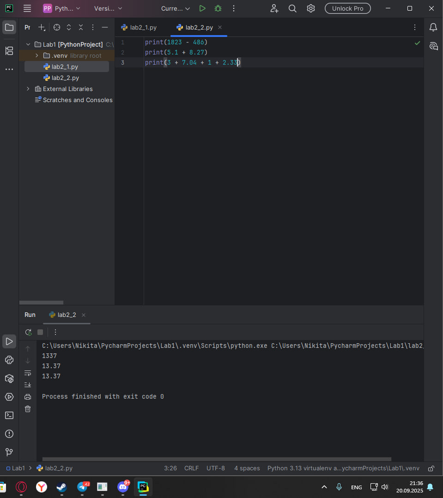

## Выводы
В данной работе были выполнены арифметические операции с разными типами числовых данных. Продемонстрированы особенности работы операторов с целыми числами (int), числами с плавающей точкой (float) и их комбинациями. Результаты показывают автоматическое приведение типов при смешанных вычислениях.

## Лабораторная работа №3
### Выведите в консоль три строки. Первая – обычная строка. Вторая – F строка с использованием заранее объявленной переменной. Третья – сложите две или более строк в одну.

```python
print('Привет, Мир!')

world = 'Мир'
print(f"Привет, {world}!")

one = 'Привет, '
two = 'Мир!'
print(one + two)
```

### Результат.
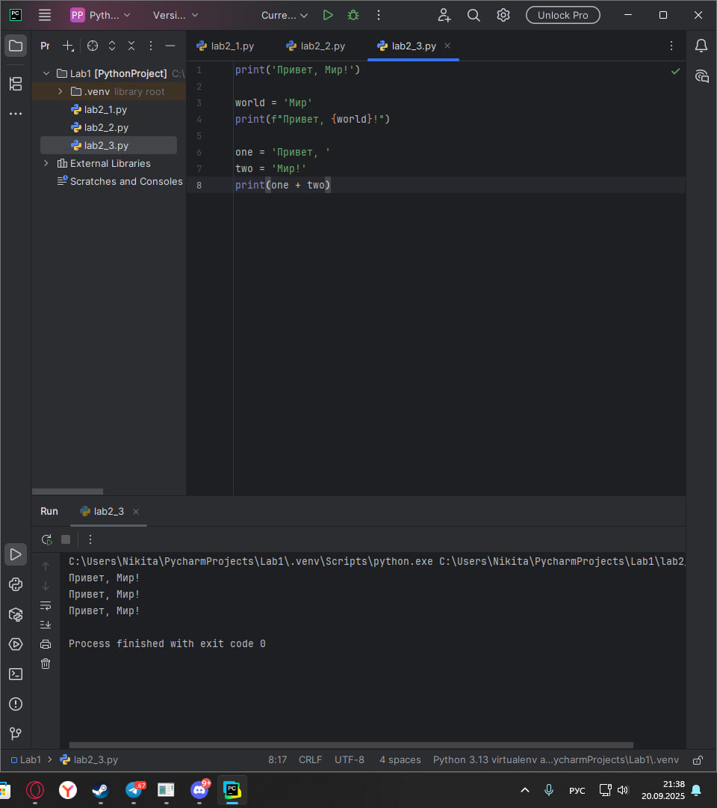

## Выводы
Были изучены различные методы форматирования строк: прямое указание строкового литерала, использование f-строк для подстановки значений переменных и конкатенация (сложение) строк. Каждый метод имеет свои преимущества в разных сценариях использования.

## Лабораторная работа №4
### Выведите в консоль три строки. Первая – трансформация любого типа переменной в bool. Вторая – трансформация любого типа переменной в float или int. Третья – трансформация любого типа переменной в str.

```python
one = 'Hello'
print(bool(one))

two = 142
print(float(two))

three = None
print(str(three))
```

### Результат.
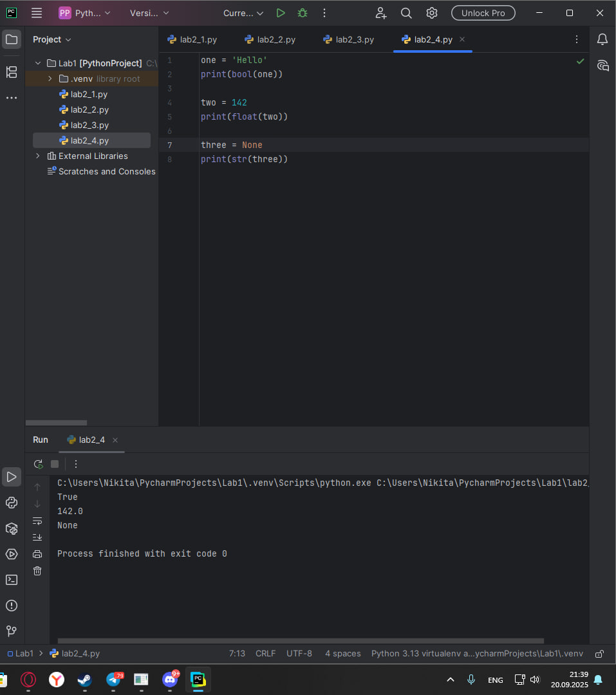

## Выводы
В работе продемонстрировано явное преобразование типов данных в Python. Показано, как различные значения преобразуются в логический тип (bool), числовые типы (int, float) и строковый тип (str). Это важная основа для работы с динамической типизацией в Python.

## Лабораторная работа №5
### Присвойте трем переменным различные значения, воспользовавшись функцией input().

```python
one = input('one: ')
two = input('two: ')
three = input('three: ')
print(one, two, three)
```

### Результат.
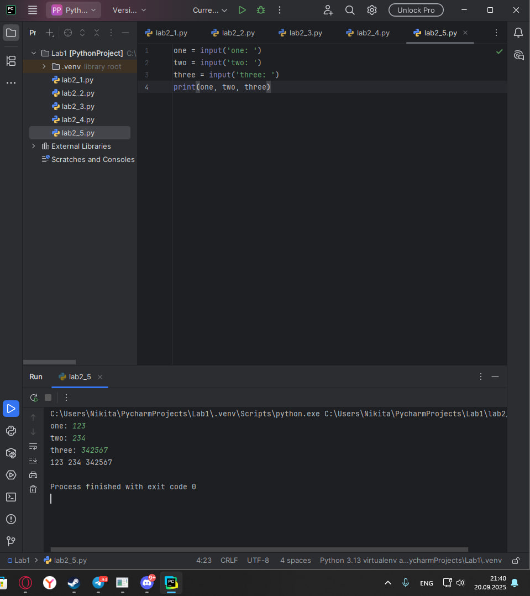

## Выводы
Освоена работа с функцией input() для получения пользовательского ввода. Показано, как можно интерактивно присваивать значения переменным во время выполнения программы, что является фундаментом для создания интерактивных приложений.

## Лабораторная работа №6
### Создайте две любые числовые переменные и выполните над ними несколько математических операций: возведение в степень, обычное деление, целочисленное деление, нахождение остатка от деления.

```python
a = 12
b = 5
print('Возведение в степень: ', a ** b)
print('Обычное деление: ', a / b)
print('Целочисленное деление: ', a // b)
print('Нахождение остатка от деления: ', a % b)
```

### Результат.
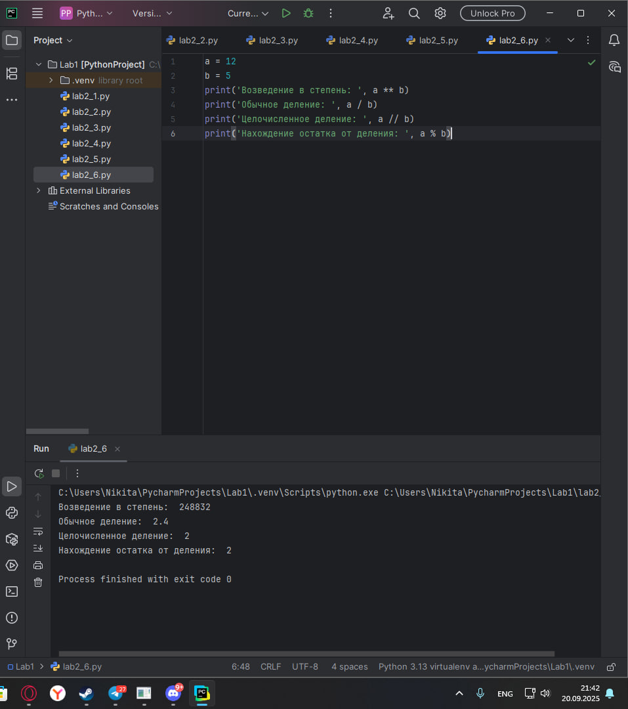

## Выводы
Изучены различные арифметические операции Python: возведение в степень (**), обычное деление (/), целочисленное деление (//) и взятие остатка от деления (%). Показаны различия в работе этих операторов с разными типами числовых данных.

## Лабораторная работа №7
### Создайте любую строковую переменную и произведите над ней математическое действие умножение на любое число.

```python
line = 'Hello!'
print(line * 6)
```

### Результат.
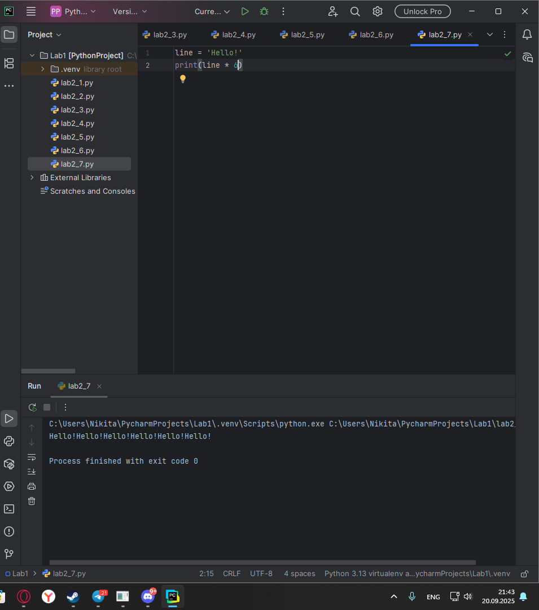

## Выводы
Продемонстрирована особенность операции умножения (*) при работе со строками. Умножение строки на целое число приводит к повторению строки указанное количество раз. Это уникальная возможность Python для работы со строками.

## Лабораторная работа №8
### Посчитайте сколько раз символ ‘o’ встречается в строке ‘Hello World’.

```python
sentence = 'Hello World'
print(sentence.count('o'))
```

### Результат.
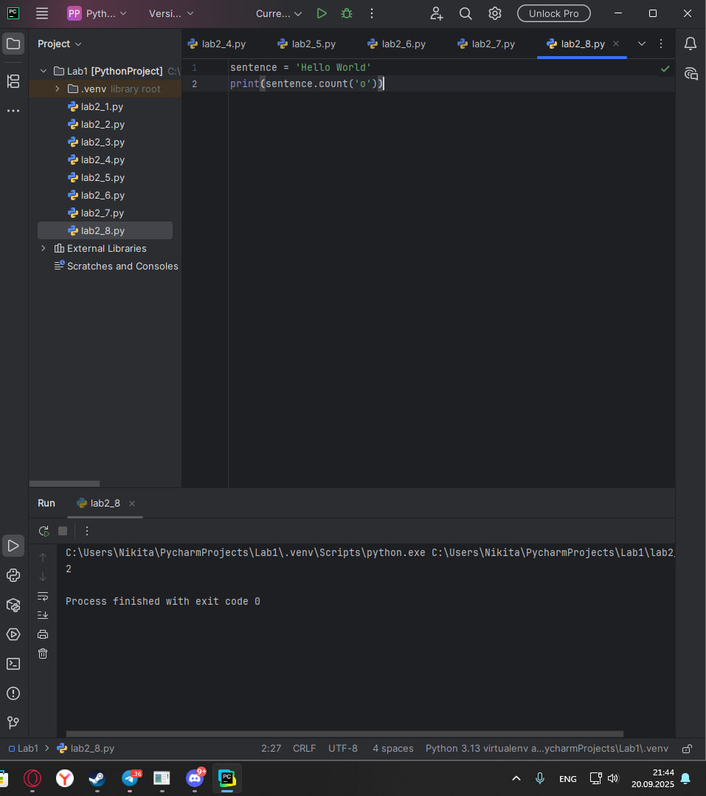

## Выводы
Использован строковый метод count() для подсчета количества вхождений определенного символа в строку. Этот метод полезен для анализа текстовых данных и поиска паттернов в строках.

## Лабораторная работа №9
### Напишите предложение ‘Hello World’ в две строкы. Написанная программа должна занимать одну строку в редакторе кода.

```python
print('Hello\nWorld')
```

### Результат.
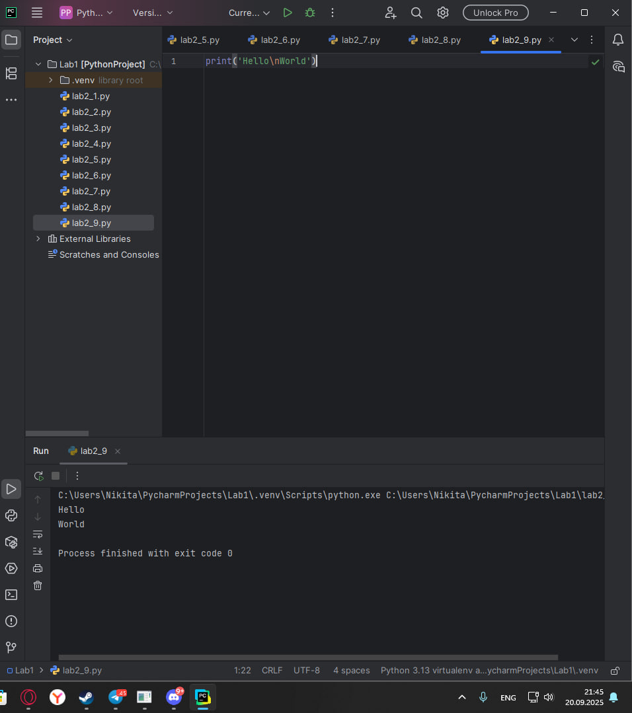

## Выводы
Применен символ новой строки (\n) для разделения вывода на несколько строк. Показано, как можно управлять форматированием вывода с помощью escape-последовательностей в строковых литералах.

## Лабораторная работа №10
### Из предложения ‘Hello World’ выведите в консоль только 2 символ, а затем выведите слово ‘Hello’

```python
sentence = 'Hello World'
print(sentence[1])
print(sentence[:5])
```

### Результат.
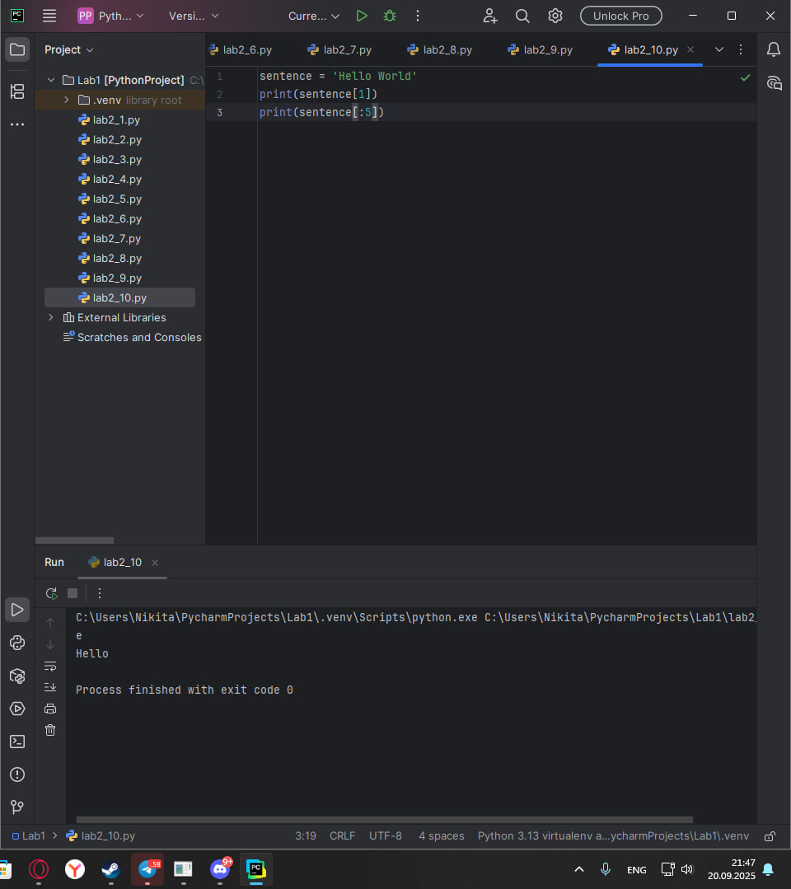

## Выводы
Использована операция среза (slicing) для извлечения отдельных символов и подстрок из строки. Показано, как обращаться к элементам строки по индексу и извлекать диапазоны символов.

## Самостоятельная работа №1
### Выведите в консоль булевую переменную False, не используя слово False в строке или изначально присвоенную булевую переменную. Программа должна занимать не более двух строк редактора кода.

```python
x = 1
print(x == 2)
```

### Результат.
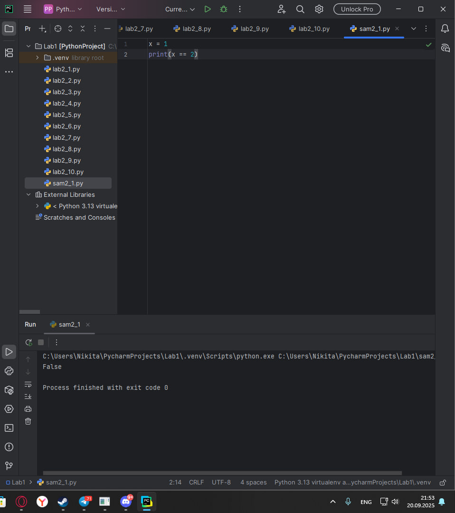

## Выводы
Продемонстрировано получение булева значения False через операцию сравнения. Это показывает, как логические значения естественным образом возникают в результате вычисления условий и сравнений в Python.

## Самостоятельная работа №2
### Присвоить значения трем переменным и вывести их в консоль, используя только две строки редактора кода

```python
x, y, z = 1, 2 ,3
print(x, y, z)
```

### Результат.
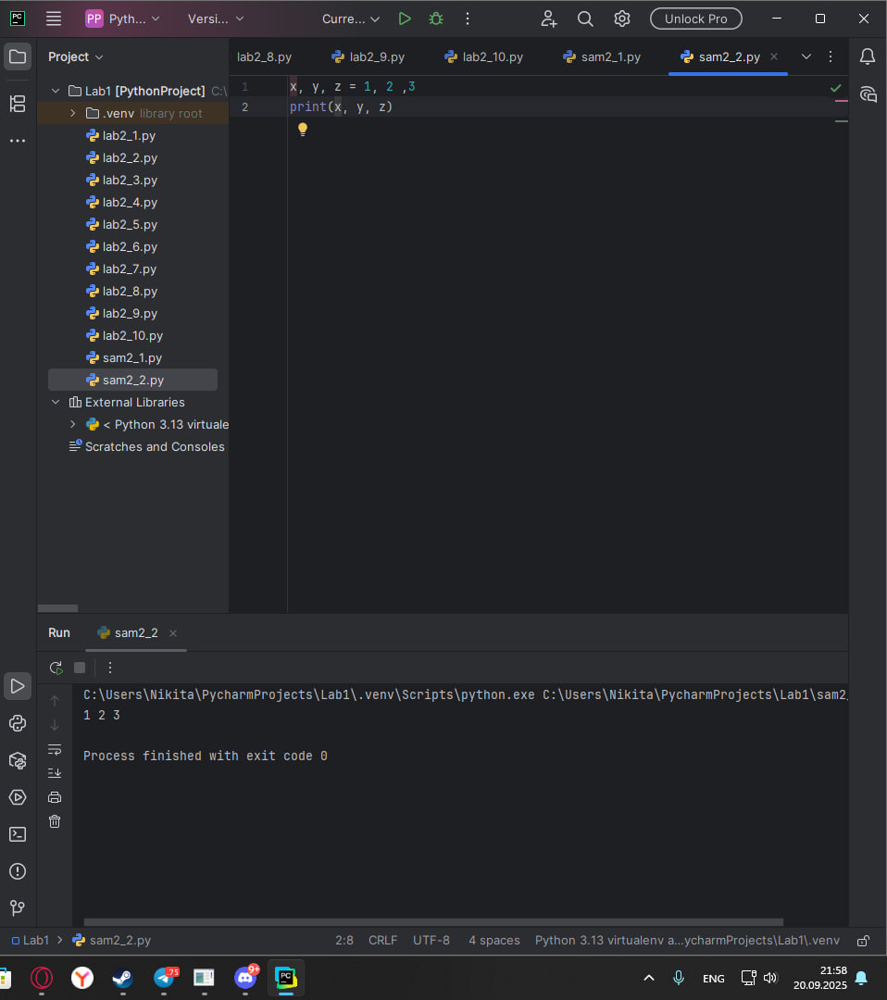

## Выводы
Показана возможность множественного присваивания значений переменным в одной строке и их последующего вывода. Это эффективный способ работы с несколькими переменными при минимальном объеме кода.

## Самостоятельная работа №3
### Реализуйте ввод данных в программу, через консоль, в виде только целых чисел (тип данных int). То есть при вводе буквенных символов в консоль, программа не должна работать. Программа должна занимать не более двух строк редактора кода.

```python
x = int(input())
print(x)
```

### Результат.
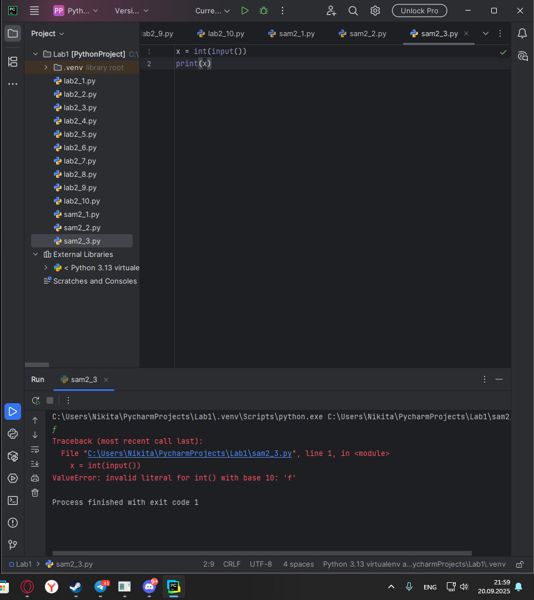

## Выводы
Использована функция int() для преобразования пользовательского ввода в целое число. При вводе нечисловых данных будет вызвано исключение ValueError, что обеспечивает проверку типа входных данных.

## Самостоятельная работа №4
### Создайте только одну строковую переменную. Длина строки должна не превышать 5 символов. На выходе мы должны получить строку длиной не менее 16 символов. Программа должна занимать не более двух строк редактора кода.

```python
x = "Hello"
print(x * 4)
```

### Результат.
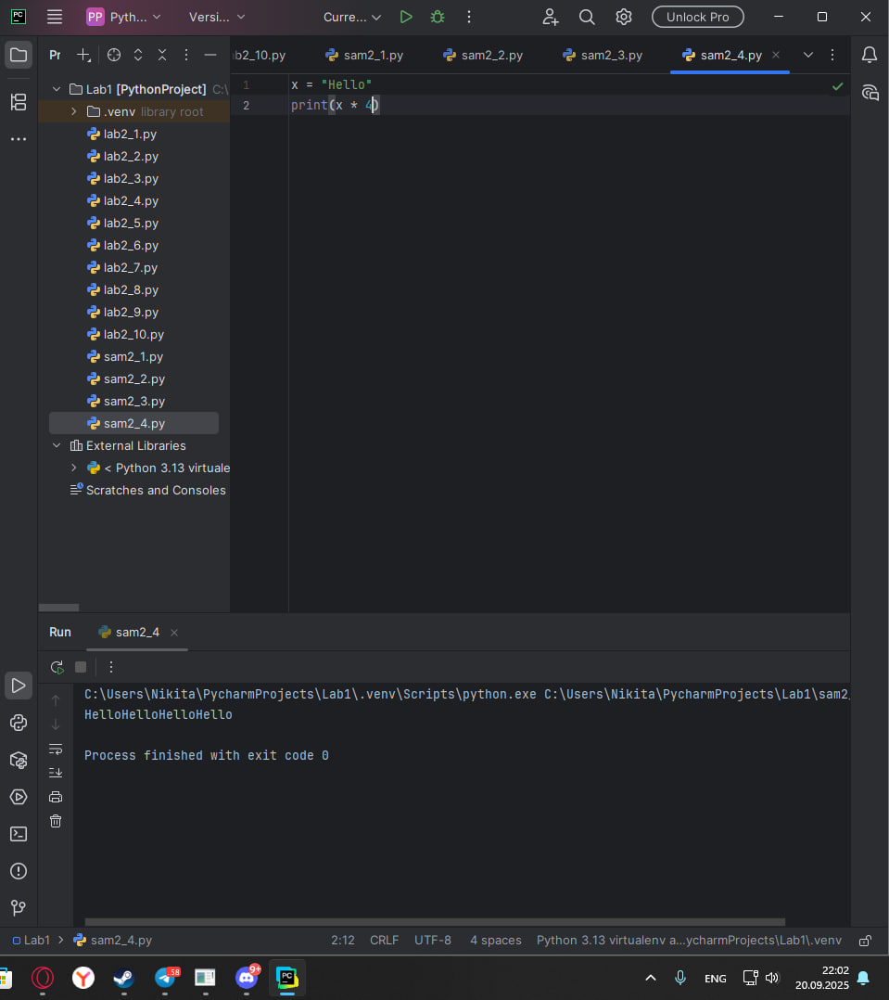

## Выводы
Применено умножение строки для увеличения ее длины. Этот прием позволяет эффективно создавать повторяющиеся паттерны или увеличивать объем текстовых данных без написания длинных литералов.

## Самостоятельная работа №5
### Создайте три переменные: день (тип данных - числовой), месяц (тип данных - строка), год (тип данных - числовой) и выведите в консоль текущую дату в формате: "Сегодня день месяц год. Всего хорошего!" используя F строку и оператор end внутри print(), в котором вы должны написать фразу "Всего хорошего!". Программа должна занимать не более двух строк редактора кода.

```python
day, month, year = 9, "мая", 2005
print(f"Сегодня {day} {month} {year}", end = '. Всего хорошего!')
```

### Результат.
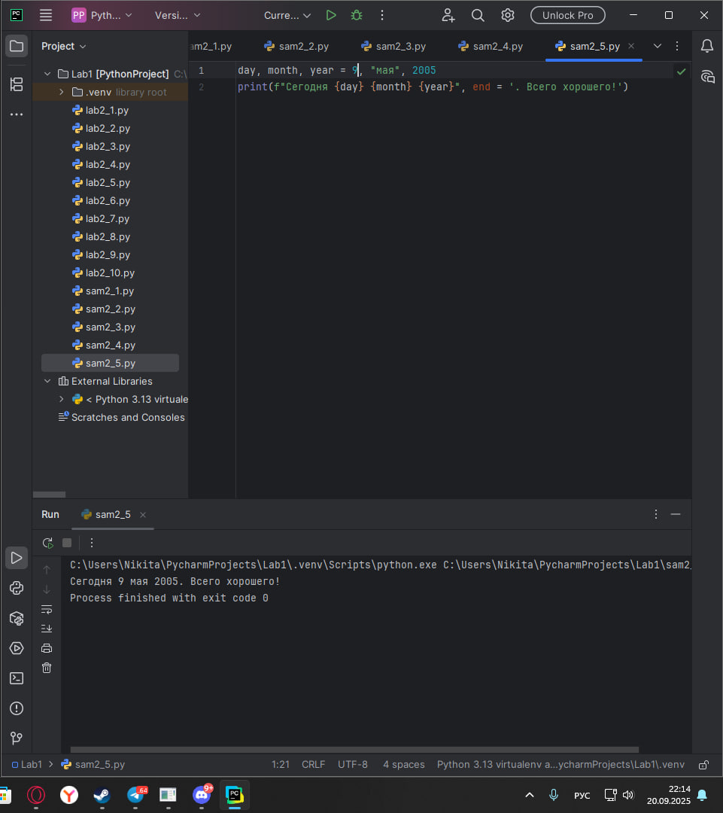

## Выводы
Скомбинированы f-строки для форматирования и параметр end функции print() для управления завершающим содержимым. Показано, как создавать сложные выходные данные с минимальным кодом.

## Самостоятельная работа №6
### В предложении 'Hello World' вставьте 'my' между двумя словами. Выведите полученное предложение в консоль в одну строку. Программа должна занимать не более двух строк редактора кода.

```python
sentence = "Hello World!"
print(sentence[:5], "my", sentence[6:])
```

### Результат.
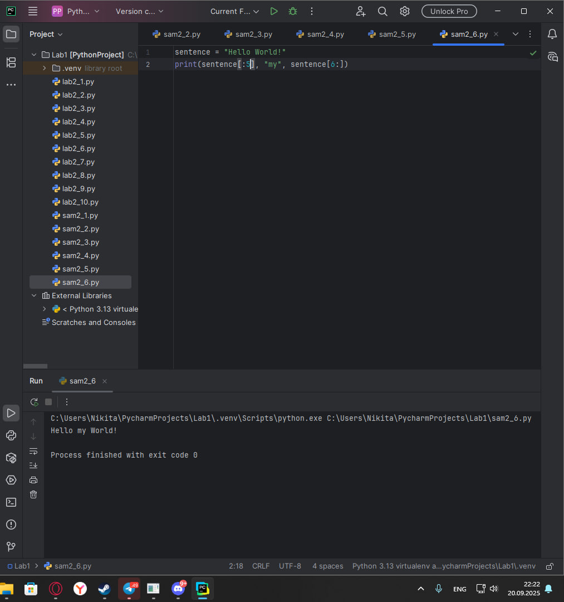

## Выводы
Использованы строковые срезы для разделения исходной строки и конкатенация для вставки нового слова. Этот подход демонстрирует манипуляции со строками через их индексацию и объединение.

## Самостоятельная работа №7
### Узнайте длину предложения 'Hello World', результат выведите в консоль. Программа должна занимать не более двух строк редактора кода.

```python
x = "HELLO WORLD"
print(len(x))
```

### Результат.
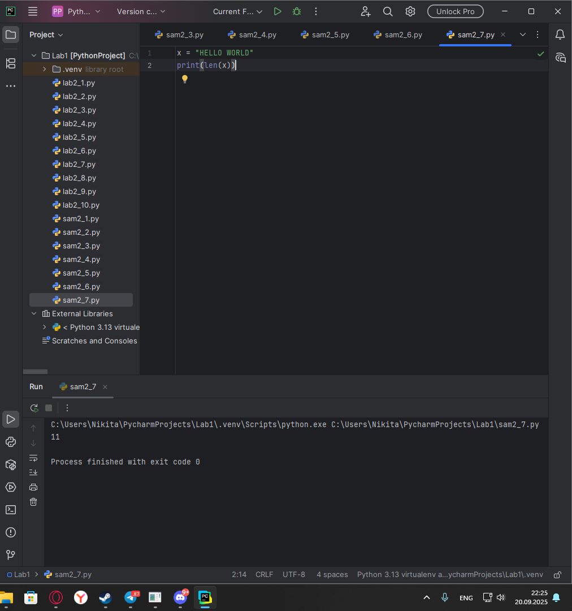

## Выводы
Применена функция len() для определения длины строки. Это базовая операция, часто используемая для проверки размера текстовых данных, валидации ввода и управления памятью.

## Самостоятельная работа №8
### Переведите предложение 'HELLO WORLD' в нижний регистр. Программа должна занимать не более двух строк редактора кода.

```python
x = "HELLO WORLD"
print(x.lower())
```

### Результат.
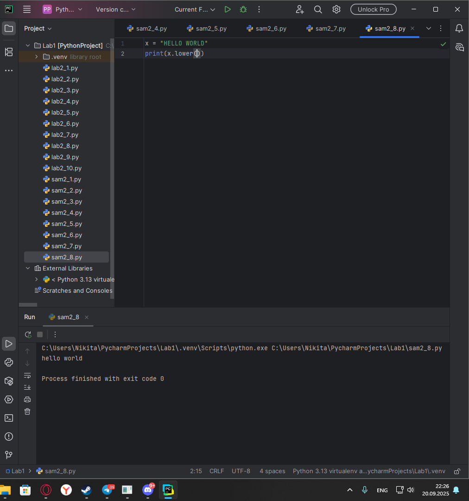

## Выводы
Использован строковый метод lower() для преобразования регистра. Это важная операция для нормализации текстовых данных, поиска без учета регистра и подготовки данных к обработке.

## Самостоятельная работа №9
### Самостоятельно придумайте задачу по проходимой теме и решите ее. Задача должна быть связанна со взаимодействием с числовыми значениями.

```python
x, y = "hello", "world"
print(len(x) + len(y))
```

### Результат.
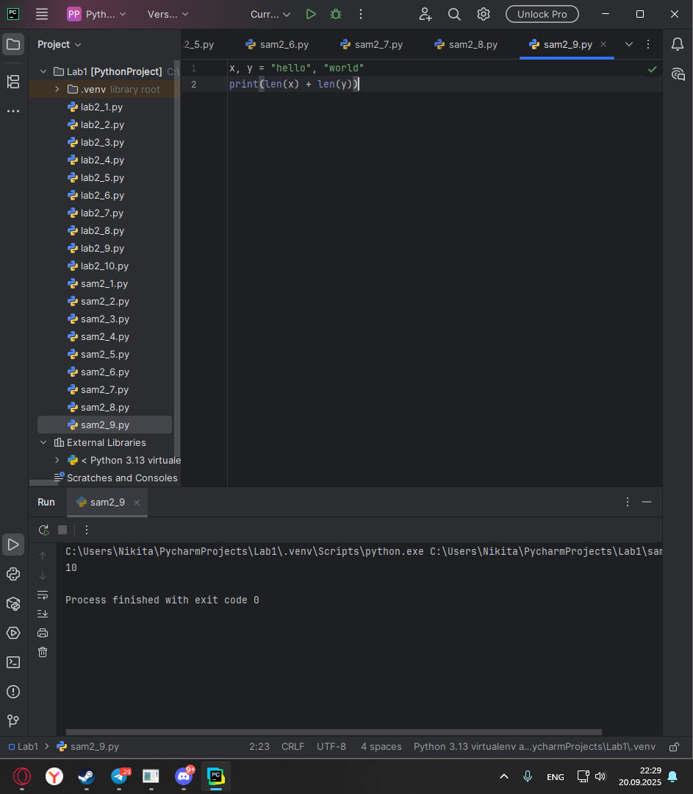

## Выводы
В данной работе продемонстрировано использование функции len() для получения длины строк и последующее сложение полученных числовых значений. Это показывает, как строковые операции могут комбинироваться с арифметическими для получения полезных результатов.

## Самостоятельная работа №10
### Самостоятельно придумайте задачу по проходимой теме и решите ее. Задача должна быть связанна со взаимодействием со строковыми значениями.

```python
x = "world Hello"
print(x[6:], x[:6])
```

### Результат.
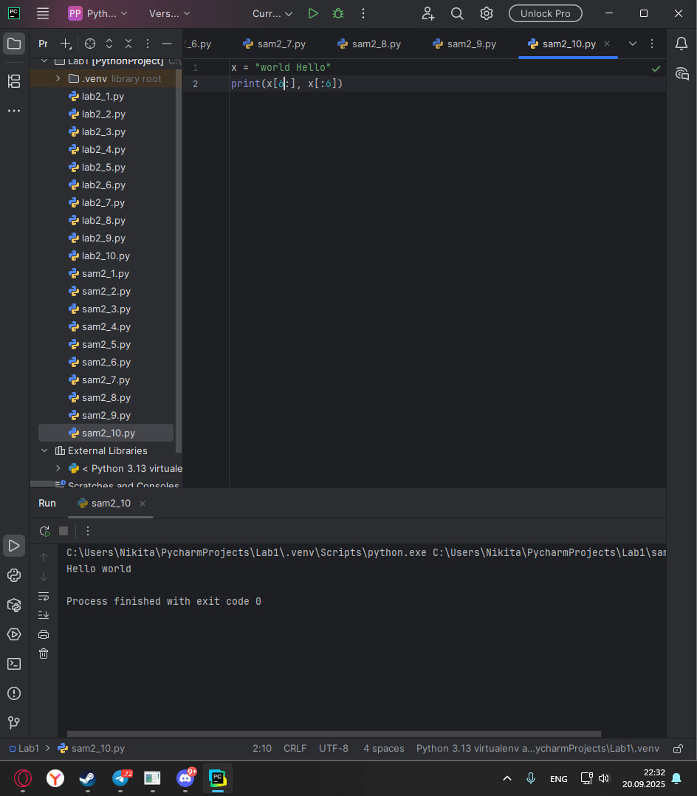

## Выводы
Применены строковые срезы для перестановки слов в предложении. Метод среза [6:] извлекает подстроку начиная с 7-го символа, а [:6] - первые 6 символов. Это демонстрирует гибкость работы со строками через индексацию.

## Общие выводы по теме
В ходе изучения темы были освоены базовые операции языка Python, включая работу с различными типами данных (int, float, str, bool), арифметические операции, строковые методы и форматирование вывода. Особый интерес представили f-строки как современный способ форматирования и параметры функции print() для управления выводом. Полученные знания составляют фундамент для дальнейшего изучения программирования на Python и создания более сложных программ. Практические задания позволили закрепить понимание динамической типизации и преобразования типов данных в языке.