# Тема 3. Операторы, условия, циклы
Отчет по Теме #3 выполнил(а):
- Пономарев Никита Сергеевич
- ИВТ-23-2

| Задание | Лаб_раб | Сам_раб |
| ------ | ------ | ------ |
| Задание 1 | + | + |
| Задание 2 | + | + |
| Задание 3 | + | + |
| Задание 4 | + | + |
| Задание 5 | + | + |
| Задание 6 | + |  |
| Задание 7 | + |  |
| Задание 8 | + |  |
| Задание 9 | + |  |
| Задание 10 | + |  |

знак "+" - задание выполнено; знак "-" - задание не выполнено;

Работу проверили:
- к.э.н., доцент Панов М.А.

## Лабораторная работа №1
### Создайте две переменные, значение которых будете вводить через консоль. Также составьте условие, в котором созданные ранее переменные будут сравниваться, если условие выполняется, то выведете в консоль «Выполняется», если нет, то «Не выполняется».
```python
one = int(input('Введите значение первой переменной: '))
two = int(input('Введите значение второй переменной: '))
if one >= two:
    print('Выполняется')
else:
    print('Не выполняется')
```
### Результат.


## Выводы
Реализовано сравнение двух числовых значений с выводом соответствующего результата проверки условия.

## Лабораторная работа №2
### Напишите программу, которая будет определять значения переменной меньше 0, больше 0 и меньше 10 или больше 10. Это нужно реализовать при помощи одной переменной, значение которой будет вводится через консоль, а также при помощи конструкions if, elif, else.
```python
one = int(input('Введите значение переменной: '))
if one < 0:
    print('Переменная меньше 0')
elif 0 < one < 10:
    print('Переменная больше 0 и меньше 10')
else:
    print('Переменная больше 10')
```
### Результат.
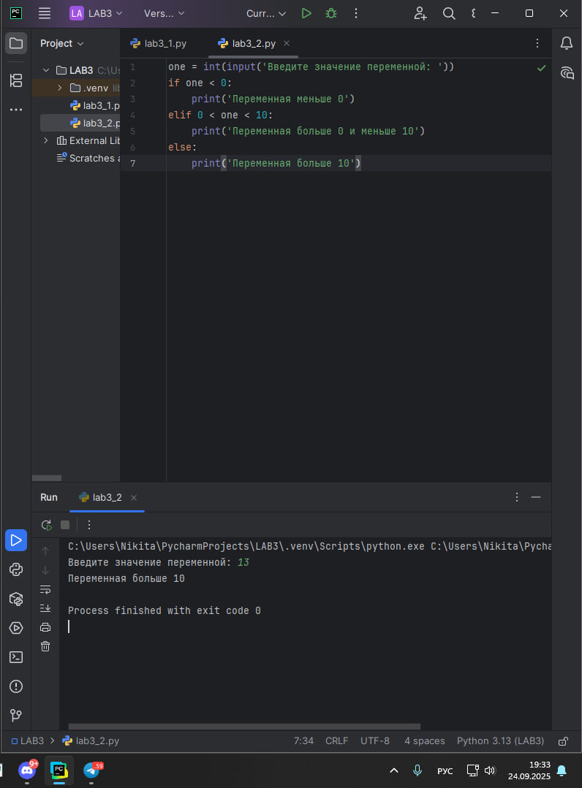

## Выводы
Создана программа с ветвлением, определяющая положение числа относительно ключевых границ 0 и 10.

## Лабораторная работа №3
### Напишите программу, в которой будет проверяться есть ли переменная в указанном массиве используя логический оператор in. Самостоятельно посмотрите, как работает программа со значениями которых нет в массиве numbers.
```python
numbers = [1, 3, 4, 6, 8, 9]
value = int(input('Введите значение переменной: '))
if value in numbers:
    print("Переменная есть в данном массиве")
else:
    print("Переменной нет в этом массиве")
```
### Результат.
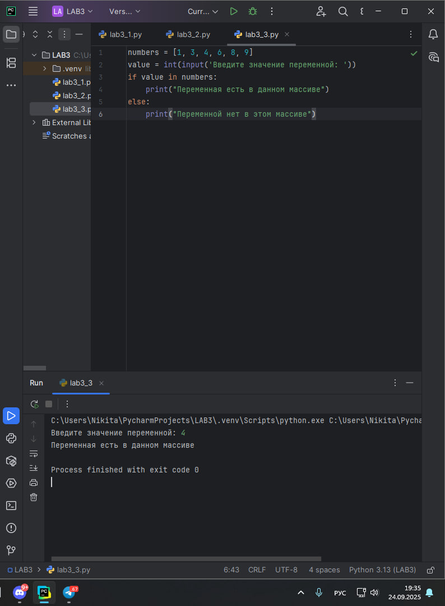

## Выводы
Продемонстрирована проверка принадлежности элемента массиву с использованием оператора in.

## Лабораторная работа №4
### Напишите программу, которая будет определять находится ли переменная в указанном массиве и если да, то проверьте четная она или нет. Самостоятельно протестируйте данную программу с разными значениями переменной value.
```python
numbers = [1, 3, 4, 6, 8, 9, 15, 16, 73, 321, 322]
value = int(input('Введите значение переменной: '))
if value in numbers:
    if value % 2 == 0:
        print('Переменная четная и есть в массиве numbers')
    else:
        print('Переменная нечетная и есть в массиве numbers')
else:
    print(f"Переменной нет в массиве numbers и она равна {value}")
```
### Результат.
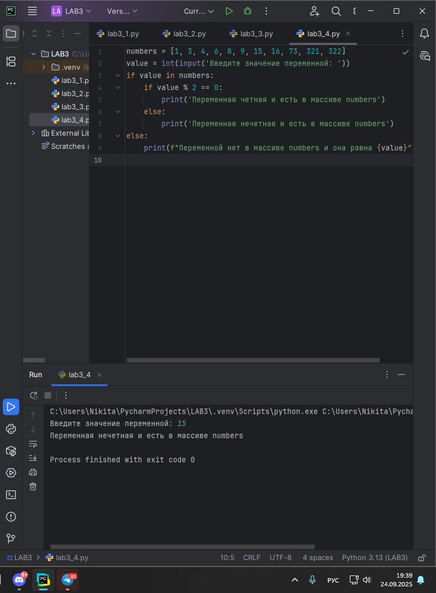

## Выводы
Реализована проверка наличия числа в массиве с дополнительной проверкой его четности через вложенное условие.

## Лабораторная работа №5
### Напишите программу, в которой циклом for значения переменной i будут меняться от 0 до 10 и посмотрите, как разные виды сравнений и операций работают в цикле.
```python
for i in range(10):
    print('i = ', i)
    if i == 0:
        i += 2
    if i == 1:
        continue
    if i == 2 or i == 3:
        print('Переменная равна 2 или 3')
    elif i in [4, 5, 6]:
        print('Переменная равна 4,5 или 6')
    else:
        break
```
### Результат.
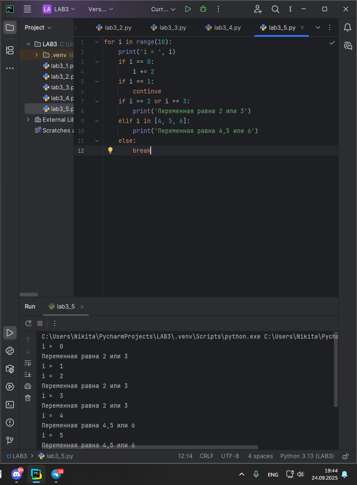

## Выводы
Изучено поведение различных операций сравнения и модификации переменной внутри цикла for.

## Лабораторная работа №6
### Напишите программу, в которой при помощи цикла for определяется есть ли переменная value в строке string и посмотрите, как работает оператор else для циклов. Самостоятельно посмотрите, что выведет программа, если значение переменной value оказалось в строке string.
```python
string = 'Привет всем изучающим Python!'
value = input()
for i in string:
    if i == value:
        index = string.find(value)
        print(f"Буква '{value}' есть в строке под {index} индексом")
        break
else:
    print(f"Буквы '{value}' нет в указанной строке")
```
### Результат.
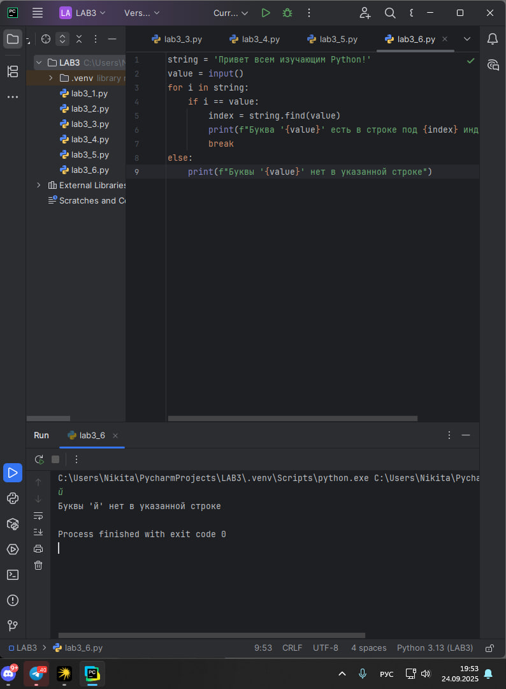

## Выводы
Показана работа цикла for с оператором else для обработки случаев, когда элемент не найден в строке.

## Лабораторная работа №7
### Напишите программу, в которой вы наглядно посмотрите, как работает цикл for проходя в обратном порядке, то есть, к примеру не от 0 до 10, а от 10 до 0. В уже готовой программе показано вычитание из 100, а вам во время реализации программы будет необходимо придумать свой вариант применения обратного цикла.
```python
value = 100
for i in range(10, -1, -1):
    value -= i
    print(i, value)
```
### Результат.
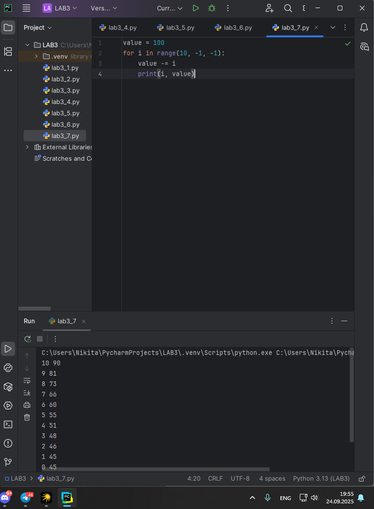

## Выводы
Использован обратный цикл for с пользовательским шагом для демонстрации работы с убывающей последовательностью.

## Лабораторная работа №8
### Напишите программу используя цикл while, внутри которого есть какие-либо проверки, но быть осторожным, поскольку циклы while при неправильно написанных условиях могут становится бесконечными, как указано в примере далее.
```python
value = 0
while value < 100:
    if value == 0:
        value += 10
    elif value // 5 > 1:
        value *= 5
    else:
        value -= 5
    print(value)
```
### Результат.
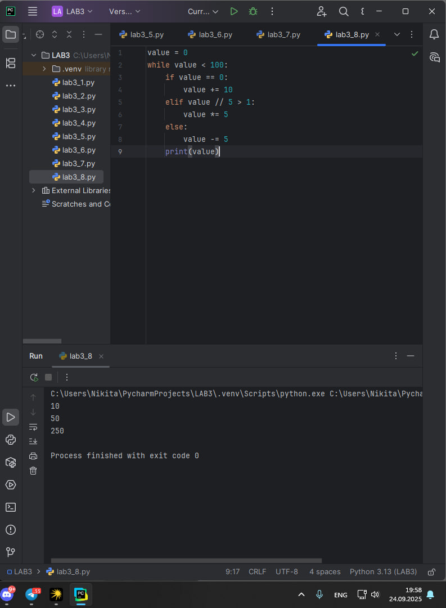

## Выводы
Создан цикл while с условием выхода и внутренними проверками для модификации переменной на каждой итерации.

## Лабораторная работа №9
### Напишите программу с использованием вложенных циклов и одной проверкой внутри них. Самое главное, не забудьте, что нельзя использовать одинаковые имена итерируемых переменных, когда вы используете вложенные циклы.
```python
value = 0
for i in range(10):
    for j in range(10):
        if i != j:
            value += j
        else:
            pass
print(value)
```
### Результат.
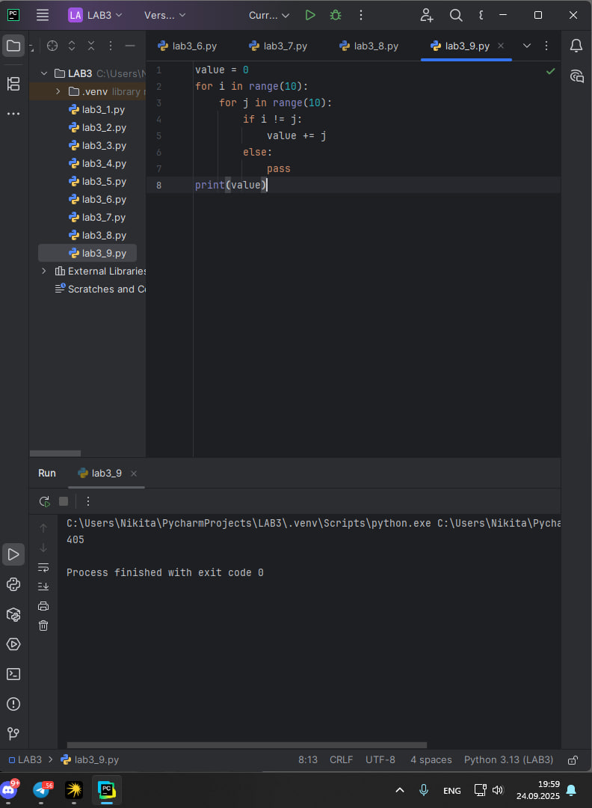

## Выводы
Продемонстрирована работа вложенных циклов с различными именами переменных и условной логикой внутри.

## Лабораторная работа №10
### Напишите программу с использованием flag, которое будет определять есть ли нечетное число в массиве. В данной задаче flag выступает в роли индикатора встречи нечетного числа в исходном массиве, четных чисел.
```python
arr = [2, 4, 6, 8, 9]
flag = False
for value in arr:
    if value % 2 == 1:
        flag = True
if flag:
    print('В массиве есть нечетное число')
else:
    print('В массиве нет нечетных чисел')
```
### Результат.
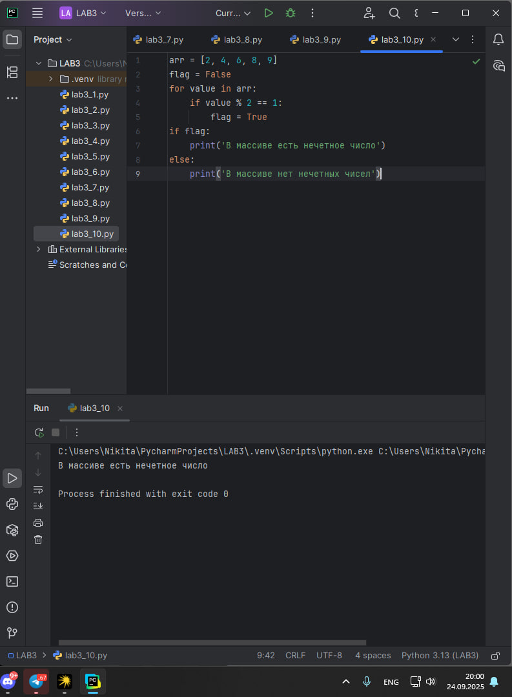

## Выводы
Использован флаг для отслеживания наличия нечетного числа в массиве при последовательном переборе элементов.

## Самостоятельная работа №1
### Напишите программу, которая преобразует 1 в 31.
Для выполнения поставленной задачи необходимо обязательно и только один раз использовать:

•	Цикл for

•	*= 5

•	+= 1

Никаких других действий или циклов использовать нельзя.
```python
one = 1
for i in range(7):
    i *= 5
i += 1
print(i)
```
### Результат.
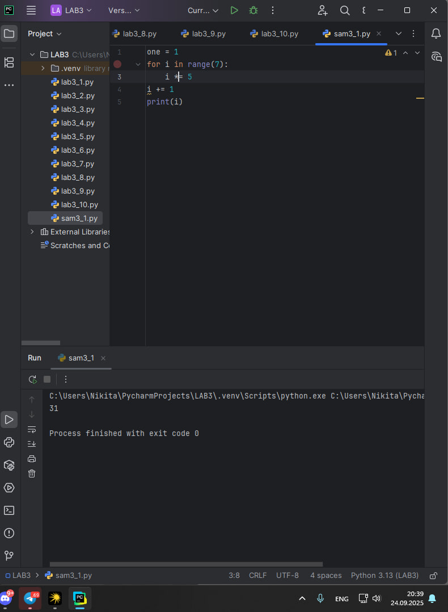

## Выводы
Решена задача последовательного преобразования числа с использованием ограниченного набора операций в цикле.

## Самостоятельная работа №2
### Напишите программу, которая фразу «Hello World» выводит в обратном порядке, и каждая буква находится в одной строке консоли. При этом необходимо обязательно использовать любой цикл, а также программа должна занимать не более 3 строк в редакторе кода.
```python
line = 'Hello World'
for i in range(len(line)-1, -1, -1):
    print(line[i])
```
### Результат.
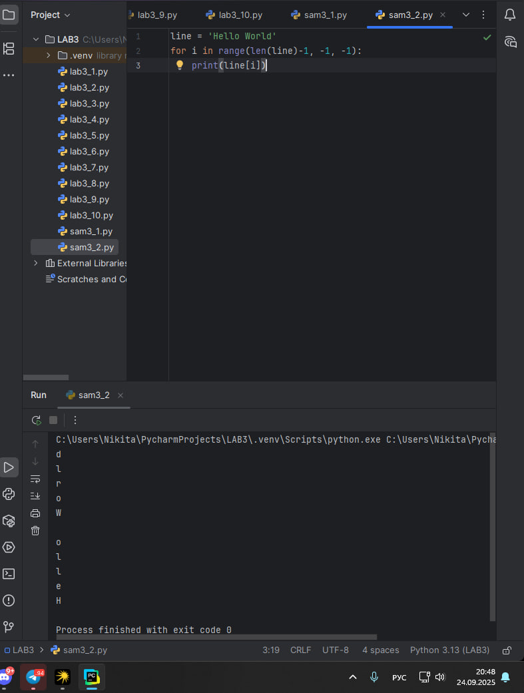

## Выводы
Реализован обратный вывод строки посимвольно с использованием цикла и управления диапазоном индексов.

## Самостоятельная работа №3
### Напишите программу, на вход которой поступает значение из консоли, оно должно быть числовым и в диапазоне от 0 до 10 включительно (это необходимо учесть в программе). Если вводимое число не подходит по требованиям, то необходимо вывести оповещение об этом в консоль и остановить программу. Код должен вычислять в каком диапазоне находится полученное число. Нужно учитывать три диапазона:

•	от 0 до 3 включительно

•	от 3 до 6

•	от 6 до 10 включительно

Результатом работы программы будет выведенный в консоль диапазон. Программа должна занимать не более 10 строчек в редакторе кода.
```python
a = int(input("Введите число: "))
if 0 <= a <= 3:
    print("от 0 до 3 включительно")
elif 3 < a < 6:
    print("от 3 до 6")
elif 6 < a <= 10:
    print("от 6 до 10 включительно")
else:
    print("Ошибка: введите число от 0 до 10")
```
### Результат.
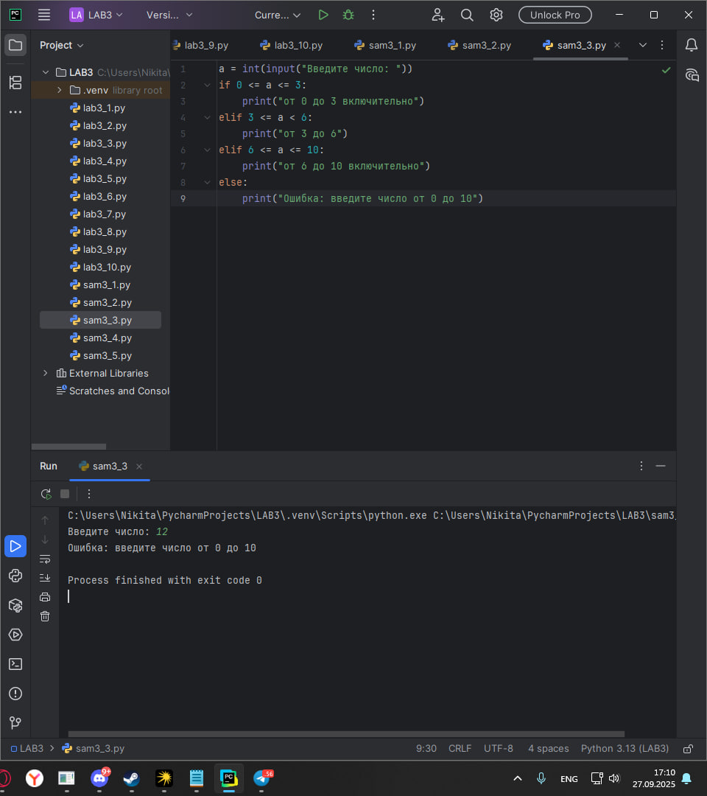

## Выводы
Создана программа с валидацией входных данных и определением принадлежности числа к одному из трех диапазонов.

## Самостоятельная работа №4
### Манипулирование строками. Напишите программу на Python, которая принимает предложение (на английском) в качестве входных данных от пользователя. Выполните следующие операции и отобразите результаты:

•	Выведите длину предложения.

•	Переведите предложение в нижний регистр.

•	Подсчитайте количество гласных (a, e, i, o, u) в предложении.

•	Замените все слова "ugly" на "beauty".

•	Проверьте, начинается ли предложение с "The" и заканчивается ли на "end".

Проверьте работу программы минимум на 3 предложениях, чтобы охватить проверку всех поставленных условий.
```python
word = input('Введите предложение: ')
arr = ['a', 'e', 'i', 'o', 'u']
bad_word = "ugly"
len_word = len(word) - 3

# длина предложения
print("Длина предложения: ", len(word))

# нижний регистр
lower_word = word.lower()
print("Предложение в нижнем регистре: ", lower_word)

# подсчет гласных
count = 0
for i in lower_word:
    if i in arr:
        count += 1
print(count)

# замена слова
print("Замена слова: ", lower_word.replace('ugly', 'beauty'))

# проверка начала и конца
if (word[:3] == "The") and (word[len_word:] == "end"):
    print("Да, предложение начинается с The и заканчивается на end")
else:
    print("Нет, предложение не прошло проверку")
```
### Результат.
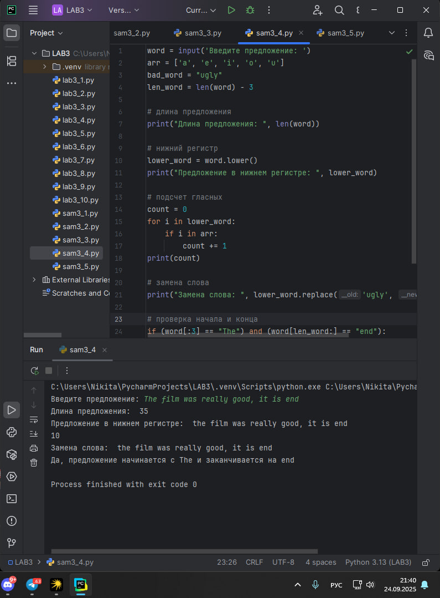

## Выводы
Реализован комплексный анализ строки с подсчетом символов, преобразованием регистра, поиском гласных, заменой подстрок и проверкой условий.

## Самостоятельная работа №5
### Составьте программу, результатом которой будет данный вывод в консоль:

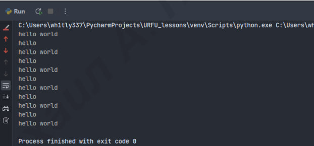

Программу нужно составить из данных фрагментов кода:

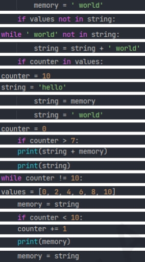

Строки кода можно использовать только один раз. Не обязательно использовать все строки кода.
```python
string = 'hello'
values = [0, 2, 4, 6, 8, 10]
counter = 0
while ' world' not in string:
    memory = string
    if counter in values:
        string = string + ' world'
    print(string)
    if counter < 10:
        string = memory
    counter += 1
```
### Результат.
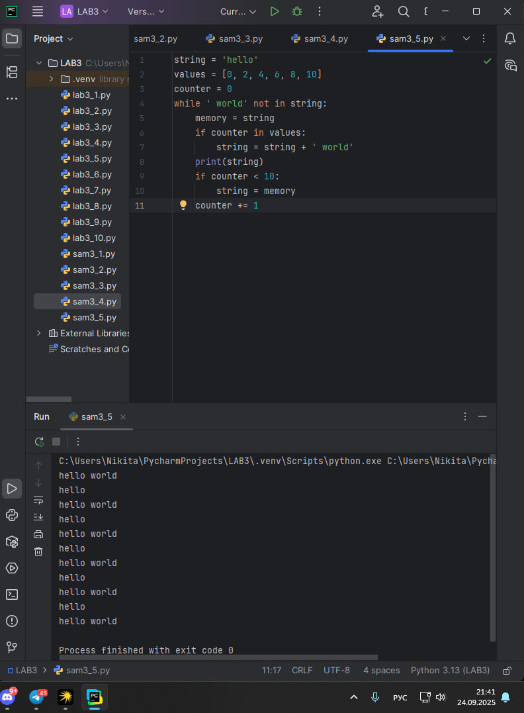

## Выводы
Составлена программа из предложенных фрагментов кода, реализующая заданную логику вывода с использованием цикла и условий.

## Общие выводы по теме
Изучены основные управляющие конструкции Python: условные операторы (if, elif, else) и циклы (for, while). Освоены принципы ветвления программы, повторения действий и обработки различных сценариев. Полученные навыки позволяют создавать более сложные и интеллектуальные программы.