# Тема 4. Функции и стандартные модули/библиотеки
Отчет по Теме #4 выполнил(а):
- Пономарев Никита Сергеевич
- ИВТ-23-2

| Задание | Лаб_раб | Сам_раб |
| ------ | ------ | ------ |
| Задание 1 | + | + |
| Задание 2 | + | + |
| Задание 3 | + | + |
| Задание 4 | + | + |
| Задание 5 | + | + |
| Задание 6 | + |  |
| Задание 7 | + |  |
| Задание 8 | + |  |
| Задание 9 | + |  |
| Задание 10 | + |  |

знак "+" - задание выполнено; знак "-" - задание не выполнено;

Работу проверили:
- к.э.н., доцент Панов М.А.

## Лабораторная работа №1
### Напишите функцию, которая выполняет любые арифметические действия и выводит результат в консоль. Вызовите функцию используя "точку входа".
```python
def main():
    print(2 + 2)

if __name__ == '__main__':
    main()
```
### Результат.


## Выводы
Создана функция с использованием точки входа для выполнения арифметических операций и вывода результата.

## Лабораторная работа №2
### Напишите функцию, которая выполняет любые арифметические действия, возвращает при помощи return значение в место, откуда вызывали функцию. Выведите результат в консоль. Вызовите функцию используя "точку входа".
```python
def main():
    return 2 + 2

if __name__ == '__main__':
    print(main())
```
### Результат.
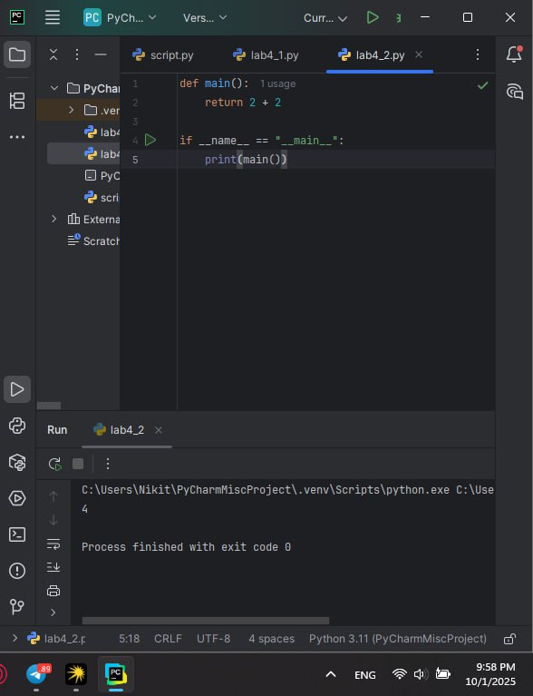

## Выводы
Реализована функция с возвратом значения через return и последующим выводом результата через точку входа.

## Лабораторная работа №3
### Напишите функцию, в которую передаются два аргумента, над ними производится арифметическое действие, результат возвращается туда, откуда эту функцию вызывали. Выведите результат в консоль. Вызовите функцию в любом небольшом цикле.
```python
def main(one, two):
    result = one + two
    return result

for i in range(5):
    x = 1
    y = 10
    answer = main(x, y)
    print(answer)
```
### Результат.
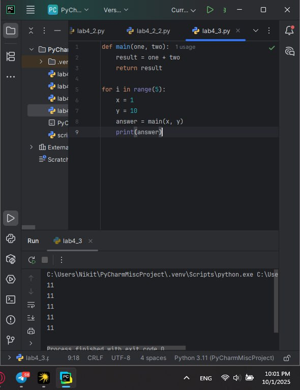

## Выводы
Создана функция с параметрами, возвращающая результат вычислений. Функция вызвана в цикле для демонстрации многократного использования.

## Лабораторная работа №4
### Напишите функцию, на вход которой подается какое-то изначальное неизвестное количество аргументов, над которыми будет производится арифметические действия. Для выполнения задания необходимо использовать кортеж "*args".
```python
def main(x, *args):
    one = x
    two = sum(args)
    three = float(len(args))

    print(f"one = {one}\ntwo = {two}\nthree = {three}")

    return x + sum(args) / float(len(args))

if __name__ == '__main__':
    result = main(10, 0, 1, 2, -1, 0, -1, 1, 1)
    print(f"\nresult = {result}")
```
### Результат.
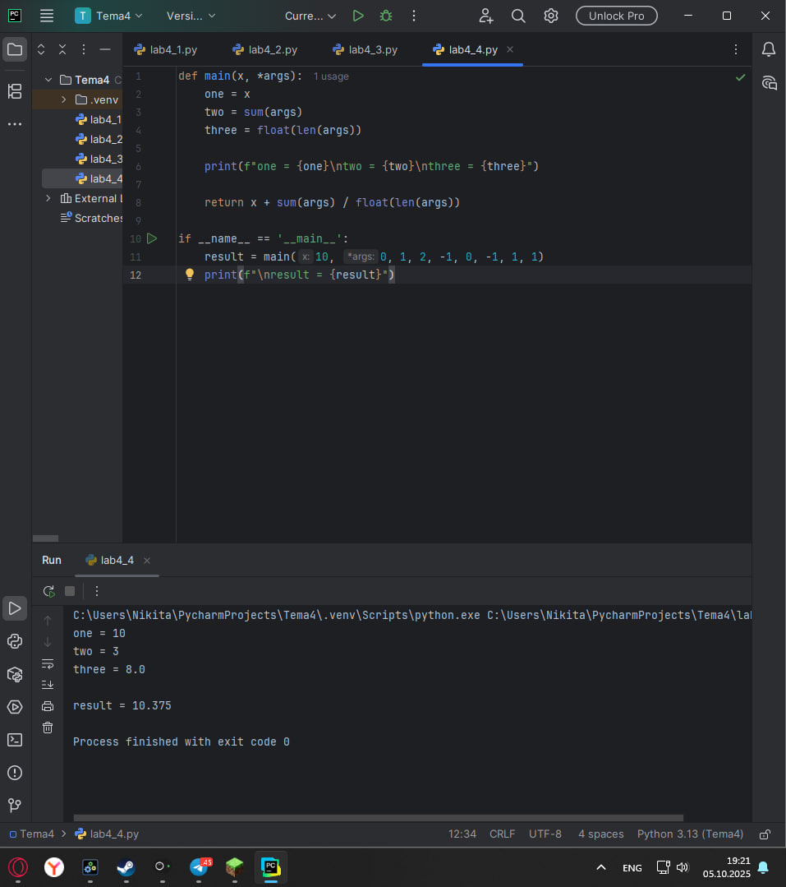

## Выводы
Использован кортеж *args для работы с произвольным количеством аргументов в функции. Продемонстрированы операции с переменным числом параметров.

## Лабораторная работа №5
### Напишите функцию, которая на вход получает кортеж "**kwargs" и при помощи цикла выводит значения, поступившие в функцию. На скриншоте ниже указаны два варианта вызова функции с "**kwargs" и два варианта работы с данными, поступившими в эту функцию. Комментарии в коде и теоретическая часть помогут вам разобраться в этом нелегком аспекте. Вызовите функцию используя "точку входа".
```python
def main(**kwargs):
    for i in kwargs.items():
        print(i[0], i[1])

    print()

    for key in kwargs:
        print(f"{key} = {kwargs[key]}")

if __name__ == '__main__':
    main(x = [1, 2, 3], y = [3, 3, 0], z = [2, 3, 0], q = [3, 3, 0], w = [3, 3, 0])
    print()
    main(**{'x': [1, 2, 3], 'y': [3, 3, 0]})
```
### Результат.
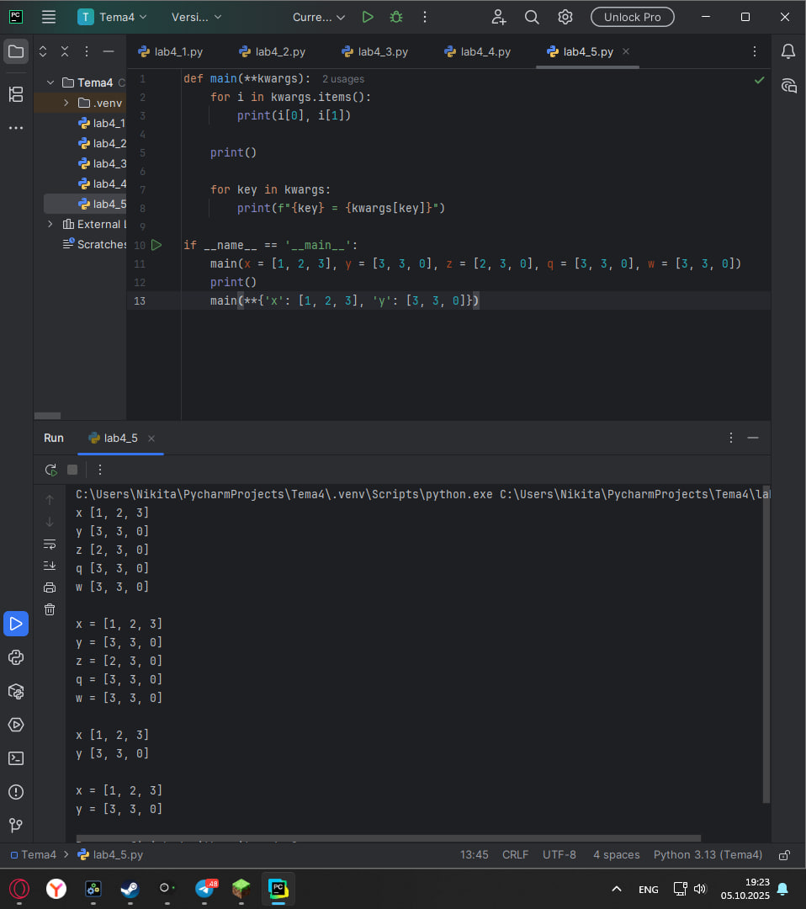

## Выводы
Применен словарь **kwargs для работы с именованными аргументами. Показаны различные способы обработки и вывода пар ключ-значение.

## Лабораторная работа №6
### Напишите две функции. Первая – получает в виде параметра "**kwargs". Вторая считает среднее арифметическое из значений первой функции. Вызовите первую функцию используя "точку входа" и минимум 4 аргумента.
```python
def main(**kwargs):
    for i, j in kwargs.items():
        print(f"{i}. Значение = {mean(j)}")

def mean(data):
    return sum(data) / float(len(data))

if __name__ == '__main__':
    main(x = [1, 2, 3], y = [3, 3, 0], z = [2, 4, 4], v = [4, 3, 5])
```
### Результат.
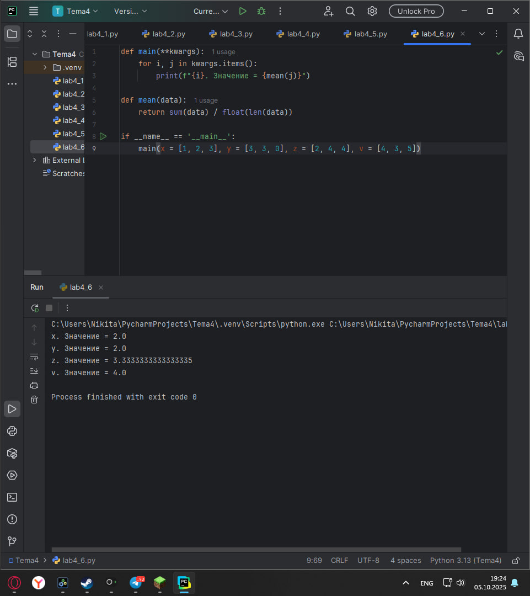

## Выводы
Созданы две взаимодействующие функции: одна принимает **kwargs, другая вычисляет среднее значение. Демонстрирует разделение функциональности.

## Лабораторная работа №7
### Создайте дополнительный файл .py. Напишите в нем любую функцию, которая будет что угодно выводить в консоль, но не вызывайте ее в нем. Откройте файл main.py, импортируйте в него функцию из нового файла и при помощи "точки входа" вызовите эту функцию.
```python
from for_import import say_hello

if __name__ == "__main__":
    say_hello()
```
### Результат.
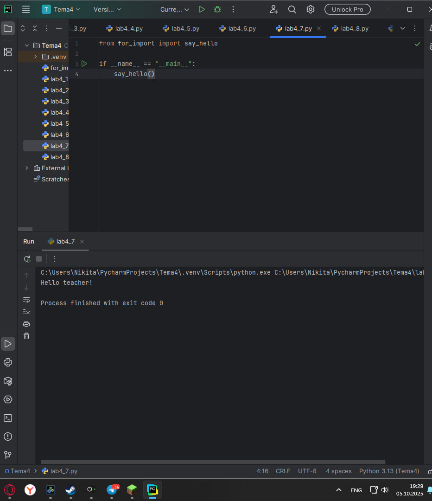

## Выводы
Освоен импорт функций из внешних модулей. Показана организация кода через разделение на несколько файлов.

## Лабораторная работа №8
### Напишите программу, которая будет выводить корень, синус, косинус полученного от пользователя числа.
```python
import math

def main():
    value = int(input('Введите значение: '))
    print(math.sqrt(value))
    print(math.sin(value))
    print(math.cos(value))


if __name__ == '__main__':
    main()
```
### Результат.
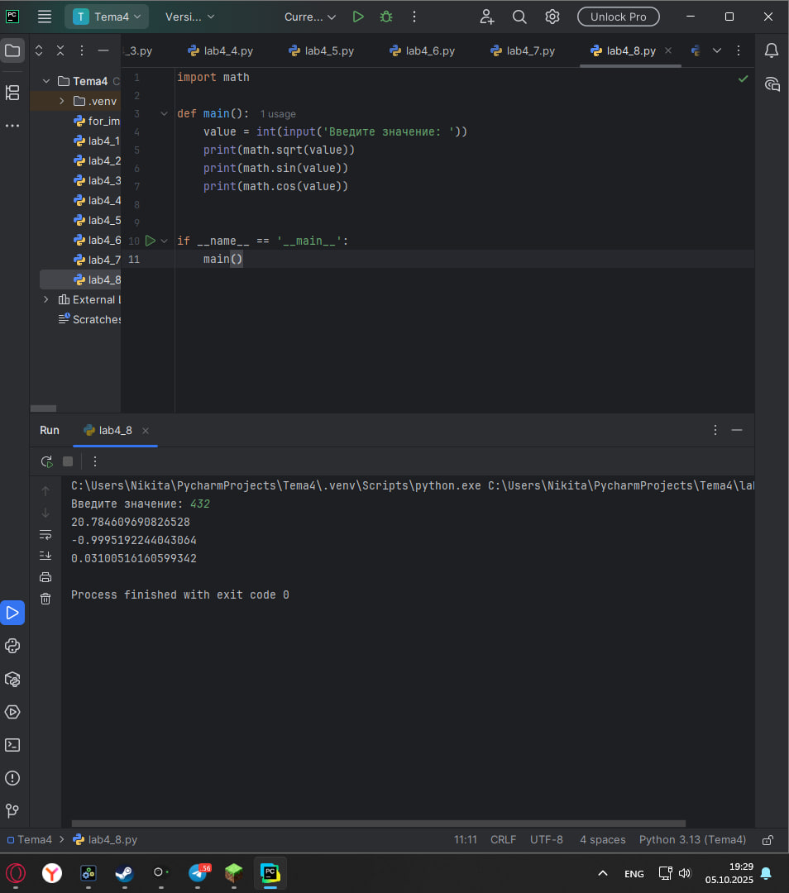

## Выводы
Использована библиотека math для математических вычислений. Программа взаимодействует с пользователем через input().

## Лабораторная работа №9
### Напишите программу, которая будет рассчитывать какой день недели будет через n-нное количество дней, которые укажет пользователь.
```python
from datetime import datetime as dt
from datetime import timedelta as td
def main():
    print(
        f"Сегодня {dt.today().date()}. "
        f"День недели - {dt.today().isoweekday()}"
    )
    n = int(input('Введите количество дней: '))
    today = dt.today()
    result = today + td(days = n)
    print(
        f"Через {n} дней будет {result.date()}. "
        f"День недели - {result.isoweekday()}"
    )

if __name__ == '__main__':
    main()
```
### Результат.
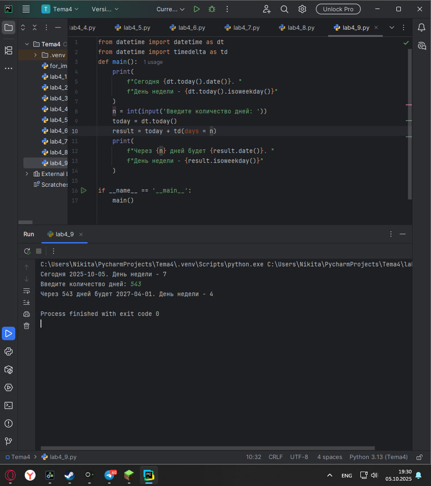

## Выводы
Применены модули datetime и timedelta для работы с датами. Реализован расчет будущей даты и дня недели.

## Лабораторная работа №10
### Напишите программу с использованием глобальных переменных, которая будет считать площадь треугольника или прямоугольника в зависимости от того, что выберет пользователь. Получение всей необходимой информации реализовать через input(), а подсчет площадей выполнить при помощи функций. Результатом программы будет число, равное площади, необходимой фигуры.
```python
global result

def rectangle():
    a = float(input("Ширина: "))
    b = float(input("Высота: "))
    global result
    result = a * b

def triangle():
    a = float(input("Основание: "))
    h = float(input("Высота: "))
    global result
    result = 0.5 * a * h

figure = input("1 - прямоугольник, 2 - треугольник: ")
if figure == '1':
    rectangle()
if figure == '2':
    triangle()

print(f"Площадь: {result}")
```
### Результат.
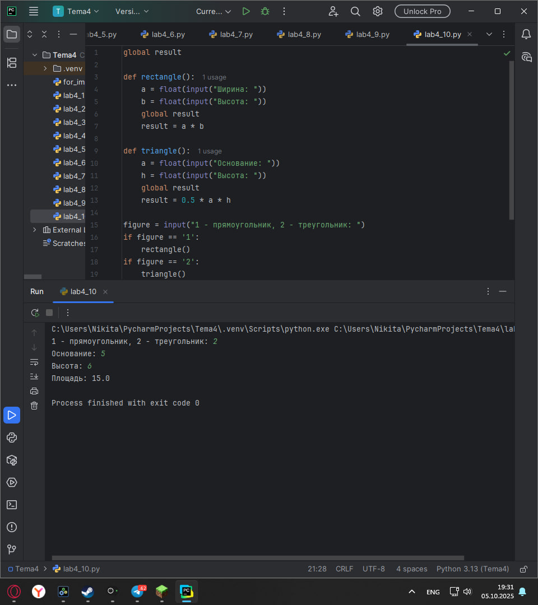

## Выводы
Использованы глобальные переменные для передачи данных между функциями. Реализовано меню выбора фигуры с соответствующими расчетами.

## Самостоятельная работа №1
### Дайте подробный комментарий для кода, написанного ниже. Комментарий нужен для каждой строчки кода, нужно описать что она делает. Не забудьте, что функции комментируются по-особенному.
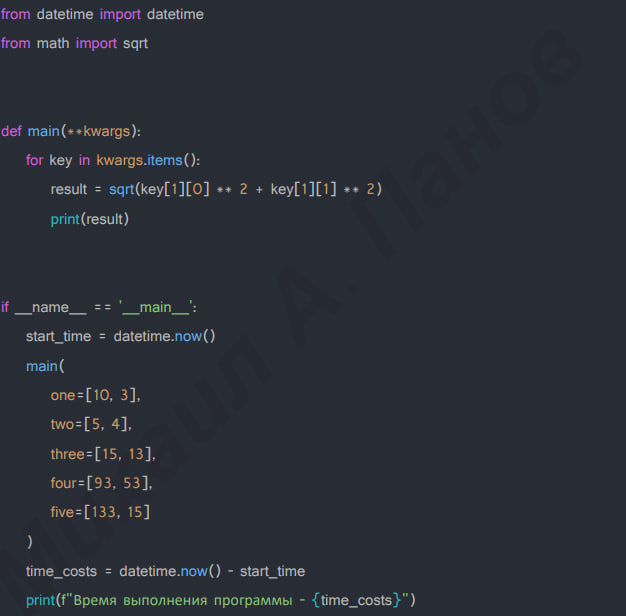
```python
# Импорт класса datetime из модуля datetime для работы с датой и временем
from datetime import datetime

# Импорт функции sqrt из модуля math для вычисления квадратного корня
from math import sqrt


# Определение главной функции, которая принимает произвольное количество именованных аргументов
# **kwargs - словарь, где ключи - имена аргументов, значения - соответствующие им значения
def main(**kwargs):
    # Цикл for, который проходит по всем элементам словаря kwargs
    # key[0] - имя аргумента, key[1] - значение аргумента (в нашем случае - список из двух чисел)
    for key in kwargs.items():
        # Вычисление квадратного корня из суммы квадратов двух чисел из текущего списка
        # key[1][0] - первое число в списке, key[1][1] - второе число в списке
        # Результат - длина вектора/гипотенуза прямоугольного треугольника с катетами key[1][0] и key[1][1]
        result = sqrt(key[1][0] ** 2 + key[1][1] ** 2)

        # Вывод вычисленного результата на экран
        print(result)


# Проверка, запущен ли скрипт напрямую (а не импортирован как модуль)
if __name__ == '__main__':
    # Запись текущего времени в переменную start_time
    start_time = datetime.now()

    # Вызов функции main с передачей пяти именованных аргументов
    # Каждый аргумент - список из двух чисел, представляющих координаты точки/вектора
    main(
        one=[10, 3],  # Вектор с координатами (10, 3)
        two=[5, 4],  # Вектор с координатами (5, 4)
        three=[15, 13],  # Вектор с координатами (15, 13)
        four=[93, 53],  # Вектор с координатами (93, 53)
        five=[133, 15]  # Вектор с координатами (133, 15)
    )

    # Вычисление времени выполнения программы: текущее время минус время начала
    time_costs = datetime.now() - start_time

    # Вывод времени выполнения программы в удобочитаемом формате
    print(f"Время выполнения программы - {time_costs}")
```
### Результат.
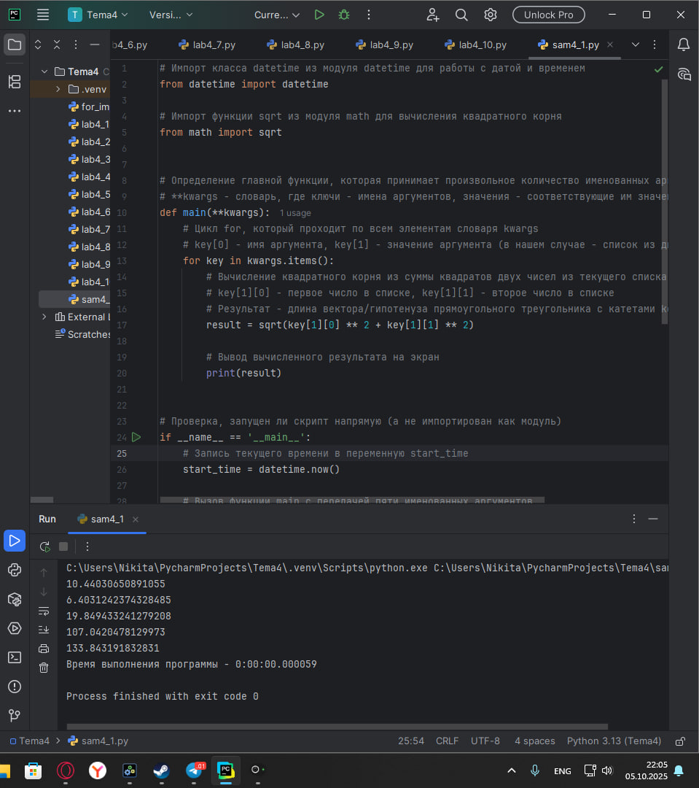

## Выводы
Проанализирован и прокомментирован код, вычисляющий длины векторов по координатам. Освоена работа с **kwargs и замером времени выполнения.

## Самостоятельная работа №2
### Напишите программу, которая будет заменять игральную кость с 6 гранями. Если значение равно 5 или 6, то в консоль выводится «Вы победили», если значения 3 или 4, то вы рекурсивно должны вызвать эту же функцию, если значение 1 или 2, то в консоль выводится «Вы проиграли». При этом каждый вызов функции необходимо выводить в консоль значение "кубика". Для выполнения задания необходимо использовать стандартную библиотеку random. Программу нужно написать, используя одну функцию и "точку входа"
```python
import random


def roll_dice():
    dice_value = random.randint(1, 6)
    print(f"Выпало: {dice_value}")

    if dice_value in [5, 6]:
        print("Вы победили")
    elif dice_value in [3, 4]:
        print("Повторный бросок...")
        roll_dice()
    else:
        print("Вы проиграли")


if __name__ == '__main__':
    print("Бросаем игральную кость...")
    roll_dice()
```
### Результат.
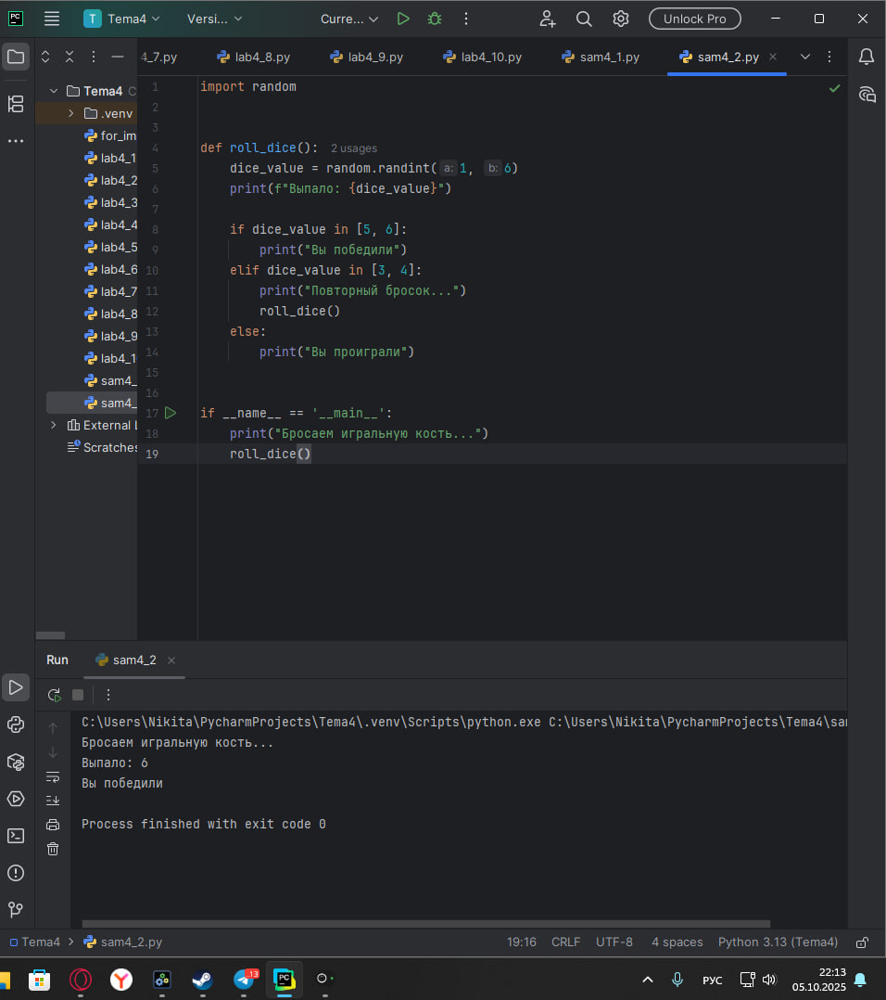

## Выводы
Создана программа-симулятор игральной кости с рекурсивными вызовами. Использована библиотека random для генерации случайных значений.

## Самостоятельная работа №3
### Напишите программу, которая будет выводить текущее время, с точностью до секунд на протяжении 5 секунд. Программу нужно написать с использованием цикла. Подсказка: необходимо использовать модуль datetime и time, а также вам необходимо как-то "усыплять" программу на 1 секунду.
```python
import datetime
import time

def display_current_time():
    for i in range(5):
        current_time = datetime.datetime.now()
        formatted_time = current_time.strftime("%H:%M:%S")
        print(f"Текущее время: {formatted_time}")
        time.sleep(1)

if __name__ == '__main__':
    print("Запуск вывода времени на протяжении 5 секунд...")
    display_current_time()
    print("Программа завершена.")
```
### Результат.
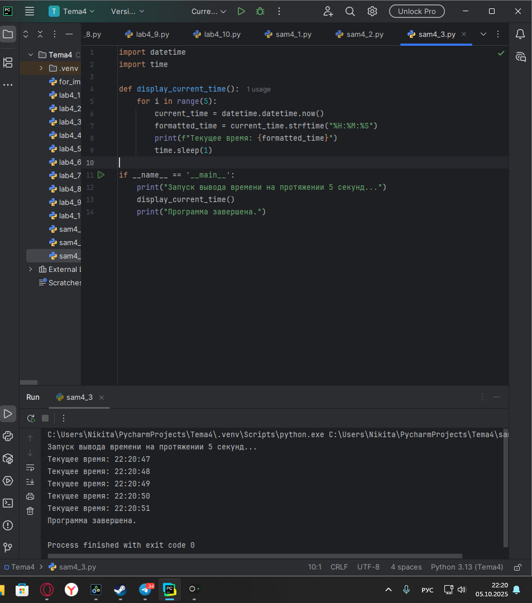

## Выводы
Реализован вывод текущего времени с интервалами. Использованы модули datetime и time для работы со временем и создания задержек.

## Самостоятельная работа №4
### Напишите программу, которая считает среднее арифметическое от аргументов вызываемое функции, с условием того, что изначальное количество этих аргументов неизвестно. Программу необходимо реализовать используя одну функцию и "точку входа".
```python
def average(*numbers):
    if not numbers:
        return "Ошибка: не передано ни одного числа"

    return sum(numbers) / len(numbers)

if __name__ == '__main__':
    test_cases = [
        [10, 20, 30],
        [5, 15],
        [100],
        [1.1, 2.2, 3.3, 4.4],
        []
    ]

    for i, numbers in enumerate(test_cases, 1):
        print(f"Тест {i}: {numbers}")
        result = average(*numbers)
        print(f"Результат: {result}\n")
```
### Результат.


## Выводы
Создана универсальная функция для вычисления среднего арифметического с использованием *args. Функция работает с любым количеством аргументов.

## Самостоятельная работа №5
### Создайте два Python файла, в одном будет выполняться вычисление площади треугольника при помощи формулы Герона (необходимо реализовать через функцию), а во втором будет происходить взаимодействие с пользователем (получение всей необходимой информации и вывод результатов). Напишите эту программу и выведите в консоль полученную площадь.
```python
import math

def triangle_square(x, y, z):
    per = (x + y + z) / 2
    square = math.sqrt(per * (per - x) * (per - y) * (per - z))
    return square
```

```python
from sam4_5_1 import triangle_square


def get_sides():
    side1 = float(input("Размер первой стороны: "))
    side2 = float(input("Размер второй стороны: "))
    side3 = float(input("Размер третьей стороны: "))
    return side1, side2, side3


def start():
    dimensions = get_sides()

    result = triangle_square(dimensions[0], dimensions[1], dimensions[2])

    print(f"Результат: {result:.2f}")


if __name__ == "__main__":
    start()
```
### Результат.
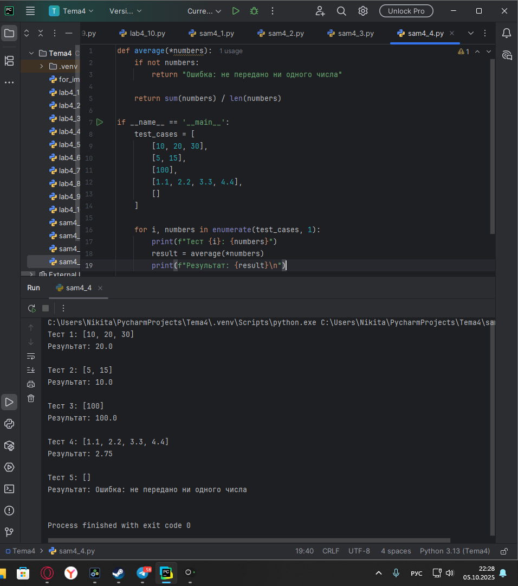

## Выводы
Реализована модульная структура программы с разделением на логический и пользовательский модули. Освоен импорт функций между файлами.

## Общие выводы по теме
Освоены основные принципы работы с функциями в Python: создание, вызов, передача параметров через *args и **kwargs. Изучены возможности стандартных библиотек math, datetime, time и random. Приобретены навыки модульного программирования, рекурсивных вызовов и организации кода через точку входа. Полученные знания позволяют создавать структурированные и эффективные программы.