# Тема 5. Базовые коллекции: строки и списки
Отчет по Теме #5 выполнил(а):
- Пономарев Никита Сергеевич
- ИВТ-23-2

| Задание | Лаб_раб | Сам_раб |
| ------ | ------ | ------ |
| Задание 1 | + | + |
| Задание 2 | + | + |
| Задание 3 | + | + |
| Задание 4 | + | + |
| Задание 5 | + | + |
| Задание 6 | + |  |
| Задание 7 | + |  |
| Задание 8 | + |  |
| Задание 9 | + |  |
| Задание 10 | + |  |

знак "+" - задание выполнено; знак "-" - задание не выполнено;

Работу проверили:
- к.э.н., доцент Панов М.А.

## Лабораторная работа №1
### Друзья предложили вам поиграть в игру "найди отличия и убери повторения (версия для программистов)". Суть игры состоит в том, что на вход программы поступает два множества, а ваша задача вывести все элементы первого, которых нет во втором. А вы как раз недавно прошли множества и знаете их возможности, поэтому это не составит для вас труда.
```python
set_1 = {"Белый", "Черный", "Красный", "Розовый"}
set_2 = {"Красный", "Зеленый", "Синий", "Красный"}

print(set_1 - set_2)
```
### Результат.


## Выводы
Продемонстрирована операция разности множеств для нахождения уникальных элементов первого множества.

## Лабораторная работа №2
### Напишите две одинаковые программы, только одна будет использовать set(), а вторая frozenset() и попробуйте к исходному множеству добавить несколько элементов, например, через цикл.
```python
a = set("abcdefg")
print(a)

for i in range(1, 5):
    a.add(i)

print(a)
```
### Результат.
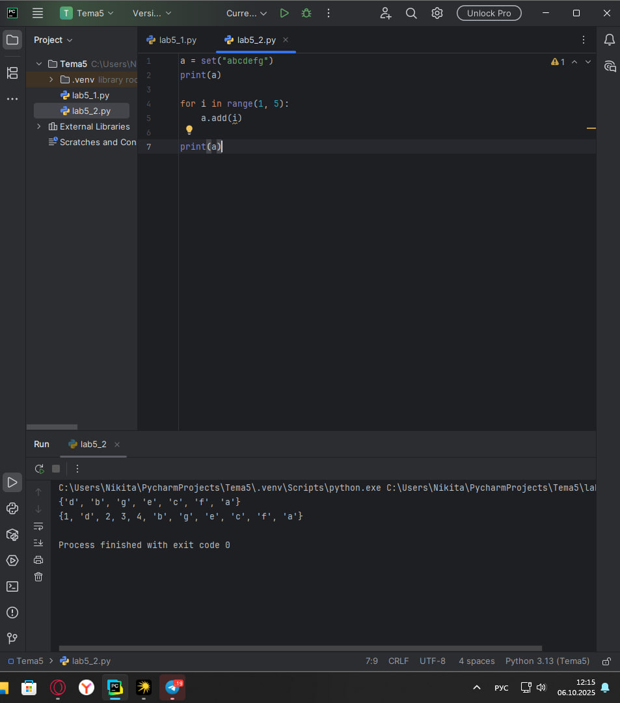

## Выводы
Сравнены изменяемые и неизменяемые множества, показаны различия в их поведении при попытке модификации.

## Лабораторная работа №3
### На вход в программу поступает список (минимальной длиной 2 символа). Напишите программу, которая будет менять первый и последний элемент списка.
```python
def replace(input_list):
    memory = input_list[0]
    input_list[0] = input_list[-1]
    input_list[-1] = memory

    return input_list

print(replace([1, 2, 3, 4, 5]))
```
### Результат.
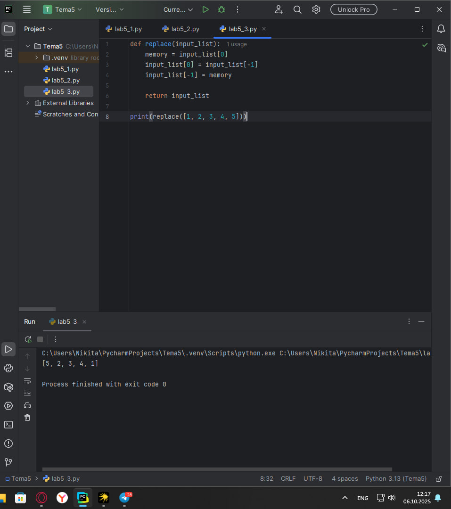

## Выводы
Реализована функция для обмена первого и последнего элементов списка через временную переменную.

## Лабораторная работа №4
### На вход в программу поступает список (минимальной длиной 10 символов). Напишите программу, которая выводит элементы с индексами от 2 до 6. В программе необходимо использовать "срез".
```python
a = [12, 54, 32, 57, 843, 2346, 765, 75, 25, 234, 756, 23]
print(a[2:6])
```
### Результат.
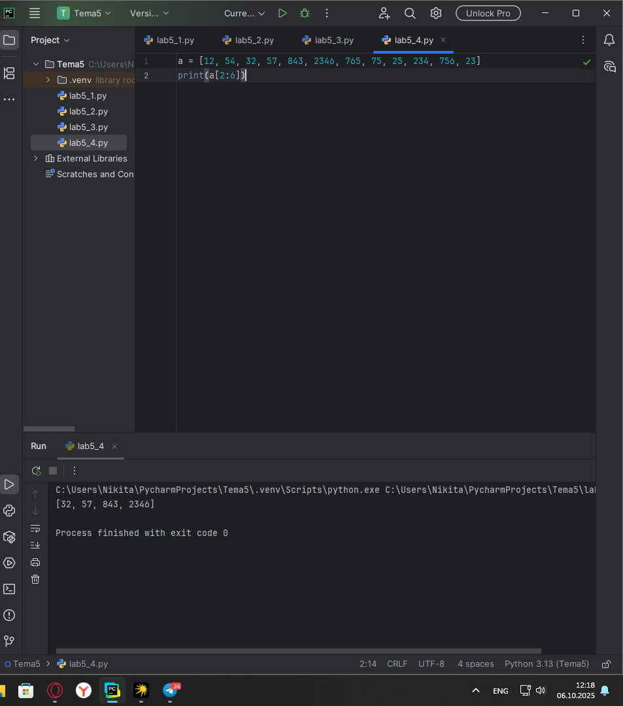

## Выводы
Использована операция среза для извлечения части списка по заданным индексам.

## Лабораторная работа №5
### Иван задумался о поиске "бесполезного" числа, полученного из списка. Суть поиска в следующем: он берет произвольный список чисел, находит самое большое из них, а затем делит его на длину списка. Студент пока не придумал, где может пригодиться подобное значение, но ищет у вас помощи в реализации такой функции useless().
```python
def useless(lst):
    return max(lst) / len(lst)


print(useless([3, 5, 7, 3, 33]))
print(useless([-12.5, 54, 77.3, 0, -36, 98.2, -63, 21.7, 47, -89.6]))
print(useless([-25.8, 86, 12.5, -56, 73.2, 0, 43, -91.5, 65.0, -7]))
```
### Результат.
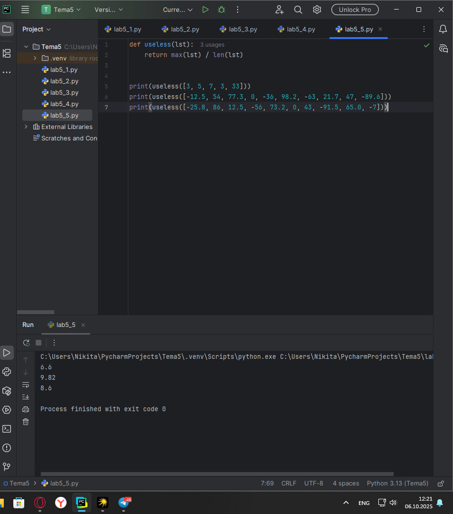

## Выводы
Создана функция для вычисления отношения максимального элемента списка к его длине.

## Лабораторная работа №6
### Ребята не могут определится каким супергероем они хотят стать. У них есть случайно составленный список супергероев, и вы должны определить кто из ребят будет каким супергероем. Необходимо использовать разделение списков.
```python
superheroes = ['superman', 'spiderman', 'batman']

nikolay, vasiliy, ivan = superheroes

print('Николай - ', nikolay)
print('Василий - ', vasiliy)
print('Иван - ', ivan)
```
### Результат.
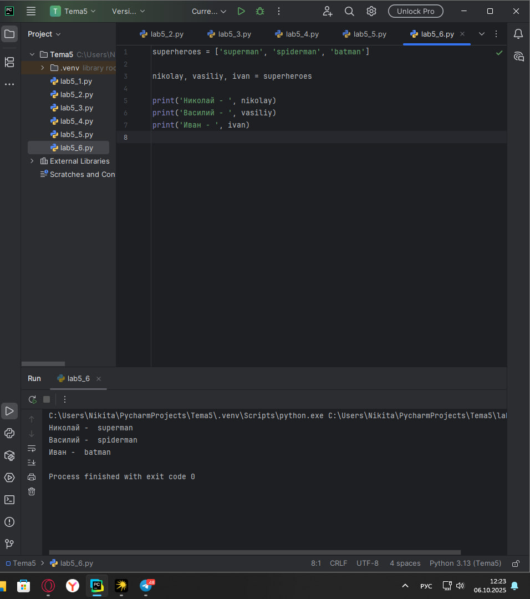

## Выводы
Продемонстрировано присваивание элементов списка отдельным переменным через распаковку.

## Лабораторная работа №7
### Вовочка, насмотревшись передачи "Слабое звено" решил написать программу, которая также будет находить самое слабое звено (минимальный элемент) и удалять его, только делать он это хочет не с людьми, а со списком. Помогите Вовочке с реализацией программы. Подсказка: для этого вам необходимо отсортировать список и удалить значение при помощи pop().
```python
a = [-25.8, 86, 12.5, -56, 73.2, 0, 43, -91.5, 65.0, -7]
a.sort()
print('Отсортированный список:\n', a)
a.pop(0)
print('Отсортированный список без наименьшего элемента:\n', a)
```
### Результат.
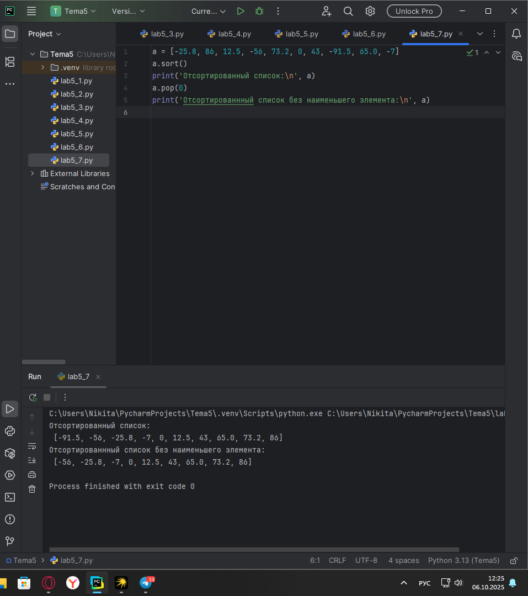

## Выводы
Реализовано удаление минимального элемента из списка после предварительной сортировки.

## Лабораторная работа №8
### Михаил решил создать большой n-мерный список, для этого он случайным образом создал несколько списков, состоящих минимум из 3, а максимум из 10 элементов и поместил их в один большой список. Он также как и Иван не знает зачем ему это сейчас нужно, но надеется на то, что это пригодится ему в будущем.
```python
from random import randint

def list_maker():
    a = [randint(1, 100)] * randint(3, 10)
    return a

if __name__ == '__main__':
    result = []
    for i in range(randint(1, 5)):
        result.append(list_maker())

    print(result)
```
### Результат.
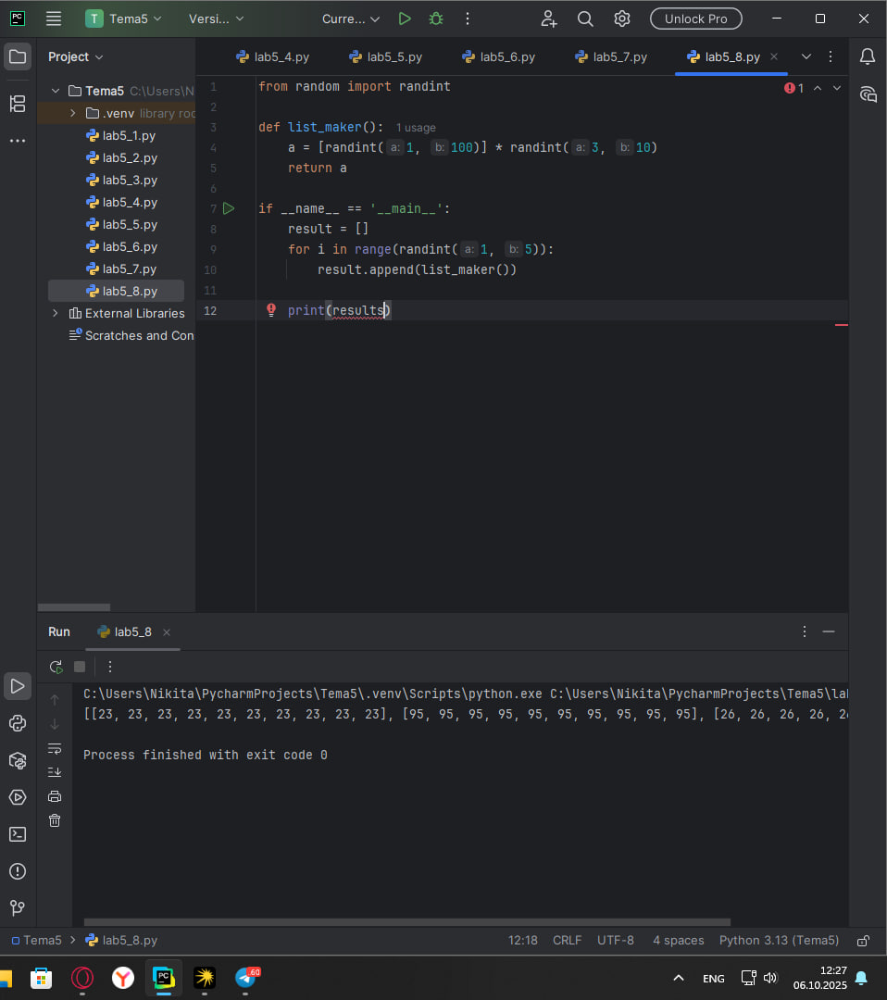

## Выводы
Создан вложенный список со случайным количеством элементов в каждом подсписке.

## Лабораторная работа №9
### Вы работаете в ресторане и отвечает за статистику покупок, ваша задача сравнить между собой заказы покупателей, которые указаны в разном порядке. Реализуйте функцию superset(), которая принимает 2 множества. Результат работы функции: вывод в консоль одного из сообщений в зависимости от ситуации:

1 - "Супермножество не обнаружено"

2 – "Объект {X} является чистым супермножеством"

3 – "Множества равны"
```python
def superset(set_1, set_2):
    if set_1 > set_2:
        print(f'Объект {set_1} является чистым супермножеством')
    elif set_1 == set_2:
        print('Множества равны')
    elif set_1 < set_2:
        print(f'Объект {set_2} является чистым супермножеством')
    else:
        print('Супермножество не обнаружено')

if __name__ == '__main__':
    superset({1, 8, 3, 5}, {3, 5})
    superset({1, 8, 3, 5}, {5, 3, 8, 1})
    superset({3, 5}, {5, 3, 8, 1})
    superset({90, 100}, {3, 5})

```
### Результат.
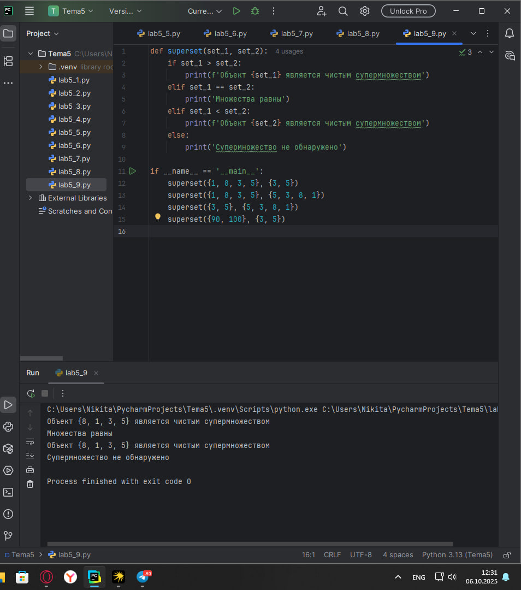

## Выводы
Реализована функция для сравнения множеств и определения отношений включения между ними.

## Лабораторная работа №10
### Предположим, что вам нужно разобрать стопку бумаг, но нужно начать работу с нижней, "переверните стопку". Вам дан произвольный список. Представьте его в обратном порядке. Программа должна занимать не более двух строк в редакторе кода.
```python
my_list = [2, 5, 8, 3]
print(my_list[::-1])
```
### Результат.
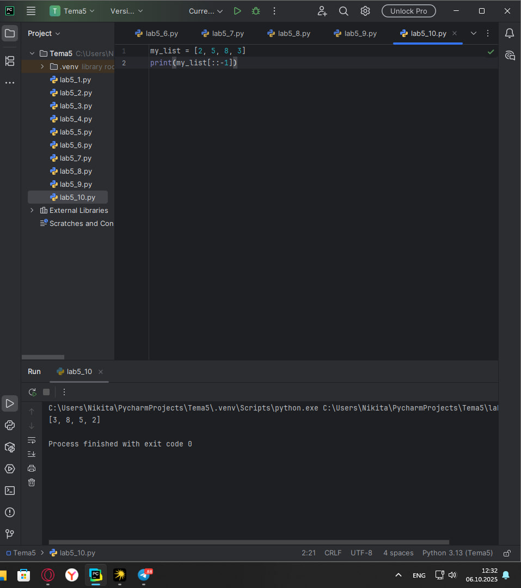

## Выводы
Использован срез с отрицательным шагом для реверсирования порядка элементов списка.

## Самостоятельная работа №1
### Ресторан на предприятии ведет учет посещений за неделю при помощи кода работника. У них есть список со всеми посещениями за неделю. Ваша задача почитать:
• Сколько было выдано чеков
• Сколько разных людей посетило ресторан  
• Какой работник посетил ресторан больше всех раз
```python
visits = [8734, 2345, 8201, 6621, 9999, 1234,
          5678, 8201, 8888, 4321, 3365, 1478,
          9865, 5555, 7777, 9998, 1111, 2222,
          3333, 4444, 5556, 6666, 5410, 7778,
          8889, 4445, 1439, 9604, 8201, 3365,
          7502, 3016, 4928, 5837, 8201, 2643,
          5017, 9682, 8530, 3250, 7193, 9051,
          4506, 1987, 3365, 5410, 7168, 7777,
          9865, 5678, 8201, 4445, 3016, 4506, 4506]

print("Было выдано чеков:", len(visits))

unique_visits = []
for code in visits:
    if code not in unique_visits:
        unique_visits.append(code)
print("Количество людей, посетивших ресторан:", len(unique_visits))

counter = {}
for code in visits:
    if code in counter:
        counter[code] += 1
    else:
        counter[code] = 1

max_visits = 0
frequent_visitor = None
for code, count in counter.items():
    if count > max_visits:
        max_visits = count
        frequent_visitor = code

print(f"Работник {frequent_visitor} посетил ресторан {max_visits} раз")
```
### Результат.
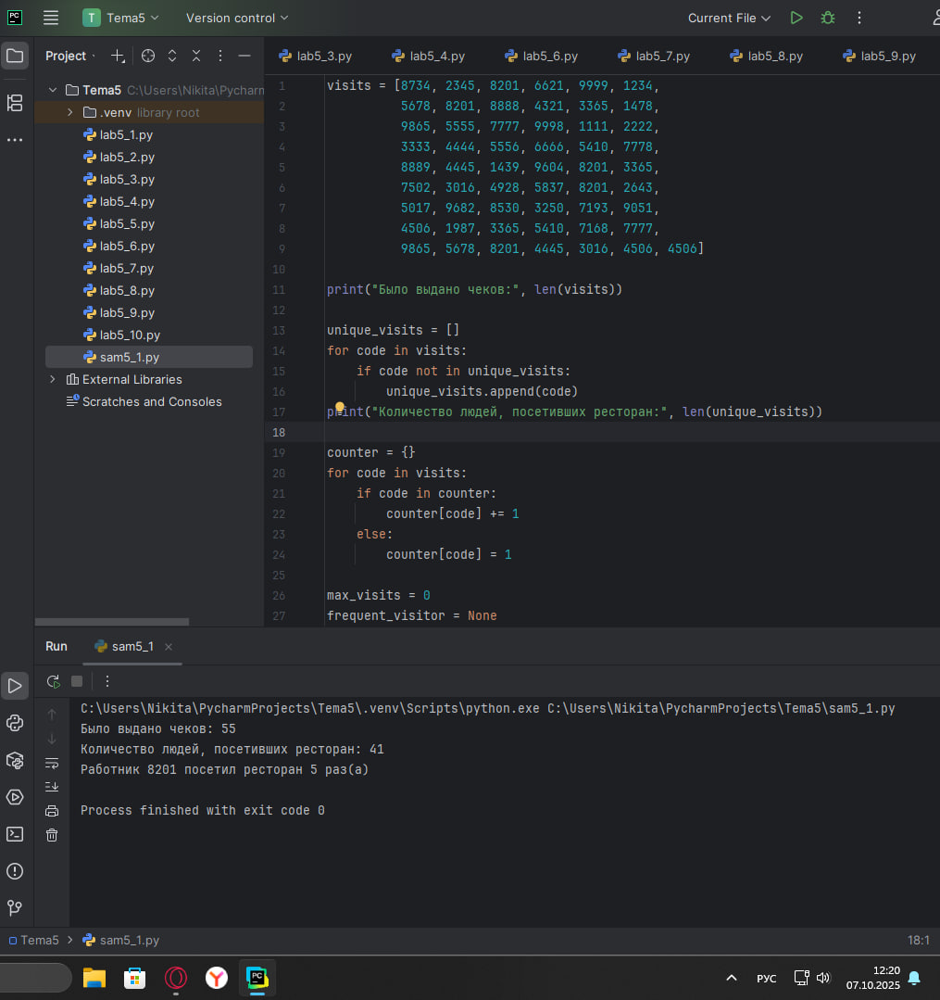

## Выводы
Проведен анализ данных о посещениях ресторана с использованием операций над списками и множествами.

## Самостоятельная работа №2
### На физкультуре студенты сдавали бег, у преподавателя физкультуры есть список всех результатов, ему нужно узнать
• Три лучшие результата
• Три худшие результата
• Все результаты начиная с 10 Ваша задача помочь ему в этом.
```python
results = [10.2, 14.8, 19.3, 22.7,
           12.5, 33.1, 38.9, 21.6,
           26.4, 17.1, 30.2, 35.7,
           16.9, 27.8, 24.5, 16.3,
           18.7, 31.9, 12.9, 37.4]

sorted_results = sorted(results)

print("Три лучших результата:", sorted_results[-3:])
print("Три худших результата:", sorted_results[:3])
print("Все элементы с 10:", results[9::])
```
### Результат.
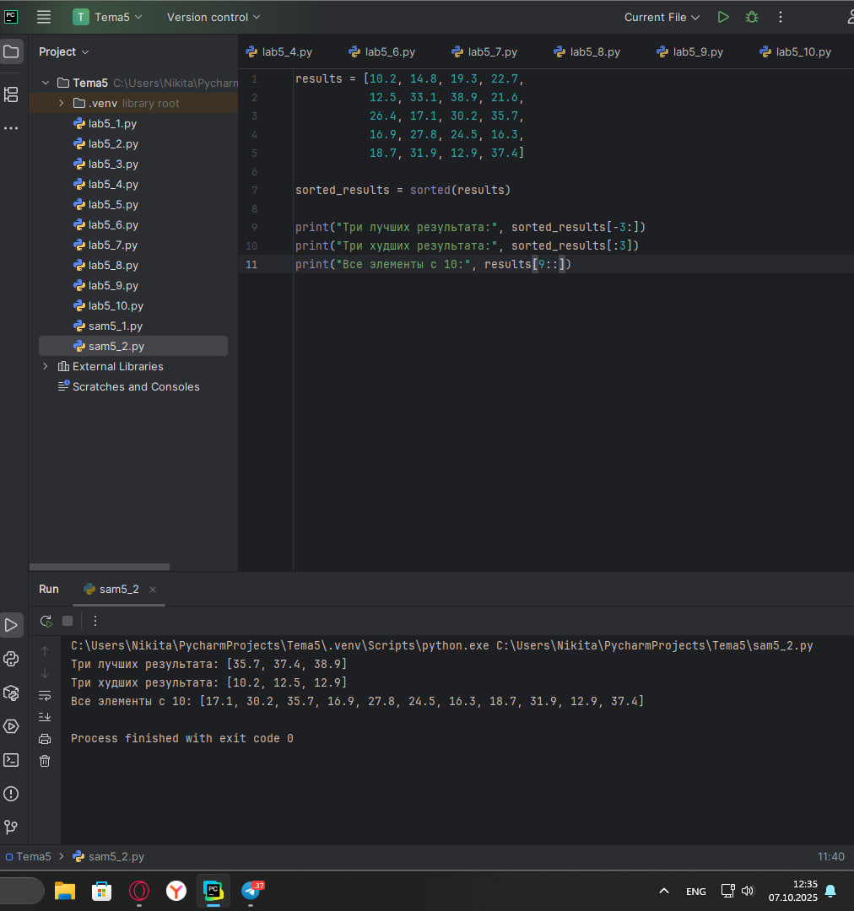

## Выводы
Выполнена сортировка результатов и выделение крайних значений через срезы

## Самостоятельная работа №3
### Преподаватель по математике придумал странную задачку. У вас есть три списка с элементами, каждый элемент которых – длина стороны треугольника, ваша задача найти площади двух треугольников, составленные из максимальных и минимальных элементов полученных списков. Результатом выполнения задачи будет: листинг кода, и вывод в консоль, в котором будут указаны два этих значения.
```python
import math

one = [12, 25, 3, 48, 71]
two = [5, 18, 40, 62, 98]
three = [4, 21, 37, 56, 84]

max_triangle = [max(one), max(two), max(three)]
min_triangle = [min(one), min(two), min(three)]

def triangle_area(a, b, c):
    p = (a + b + c) / 2
    area = math.sqrt(p * (p - a) * (p - b) * (p - c))
    return area

area_max = triangle_area(max_triangle[0], max_triangle[1], max_triangle[2])
area_min = triangle_area(min_triangle[0], min_triangle[1], min_triangle[2])

print("Треугольник из максимальных элементов:", max_triangle)
print("Площадь треугольника из максимальных элементов:", round(area_max, 2))

print("Треугольник из минимальных элементов:", min_triangle)
print("Площадь треугольника из минимальных элементов:", round(area_min, 2))
```
### Результат.
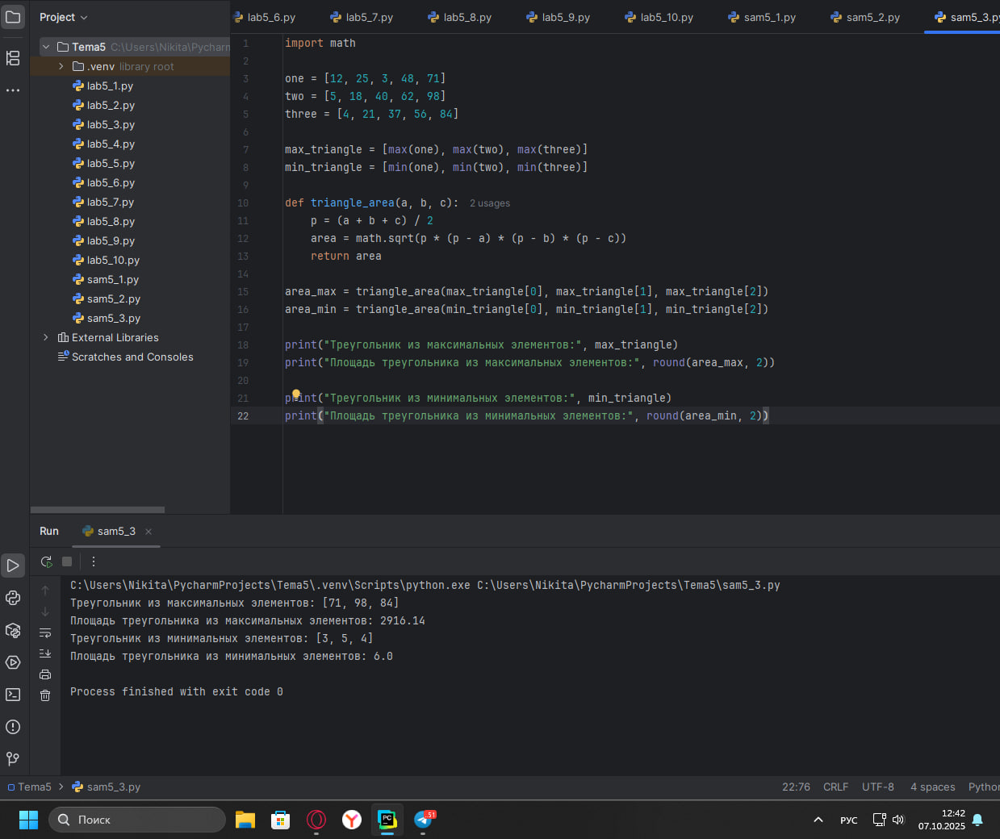

## Выводы
Реализован расчет площадей треугольников по формуле Герона для комбинаций минимальных и максимальных сторон.

## Самостоятельная работа №4
### Никто не любит получать плохие оценки, поэтому Борис решил это исправить. Допустим, что все оценки студента за семестр хранятся в одном списке. Ваша задача удалить из этого списка все двойки, а все тройки заменить на четверки.
```python
list1 = [2, 3, 4, 5, 3, 4, 5, 2, 2, 5, 3, 4, 3, 5, 4]
list2 = [4, 2, 3, 5, 3, 5, 4, 2, 2, 5, 4, 3, 5, 3, 4]
list3 = [5, 4, 3, 3, 4, 3, 3, 5, 5, 3, 3, 3, 3, 4, 4]

marks_without2 = []
for mark in list3:
    if mark != 2:
        marks_without2.append(mark)

for i in range(len(marks_without2)):
    if marks_without2[i] == 3:
        marks_without2[i] = 4

print("Оригинальный список:\n", list3)
print("Список, где нет двоек и 3-ки заменены на 4-ки:\n", marks_without2)


```
### Результат.
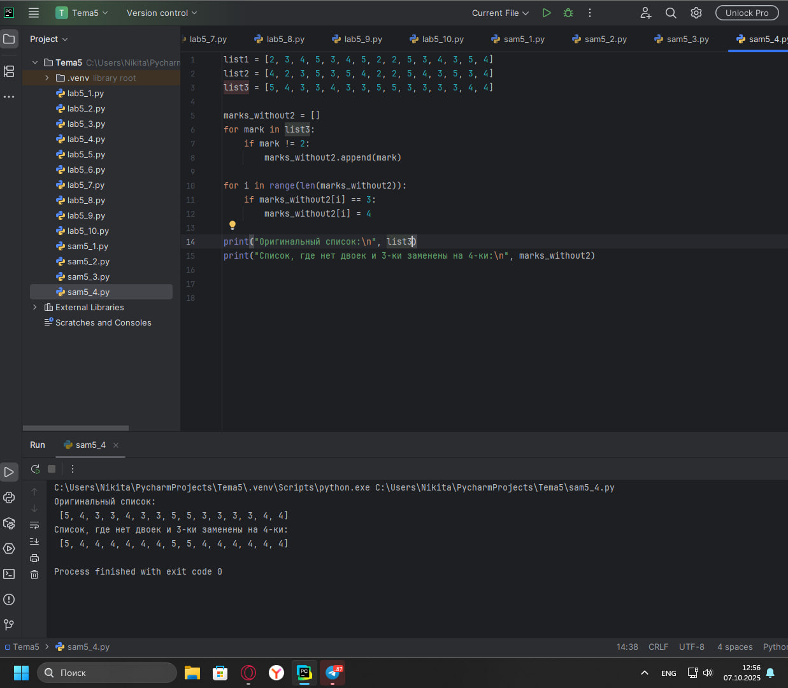

## Выводы
Выполнена обработка учебных оценок с удалением и заменой элементов по заданным условиям.

## Самостоятельная работа №5
### Вам предоставлены списки натуральных чисел, из них необходимо сформировать множества. При этом следует соблюдать это правило: если какое-либо число повторяется, то преобразовать его в строку по следующему образцу: например, если число 4 повторяется 3 раза, то в множестве будет следующая запись: само число 4, строка "44", строка "444".
```python
list_1 = [1, 1, 3, 3, 1]
list_2 = [5, 5, 5, 5, 5, 5, 5]
list_3 = [2, 2, 1, 2, 2, 5, 6, 7, 1, 3, 2, 2]

def create_special_set(lst):
    result_set = set()

    for num in set(lst):
        count = lst.count(num)
        result_set.add(num)
        for repeat_count in range(2, count + 1):
            result_set.add(str(num) * repeat_count)

    return result_set

set_1 = create_special_set(list_1)
set_2 = create_special_set(list_2)
set_3 = create_special_set(list_3)

print("Множество 1:", set_1)
print("Множество 2:", set_2)
print("Множество 3:", set_3)
```
### Результат.
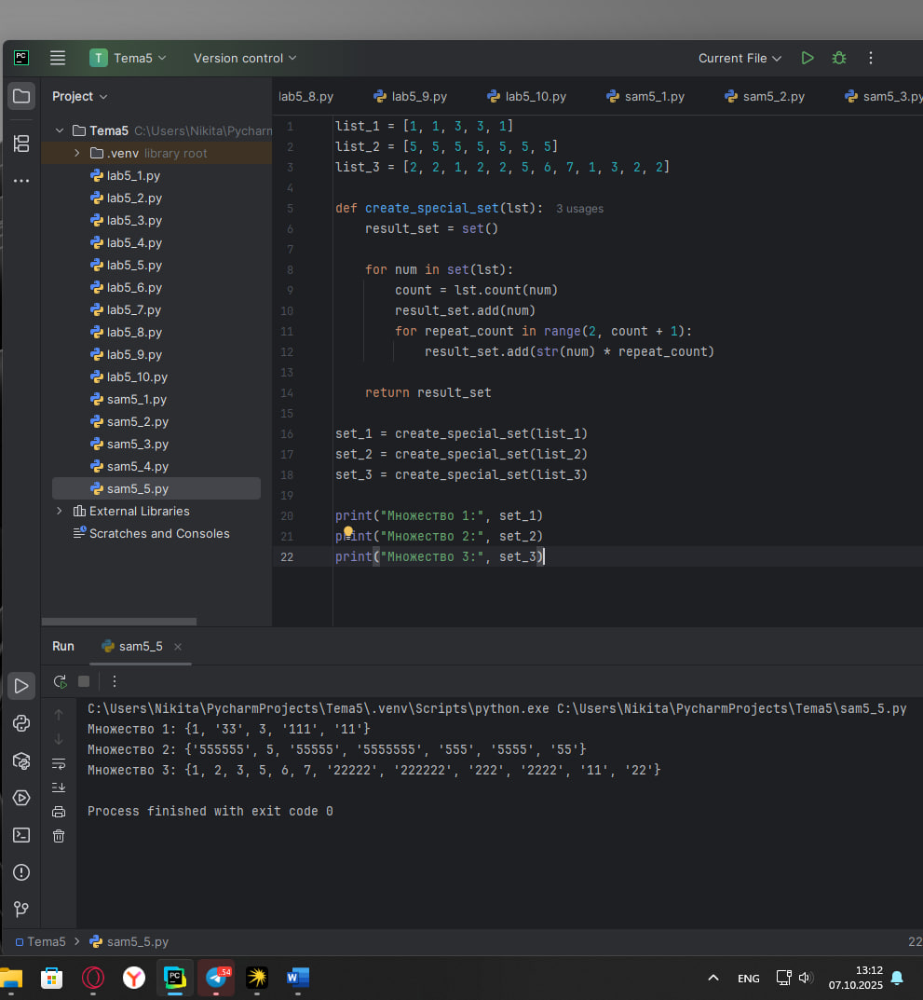

## Выводы
Созданы множества с преобразованием повторяющихся чисел в строковые представления различной длины.

## Общие выводы по теме
Освоены основные операции работы со списками и множествами в Python. Приобретены навыки сортировки, фильтрации, срезов и модификации коллекций. Изучены методы обработки данных для решения практических задач анализа и преобразования информации.