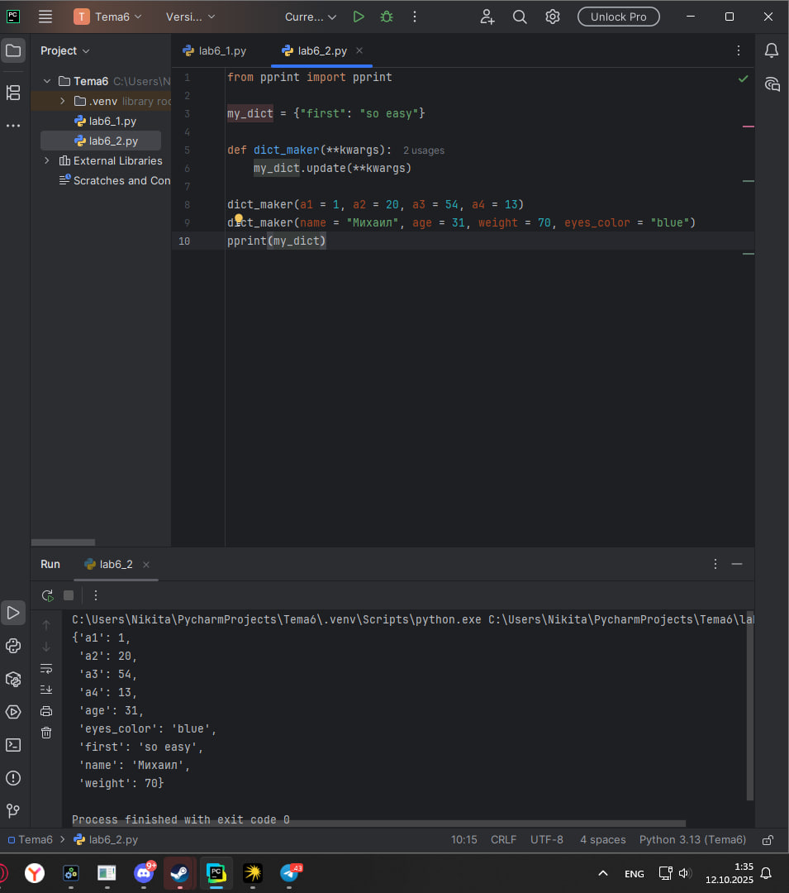
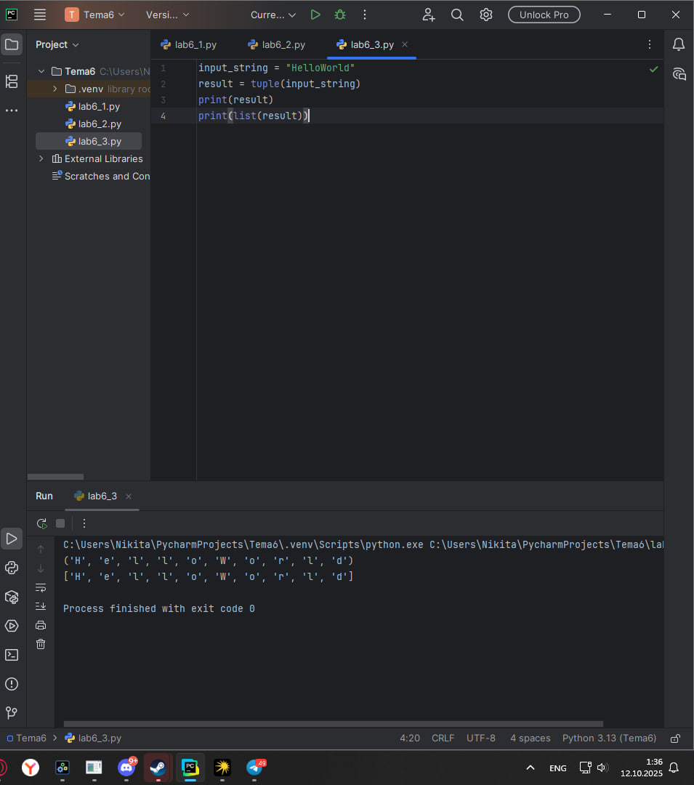
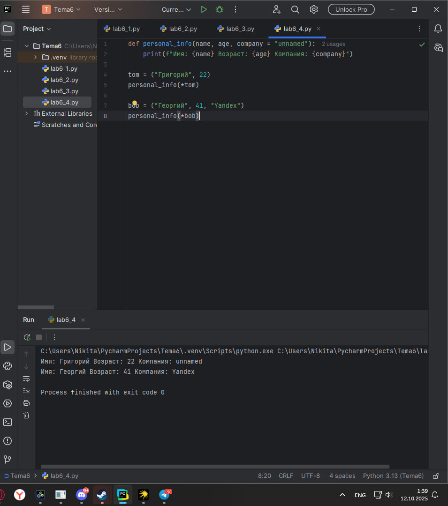
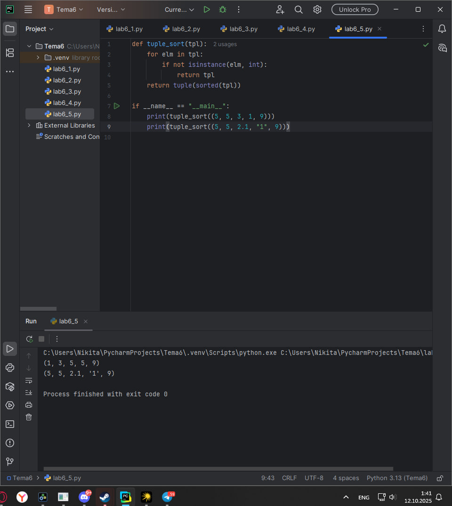
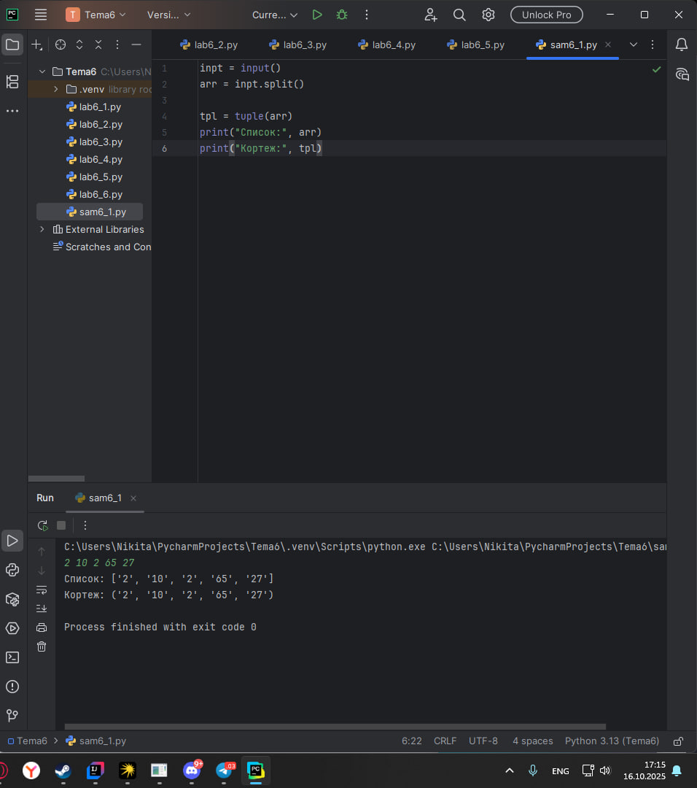
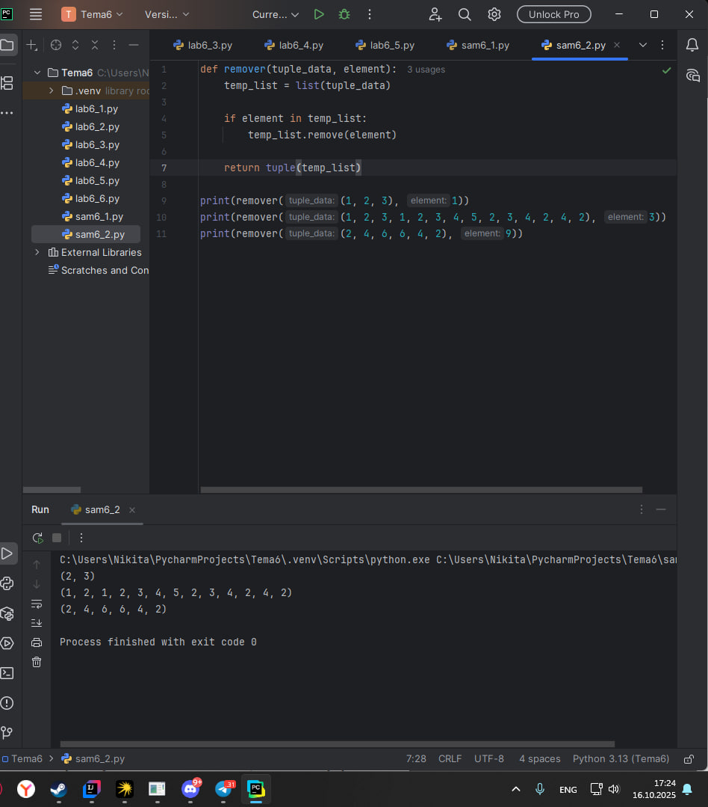
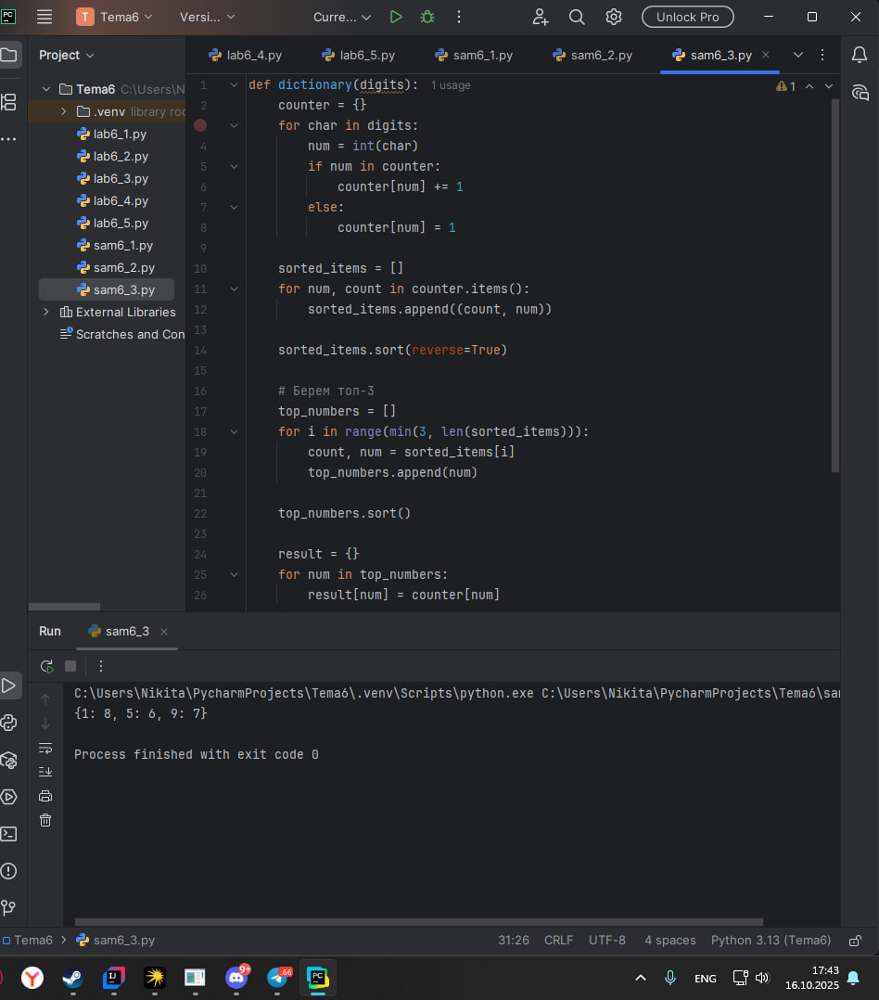
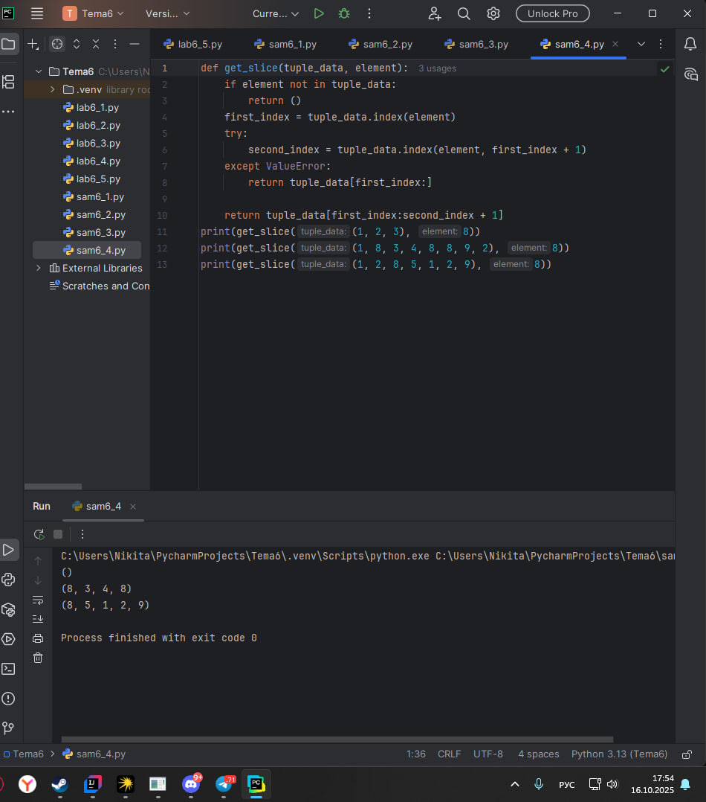
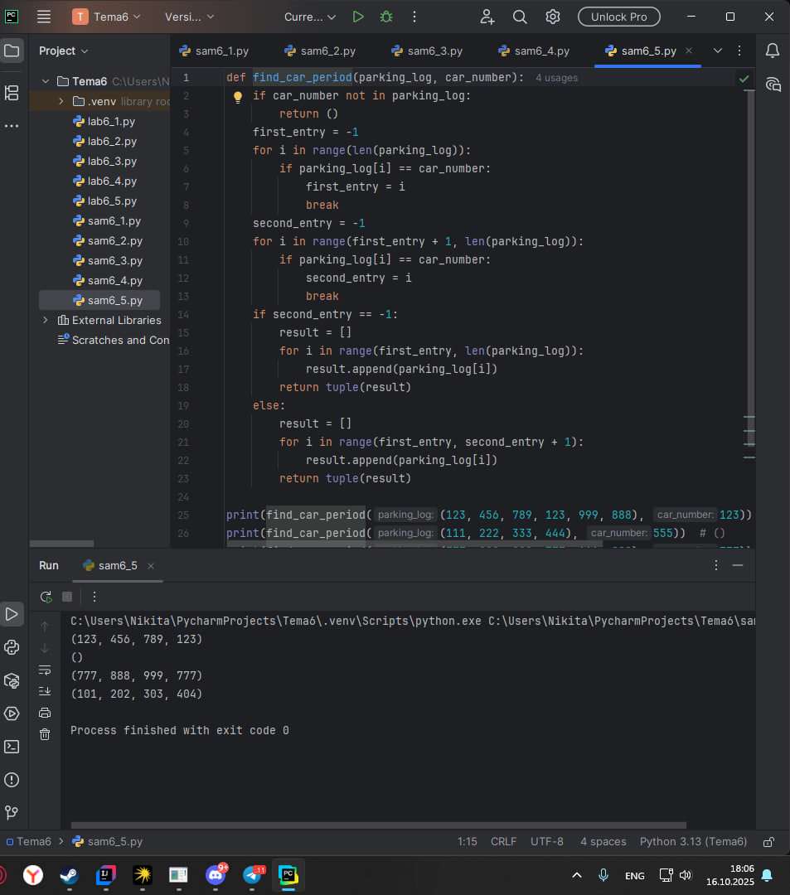

# Тема 6. Базовые коллекции: словари, кортежи
Отчет по Теме #6 выполнил(а):
- Пономарев Никита Сергеевич
- ИВТ-23-2

| Задание | Лаб_раб | Сам_раб |
| ------ | ------ | ------ |
| Задание 1 | + | + |
| Задание 2 | + | + |
| Задание 3 | + | + |
| Задание 4 | + | + |
| Задание 5 | + | + |

знак "+" - задание выполнено; знак "-" - задание не выполнено;

Работу проверили:
- к.э.н., доцент Панов М.А.

## Лабораторная работа №1
### В школе, где вы учились, узнали, что вы крутой программист и попросили написать программу для учителей, которая будет при вводе кабинета писать для него ключ доступа и статус, занят кабинет или нет. При написании программы необходимо использовать словарь (dict), который на вход получает номер кабинета, а выводит необходимую информацию. Если кабинета, который вы ввели нет в словаре, то в консоль в виде значения ключа нужно вывести "None" и виде статуса вывести "False".
```python
request = int(input("Введите номер кабинета: "))

dictionary = {
    101: {"key": 1234, "access": True},
    102: {"key": 1337, "access": True},
    103: {"key": 8943, "access": True},
    104: {"key": 5555, "access": False},
    None: {"key": None, "access": False}
}

response = dictionary.get(request)
if not response:
    response = dictionary[None]
key = response.get("key")
access = response.get("access")
print(key, access)
```
### Результат.


## Выводы
Реализована система управления доступом к кабинетам с использованием словаря для хранения информации.

## Лабораторная работа №2
### Алексей решил создать самый большой словарь в мире. Для этого он придумал функцию dict_maker (**kwargs), которая принимает неограниченное количество параметров «ключ: значение» и обновляет созданный им словарь my_dict, состоящий всего из одного элемента «first» со значением «so easy». Помогите Алексею создать данную функцию.
```python
from pprint import pprint

my_dict = {"first": "so easy"}

def dict_maker(**kwargs):
    my_dict.update(**kwargs)

dict_maker(a1 = 1, a2 = 20, a3 = 54, a4 = 13)
dict_maker(name = "Михаил", age = 31, weight = 70, eyes_color = "blue")
pprint(my_dict)
```
### Результат.


## Выводы
Создана функция для динамического расширения словаря с использованием параметров **kwargs.

## Лабораторная работа №3
### Для решения некоторых задач бывает необходимо разложить строку на отдельные символы. Мы знаем что это можно сделать при помощи split(), у которого более гибкая настройка для разделения для этого, но если нам нужно посимвольно разделить строку без всяких условий, то для этого мы можем использовать кортежи (tuple). Для этого напишем любую строку, которую будем делить и "обвернем" ее в tuple и дальше мы можем как нам угодно с ней работать, например, сделать ее списком (тогда получится полный аналог split()) или же работать с ним дальше, как с кортежем.
```python
input_string = "HelloWorld"
result = tuple(input_string)
print(result)
print(list(result))
```
### Результат.


## Выводы
Продемонстрировано преобразование строки в кортеж символов и последующая конвертация в список.

## Лабораторная работа №4
### Вовочка решил написать крутую функцию, которая будет писать имя, возраст и место работы, но при этом на вход этой функции будет поступать кортеж. Помогите Вовочке написать эту программу.
```python
def personal_info(name, age, company = "unnamed"):
    print(f"Имя: {name} Возраст: {age} Компания: {company}")

tom = ("Григорий", 22)
personal_info(*tom)

bob = ("Георгий", 41, "Yandex")
personal_info(*bob)
```
### Результат.


## Выводы
Реализована функция с распаковкой кортежа для форматированного вывода информации о пользователе.

## Лабораторная работа №5
### Для сопровождения первых лиц государства X нужен кортеж, но никто не может определиться с порядком машин, поэтому вам нужно написать функцию, которая будет сортировать кортеж, состоящий из целых чисел по возрастанию, и возвращает его. Если хотя бы один элемент не является целым числом, то функция возвращает исходный кортеж.
```python
def tuple_sort(tpl):
    for elm in tpl:
        if not isinstance(elm, int):
            return tpl
    return tuple(sorted(tpl))

if __name__ == "__main__":
    print(tuple_sort((5, 5, 3, 1, 9)))
    print(tuple_sort((5, 5, 2.1, "1", 9)))

```
### Результат.


## Выводы
Создана функция для условной сортировки кортежа с проверкой типов элементов.

## Самостоятельная работа №1
### При создании сайта у вас возникла потребность обрабатывать данные пользователя в странной форме, а потом переводить их в нужные вам форматы. Вы хотите принимать от пользователя последовательность чисел, разделенных пробелом, а после переформатировать эти данные в список и кортеж. Реализуйте вашу задумку. Для получения начальных данных используйте input(). Результатом программы будет выведенный список и кортеж из начальных данных.
```python
inpt = input()
arr = inpt.split()

tpl = tuple(arr)
print("Список:", arr)
print("Кортеж:", tpl)
```
### Результат.


## Выводы
Реализовано преобразование пользовательского ввода в различные типы коллекций.

## Самостоятельная работа №2
### Николай знает, что кортежи являются неизменяемыми, но он очень упрямый и всегда хочет доказать, что он прав. Студент решил создать функцию, которая будет удалять первое появление определенного элемента из кортежа по значению и возвращать кортеж без него. Попробуйте повторить шедевр не признающего авторитеты начинающего программиста. Но учтите, что Николай не всегда уверен в наличии элемента в кортеже (в этом случае кортеж вернется функцией в исходном виде).
```python
def remover(tuple_data, element):
    temp_list = list(tuple_data)

    if element in temp_list:
        temp_list.remove(element)

    return tuple(temp_list)

print(remover((1, 2, 3), 1))
print(remover((1, 2, 3, 1, 2, 3, 4, 5, 2, 3, 4, 2, 4, 2), 3))
print(remover((2, 4, 6, 6, 4, 2), 9))
```
### Результат.


## Выводы
Создана функция для удаления элементов через преобразование в список.

## Самостоятельная работа №3
### Ребята поспорили кто из них одним нажатием на numpad наберет больше повторяющихся цифр, но не понимают, как узнать победителя. Вам им нужно в этом помочь. Дана строка в виде случайной последовательности чисел от 0 до 9 (длина строки минимум 15 символов). Требуется создать словарь, который в качестве ключей будет принимать данные числа (т. е. ключи будут типом int), а в качестве значений – количество этих чисел в имеющейся последовательности. Для построения словаря создайте функцию, принимающую строку из цифр. Функция должна возвратить словарь из 3-х самых часто встречаемых чисел, также эти значения нужно вывести в порядке возрастания ключа.
```python
def dictionary(digits):
    counter = {}
    for char in digits:
        num = int(char)
        if num in counter:
            counter[num] += 1
        else:
            counter[num] = 1
    sorted_items = []
    for num, count in counter.items():
        sorted_items.append((count, num))
    sorted_items.sort(reverse=True)

    top_numbers = []
    for i in range(min(3, len(sorted_items))):
        count, num = sorted_items[i]
        top_numbers.append(num)
    top_numbers.sort()
    result = {}
    for num in top_numbers:
        result[num] = counter[num]
    return result
digits = "1111111122233344455555566778889999999000"
print(dictionary(digits))
```
### Результат.


## Выводы
Реализован частотный анализ цифр с сортировкой результатов по критериям встречаемости.

## Самостоятельная работа №4
### Ваш хороший друг владеет офисом со входом по электронным картам, ему нужно чтобы вы написали программу, которая показывала в каком порядке сотрудники входили и выходили из офиса. Определение сотрудника происходит по id. Напишите функцию, которая на вход принимает кортеж и случайный элемент (id), его можно придумать самостоятельно. Требуется вернуть новый кортеж, начинающийся с первого появления элемента в нем и заканчивающийся вторым его появлением включительно. Если элемента нет вовсе – вернуть пустой кортеж. Если элемент встречается только один раз, то вернуть кортеж, который начинается с него и идет до конца исходного.
```python
def get_slice(tuple_data, element):
    if element not in tuple_data:
        return ()
    first_index = tuple_data.index(element)
    try:
        second_index = tuple_data.index(element, first_index + 1)
    except ValueError:
        return tuple_data[first_index:]

    return tuple_data[first_index:second_index + 1]
print(get_slice((1, 2, 3), 8))
print(get_slice((1, 8, 3, 4, 8, 8, 9, 2), 8))
print(get_slice((1, 2, 8, 5, 1, 2, 9), 8))
```
### Результат.


## Выводы
Разработана функция для извлечения сегментов кортежа между первым и вторым вхождением элемента.

## Самостоятельная работа №5
### Создайте функцию для анализа журнала парковки автомобилей. Функция должна принимать кортеж с номерами автомобилей и конкретный номер для поиска. Требуется найти период пребывания автомобиля на парковке: если автомобиль заезжал дважды - вернуть кортеж от первого до второго включительно, если один раз - от первого вхождения до конца, если автомобиля нет - пустой кортеж.
```python
def find_car_period(parking_log, car_number):
    if car_number not in parking_log:
        return ()
    first_entry = -1
    for i in range(len(parking_log)):
        if parking_log[i] == car_number:
            first_entry = i
            break
    second_entry = -1
    for i in range(first_entry + 1, len(parking_log)):
        if parking_log[i] == car_number:
            second_entry = i
            break
    if second_entry == -1:
        result = []
        for i in range(first_entry, len(parking_log)):
            result.append(parking_log[i])
        return tuple(result)
    else:
        result = []
        for i in range(first_entry, second_entry + 1):
            result.append(parking_log[i])
        return tuple(result)

print(find_car_period((123, 456, 789, 123, 999, 888), 123))  # (123, 456, 789, 123)
print(find_car_period((111, 222, 333, 444), 555))  # ()
print(find_car_period((777, 888, 999, 777, 111, 222), 777))  # (777, 888, 999, 777)
print(find_car_period((101, 202, 303, 404), 101))  # (101, 202, 303, 404)
```
### Результат.


## Выводы
Реализована функция для анализа временных интервалов пребывания автомобилей на парковке на основе журнала заездов.

## Общие выводы по теме
Освоены принципы работы со словарями и кортежами в Python. Приобретены навыки создания, модификации и анализа этих структур данных. Изучены методы решения практических задач с использованием различных операций над коллекциями.