# Тема 7. Работа с файлами (ввод, вывод)
Отчет по Теме #7 выполнил(а):
- Пономарев Никита Сергеевич
- ИВТ-23-2

| Задание | Лаб_раб | Сам_раб |
| ------ | ------ | ------ |
| Задание 1 | + | + |
| Задание 2 | + | + |
| Задание 3 | + | + |
| Задание 4 | + | + |
| Задание 5 | + | + |
| Задание 6 | + |  |
| Задание 7 | + |  |
| Задание 8 | + |  |
| Задание 9 | + |  |
| Задание 10 | + |  |

знак "+" - задание выполнено; знак "-" - задание не выполнено;

Работу проверили:
- к.э.н., доцент Панов М.А.

## Лабораторная работа №1
### Составьте текстовый файл и положите его в одну директорию с программой на Python. Текстовый файл должен состоять минимум из двух строк.

### Результат.


## Выводы
Создан текстовый файл для последующей работы с файловыми операциями.

## Лабораторная работа №2
### Напишите программу, которая выведет только первую строку из вашего файла, при этом используйте конструкцию open()/close().
```python
f = open('input.txt', 'r')
print(f.readline())
f.close()
```
### Результат.
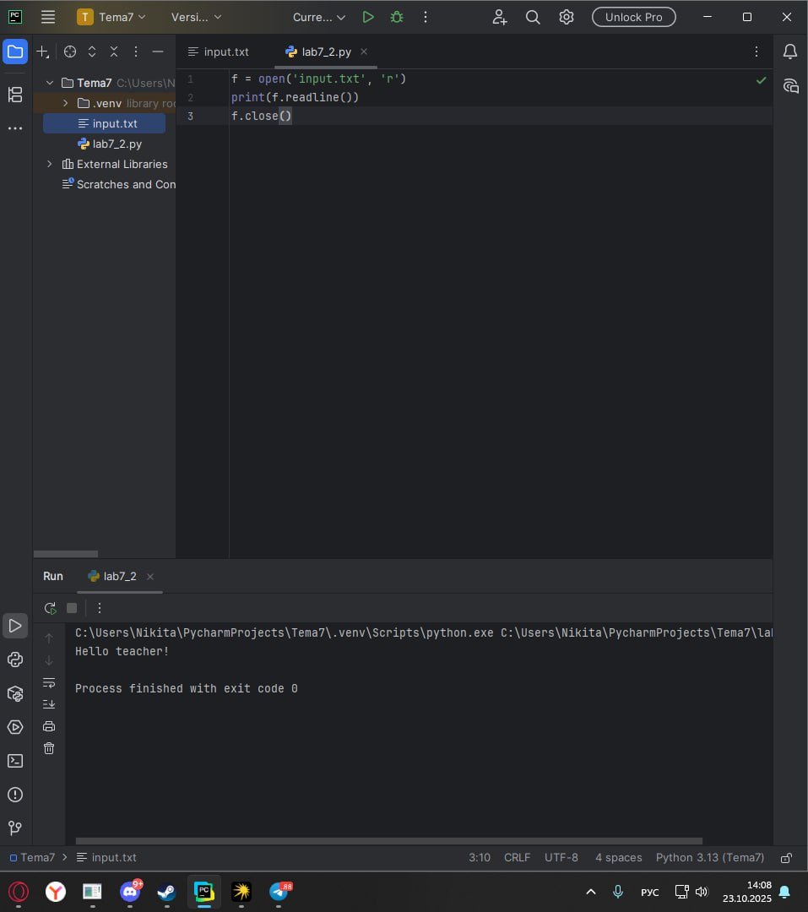

## Выводы
Применен классический подход к чтению файлов с явным открытием и закрытием файлового дескриптора.

## Лабораторная работа №3
### Напишите программу, которая выведет все строки из вашего файла в массиве, при этом используйте конструкцию open()/close().
```python
f = open('input.txt', 'r')
print(f.readlines())
f.close()
```
### Результат.
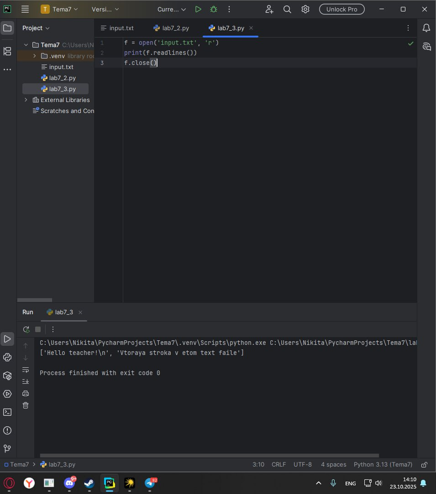

## Выводы
Использован метод readlines() для получения содержимого файла в виде списка строк.

## Лабораторная работа №4
### Напишите программу, которая выведет все строки из вашего файла в массиве, при этом используйте конструкцию with open().
```python
with open('input.txt') as f:
    print(f.readlines())
```
### Результат.
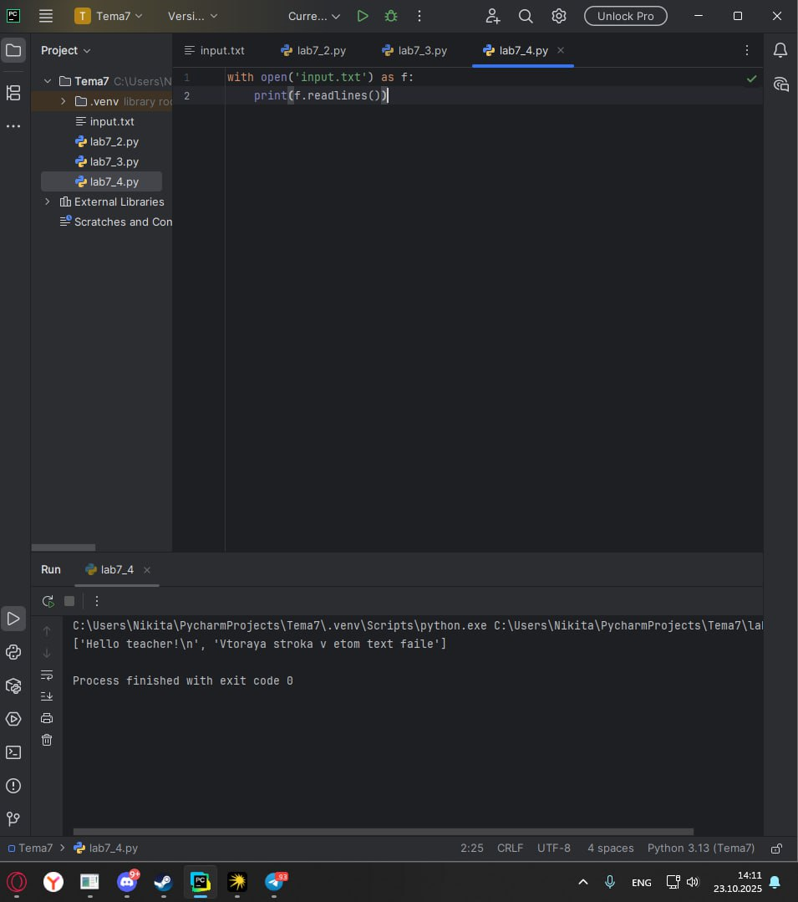

## Выводы
Продемонстрирована работа с файлами через контекстный менеджер, обеспечивающий автоматическое закрытие.

## Лабораторная работа №5
### Напишите программу, которая выведет каждую строку из вашего файла отдельно, при этом используйте конструкцию with open().
```python
with open('input.txt') as f:
    for line in f:
        print(line)
```
### Результат.
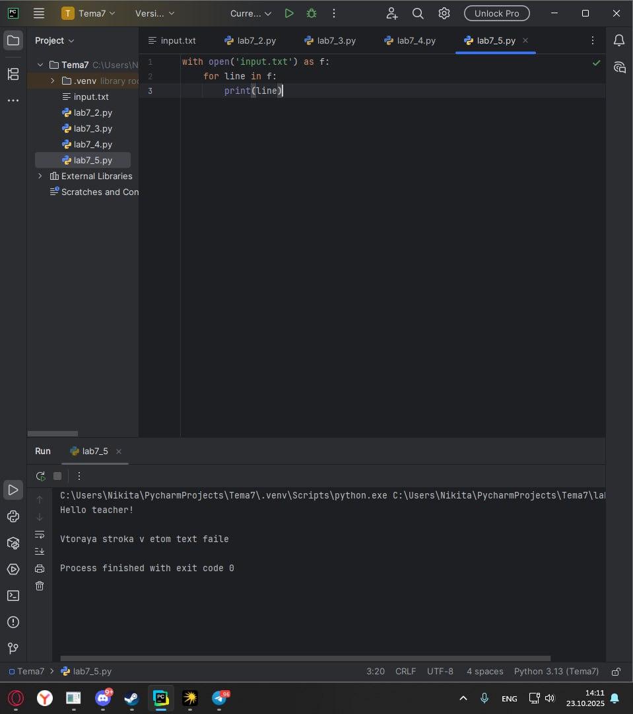

## Выводы
Реализовано построчное чтение файла с использованием итерации по файловому объекту.

## Лабораторная работа №6
### Напишите программу, которая будет добавлять новую строку в ваш файл, а потом выведет полученный файл в консоль. Вывод можно осуществлять любым способом. Обязательно проверьте сам файл, чтобы изменения в нем тоже отображались.
```python
with open('input.txt', 'a+') as f:
    f.write('\nIm additional line')

with open('input.txt', 'r') as f:
    result = f.readlines()
    print(result)
```
### Результат.
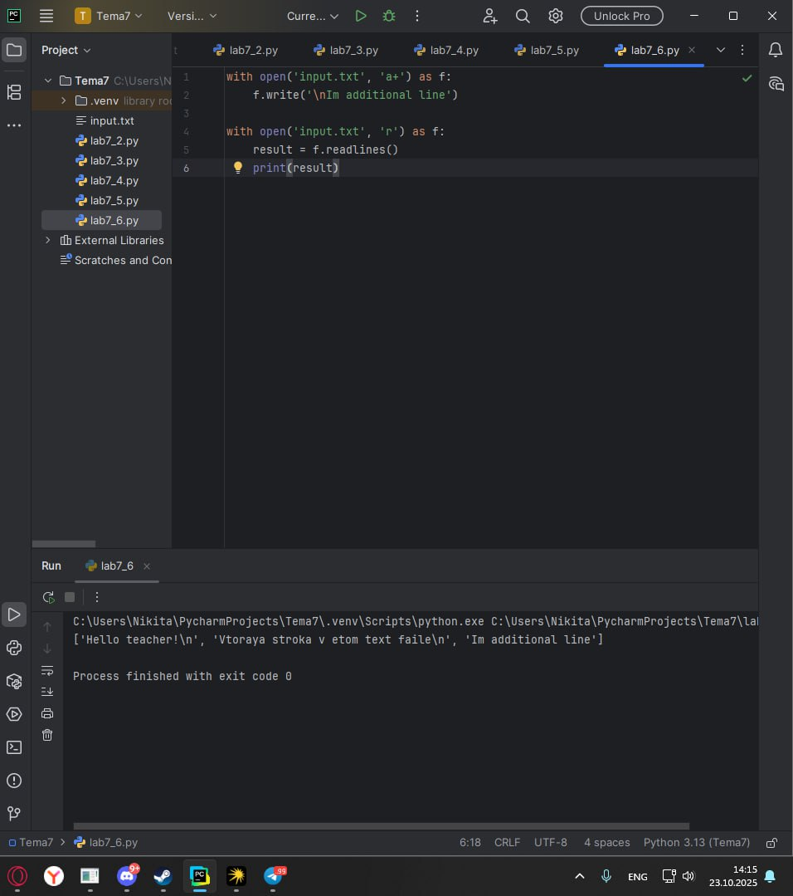

## Выводы
Освоен режим добавления данных в файл с последующей проверкой сохраненных изменений.

## Лабораторная работа №7
### Напишите программу, которая перепишет всю информацию, которая была у вас в файле до этого, например напишет любые данные из произвольно вами составленного списка. Также не забудьте проверить что измененная вами информация сохранилась в файле.
```python
lines = ['one', 'two', 'three']
with open('input.txt', 'w') as f:
    for line in lines:
        f.write('\nCycle run ' + line)
    print('Done!')
```
### Результат.
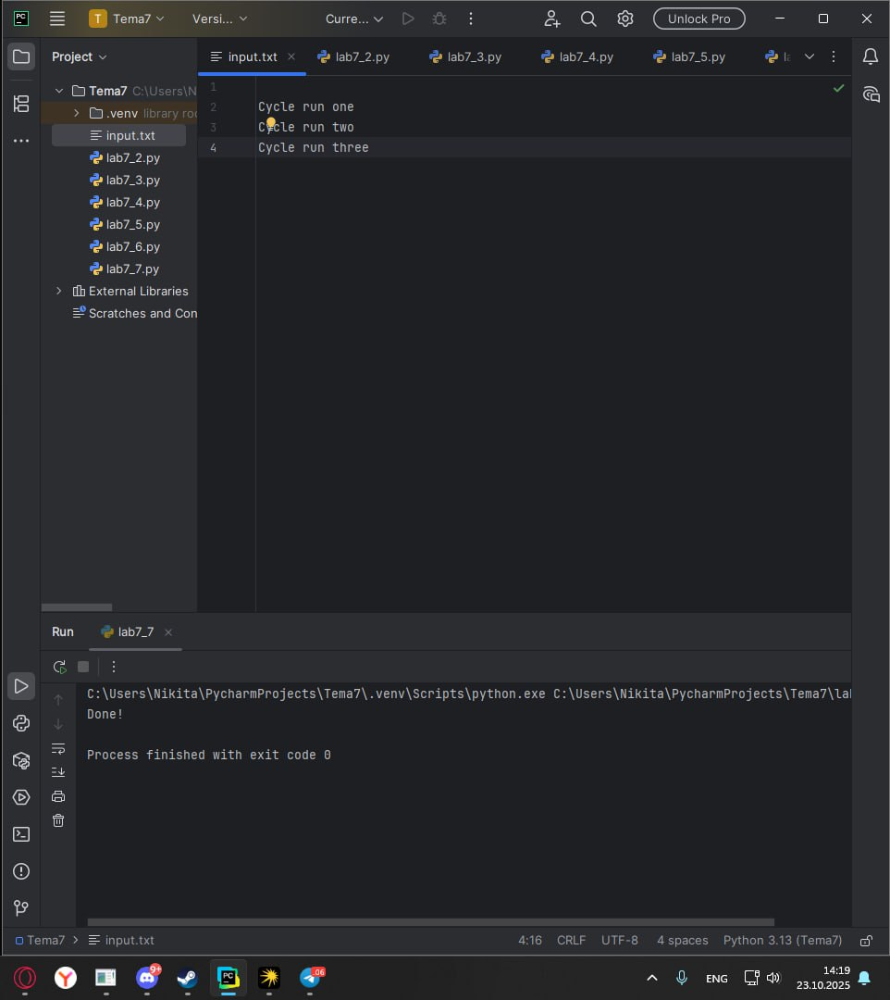

## Выводы
Продемонстрирована полная перезапись файлового содержимого с использованием режима 'w'.

## Лабораторная работа №8
### Выберите любую папку на своем компьютере, имеющую вложенные директории. Выведите на печать в терминал ее содержимое, как и всех подкаталогов при помощи функции print_docs(directory).
```python
import os

def print_docs(directory):
    all_files = os.walk(directory)
    for catalog in all_files:
        print(f'Папка {catalog[0]} содержит:')
    print(f'Директория: {", ".join([folder for folder in catalog[1]])}')
    print(f'Файлы: {", ".join([file for file in catalog[2]])}')
    print('-' * 40)

print_docs('F:/discord_obhod')
```
### Результат.
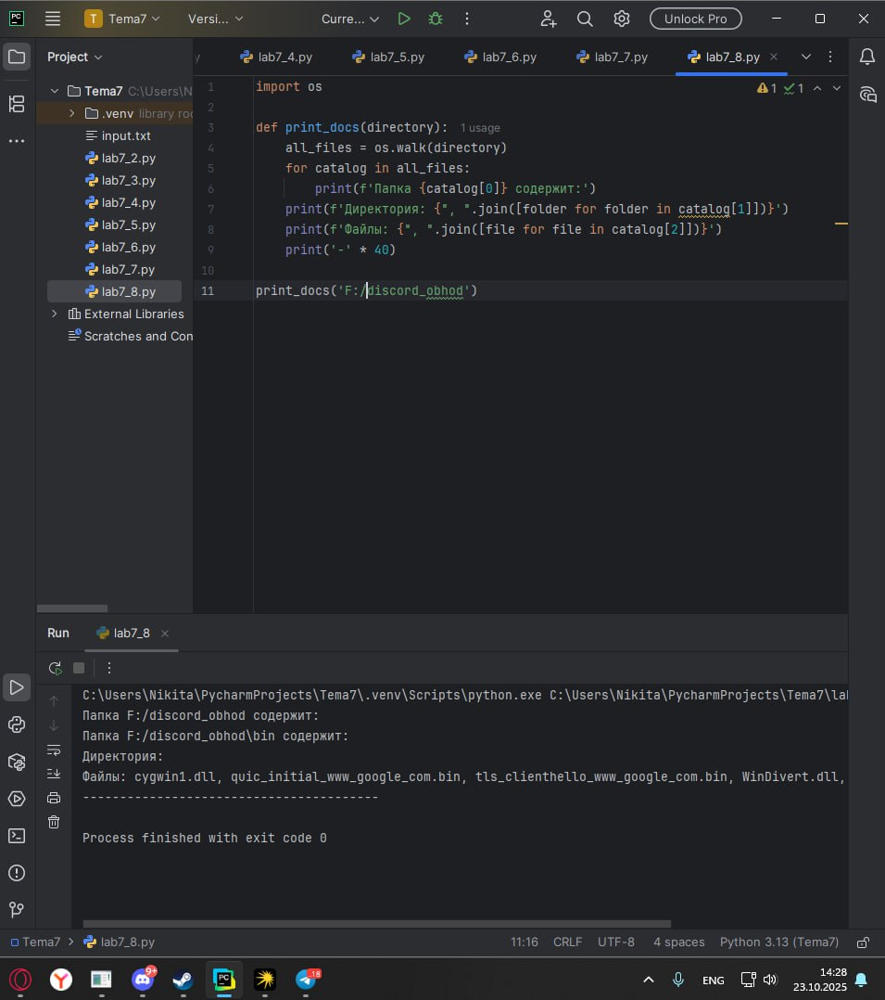

## Выводы
Использована функция os.walk() для рекурсивного обхода структуры директорий и файлов.

## Лабораторная работа №9
### Документ «input.txt» содержит следующий текст:

Приветствие

Спасибо

Извините

Пожалуйста

До свидания

Ты готов?

Как дела?

С днем рождения!

Удача!

Я тебя люблю.

Требуется реализовать функцию, которая выводит слово, имеющее максимальную длину (или список слов, если таковых несколько).
```python
def longest_words(file):
    with open(file, encoding = 'utf-8') as f:
        words = f.read().split()
        max_length = len(max(words, key = len))
        for word in words:
            if len(word) == max_length:
                sought_words = word

        if len(sought_words) == 1:
            return sought_words[0]
        return sought_words

print(longest_words('input.txt'))
```
### Результат.
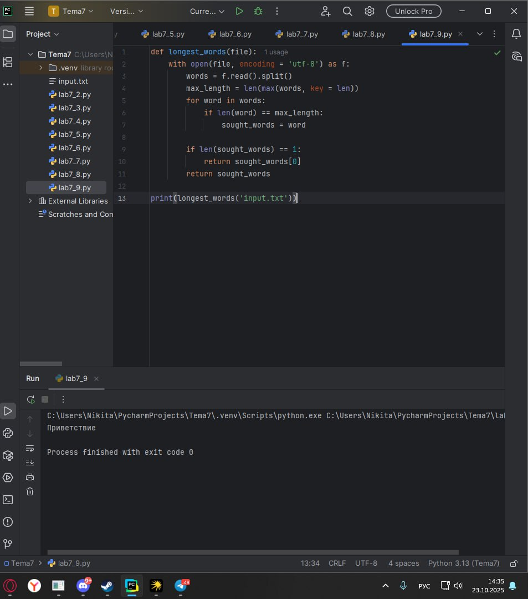

## Выводы
Реализован поиск наиболее длинных слов в текстовом файле с обработкой нескольких вариантов.

## Лабораторная работа №10
### Требуется создать csv-файл «rows_300.csv» со следующими столбцами:

•	№ - номер по порядку (от 1 до 300);
 
•	Секунда – текущая секунда на вашем ПК;

•	Микросекунда – текущая миллисекунда на часах.

Для наглядности на каждой итерации цикла искусственно приостанавливайте скрипт на 0,01 секунды.
```python
import csv
import datetime
import time

with open('rows_300.csv', 'w', encoding = 'utf-8', newline = '') as f:
    writer = csv.writer(f)
    writer.writerow(['№', 'Секунда', 'Микросекунда'])
    for line in range(1, 301):
        writer.writerow([line, datetime.datetime.now().second,
                         datetime.datetime.now().microsecond])
        time.sleep(0.01)
```
### Результат.
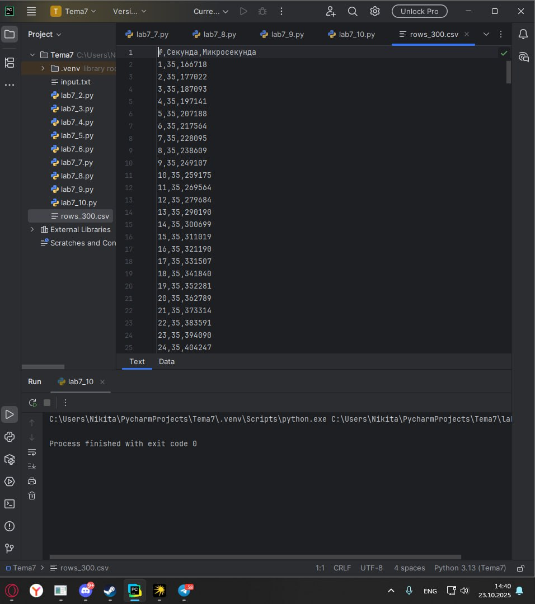

## Выводы
Создан CSV-файл с временными метками с использованием модуля csv и функций работы со временем.

## Самостоятельная работа №1
### Найдите в интернете любую статью (объем статьи не менее 200 слов), скопируйте ее содержимое в файл и напишите программу, которая считает количество слов в текстовом файле и определит самое часто встречающееся слово. Результатом выполнения задачи будет: скриншот файла со статьей, листинг кода, и вывод в консоль, в котором будет указана вся необходимая информация.
```python
import re
from collections import Counter

with open('python_text.txt', 'r', encoding='utf-8') as file:
    text = file.read()

words = re.findall(r'\b[а-яёa-z]+\b', text.lower())

total_words = len(words)
word_counts = Counter(words)
most_common_word, most_common_count = word_counts.most_common(1)[0]

print(f"Общее количество слов: {total_words}")
print(f"Самое частое слово: '{most_common_word}' ({most_common_count} раз)")
print("\nТоп-10 слов:")
for word, count in word_counts.most_common(10):
    print(f"'{word}': {count}")
```
### Результат.
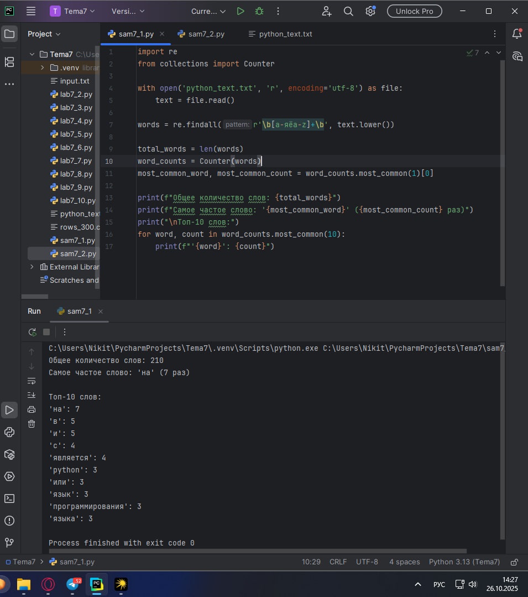

## Выводы
Проведен частотный анализ текста с использованием регулярных выражений и подсчетом слов

## Самостоятельная работа №2
### У вас появилась потребность в ведении книги расходов, посмотрев все существующие варианты вы пришли к выводу что вас ничего не устраивает и нужно все делать самому. Напишите программу для учета расходов. Программа должна позволять вводить информацию о расходах, сохранять ее в файл и выводить существующие данные в консоль. Ввод информации происходит через консоль. Результатом выполнения задачи будет: скриншот файла с учетом расходов, листинг кода, и вывод в консоль, с демонстрацией работоспособности программы.
```python
expenses = []

print("УЧЕТ РАСХОДОВ")

while True:
    print("\n1 - Добавить расход")
    print("2 - Показать все расходы")
    print("3 - Выйти")

    choice = input("Выберите: ")

    if choice == "1":
        what = input("На что потратили? ")
        how_much = input("Сколько рублей? ")

        expense = f"{what} - {how_much} руб."
        expenses.append(expense)

        with open("my_expenses.txt", "w", encoding="utf-8") as f:
            for item in expenses:
                f.write(item + "\n")

        print("Расход добавлен!")

    elif choice == "2":
        print("\nМОИ РАСХОДЫ")
        if len(expenses) == 0:
            print("Пока нет расходов")
        else:
            total = 0
            for i, expense in enumerate(expenses, 1):
                print(f"{i}. {expense}")
                if "руб." in expense:
                    try:
                        amount = float(expense.split(" - ")[1].replace(" руб.", ""))
                        total += amount
                    except:
                        pass
            print(f"\nВсего потрачено: {total} руб.")

    elif choice == "3":
        print("Пока!")
        break

    else:
        print("Не понял, выберите 1, 2 или 3")
```
### Результат.
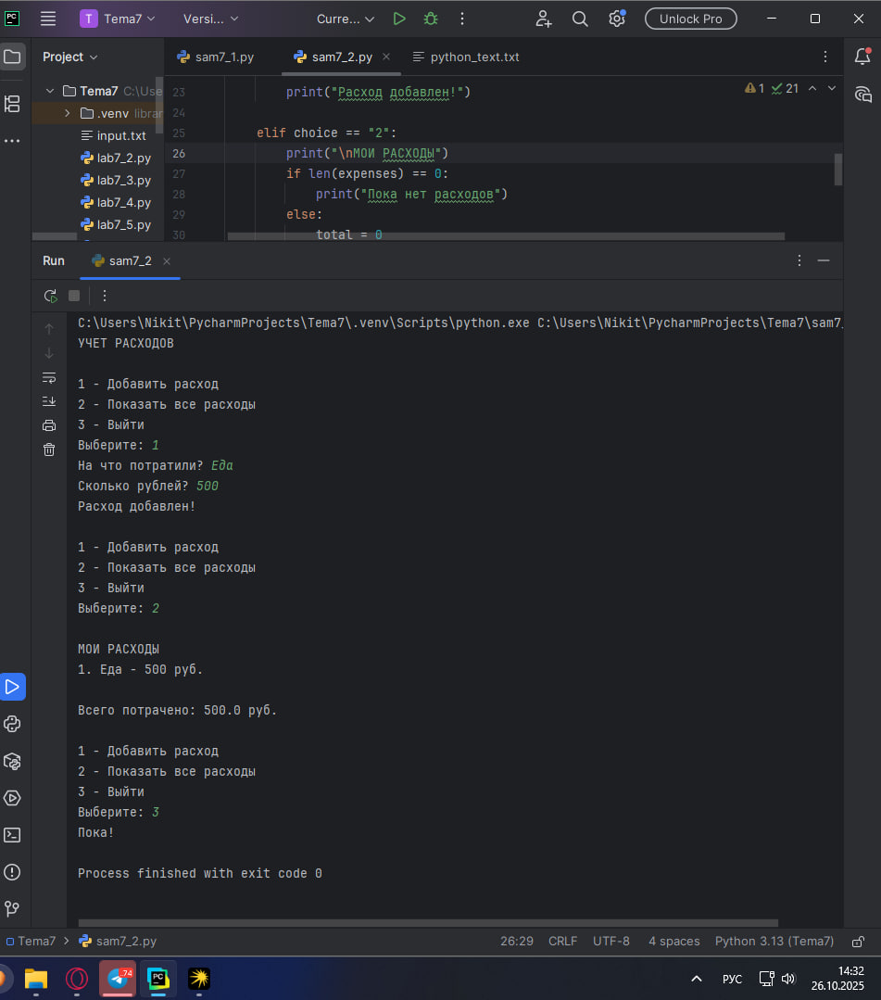

## Выводы
Разработана система учета финансовых операций с интерактивным интерфейсом и сохранением данных.

## Самостоятельная работа №3
### Имеется файл input.txt с текстом на латинице. Напишите программу, которая выводит следующую статистику по тексту: количество букв латинского алфавита; число слов; число строк.
```python
with open('input.txt', 'r') as f:
    content = f.read()

letters = 0
for char in content:
    if 'a' <= char <= 'z' or 'A' <= char <= 'Z':
        letters += 1

words = len(content.split())
lines = len(content.splitlines())

print("Input file contains:")
print(f"  {letters} letters")
print(f"  {words} words")
print(f"  {lines} lines")
```
### Результат.
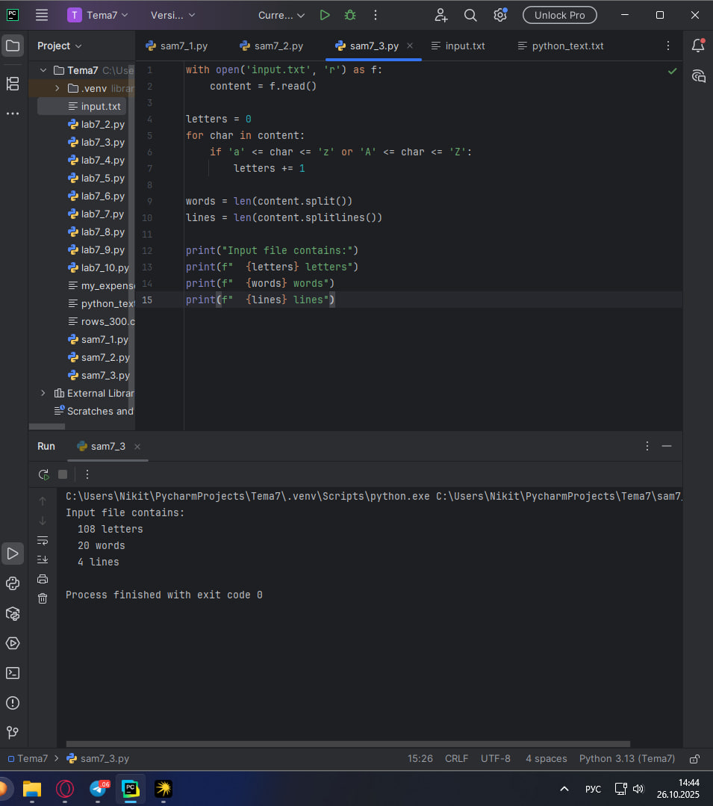

## Выводы
Выполнен статистический анализ текстового файла с подсчетом букв, слов и строк.

## Самостоятельная работа №4
### Напишите программу, которая получает на вход предложение, выводит его в терминал, заменяя все запрещенные слова звездочками * (количество звездочек равно количеству букв в слове). Запрещенные слова, разделенные символом пробела, хранятся в текстовом файле input.txt. Все слова в этом файле записаны в нижнем регистре. Программа должна заменить запрещенные слова, где бы они ни встречались, даже в середине другого слова. Замена производится независимо от регистра: если файл input.txt содержит запрещенное слово exam, то слова exam, Exam, ExaM, EXAM и exAm должны быть заменены на ****.
```python
import re

with open('input.txt', 'r') as f:
    bad_words = f.read().split()

text = input("Введите текст: ")

for word in bad_words:
    pattern = re.compile(re.escape(word), re.IGNORECASE)
    text = pattern.sub('*' * len(word), text)

print("Результат:")
print(text)
```
### Результат.
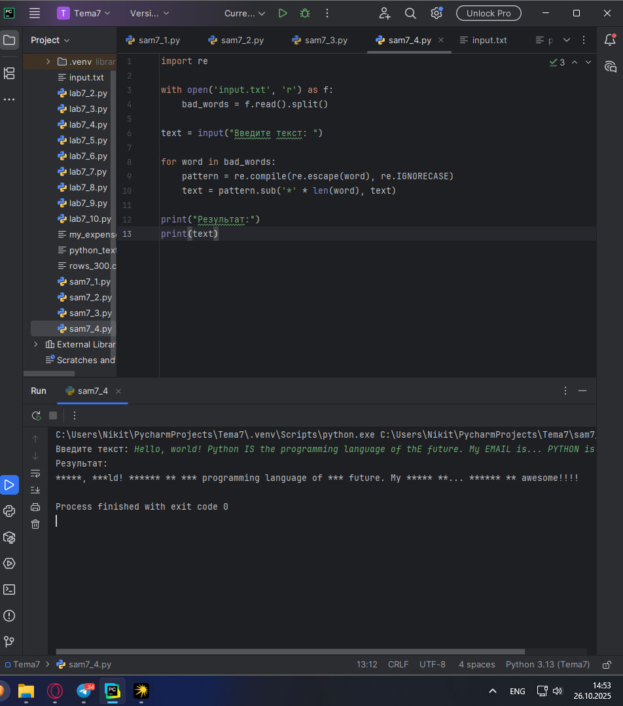

## Выводы
Реализовано цензурирование текста с использованием регулярных выражений для регистронезависимой замены.

## Самостоятельная работа №5
### Самостоятельно придумайте и решите задачу, которая будет взаимодействовать с текстовым файлом.
Напишите программу, которая читает текст из файла input.txt и выводит статистику:

- Количество символов (с пробелами и без)

- Количество слов

- Количество предложений

- Самое длинное слово

```python
with open('input.txt', 'r', encoding='utf-8') as f:
    text = f.read()

print("Текст из файла:")
print(text)
print()

all_chars = len(text)
no_space_chars = len(text.replace(" ", ""))
words = text.split()
word_count = len(words)
sentences = text.count('.') + text.count('!') + text.count('?')
longest_word = max(words, key=len)

print("Результат анализа:")
print(f"Символов: {all_chars} (без пробелов: {no_space_chars})")
print(f"Слов: {word_count}")
print(f"Предложений: {sentences}")
print(f"Самое длинное слово: {longest_word}")
```
### Результат.
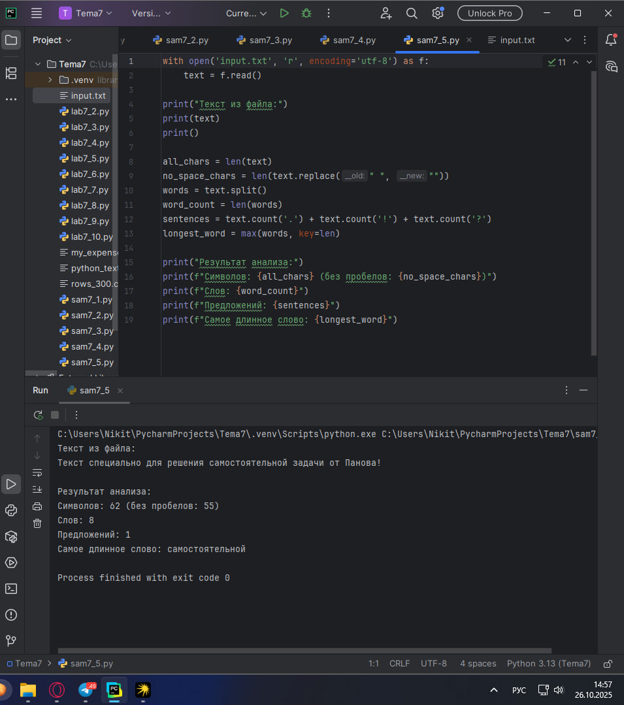

## Выводы
Создана программа для комплексного анализа текстовых файлов с подсчетом различных метрик.

## Общие выводы по теме
Освоены основные методы работы с файлами в Python. Изучены различные режимы доступа, техники чтения и записи данных. Приобретены навыки обработки текстовой информации и создания приложений для работы с файловой системой.