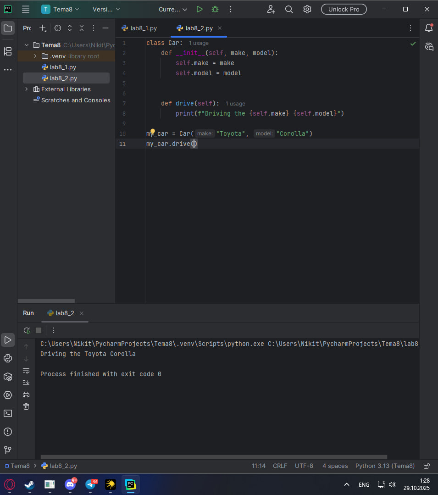
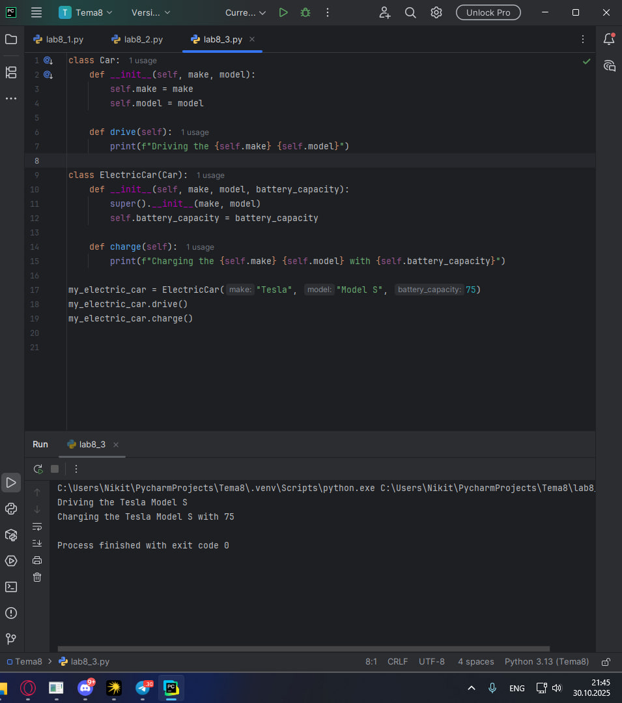
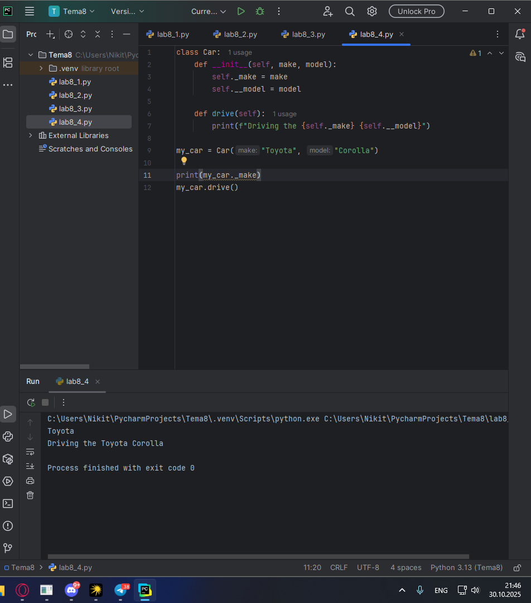
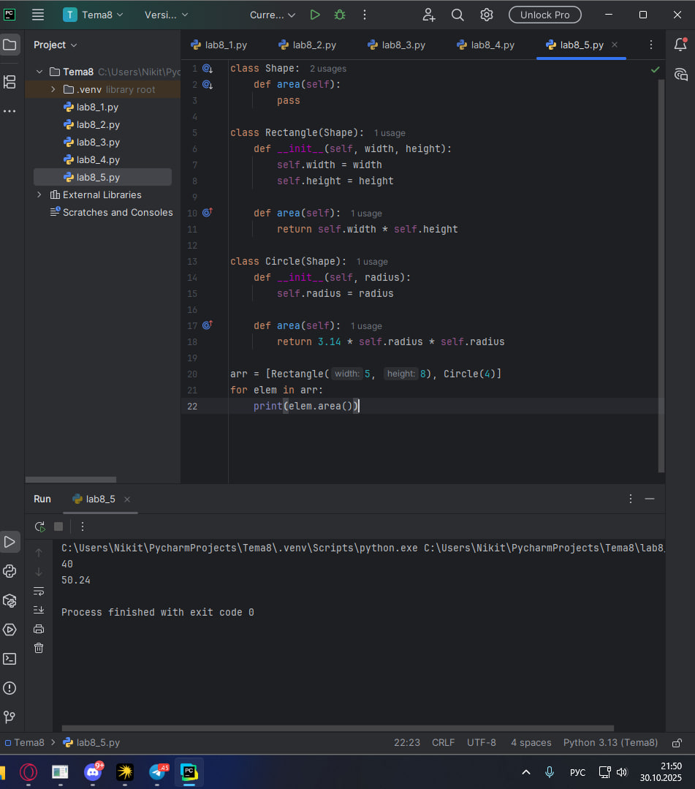
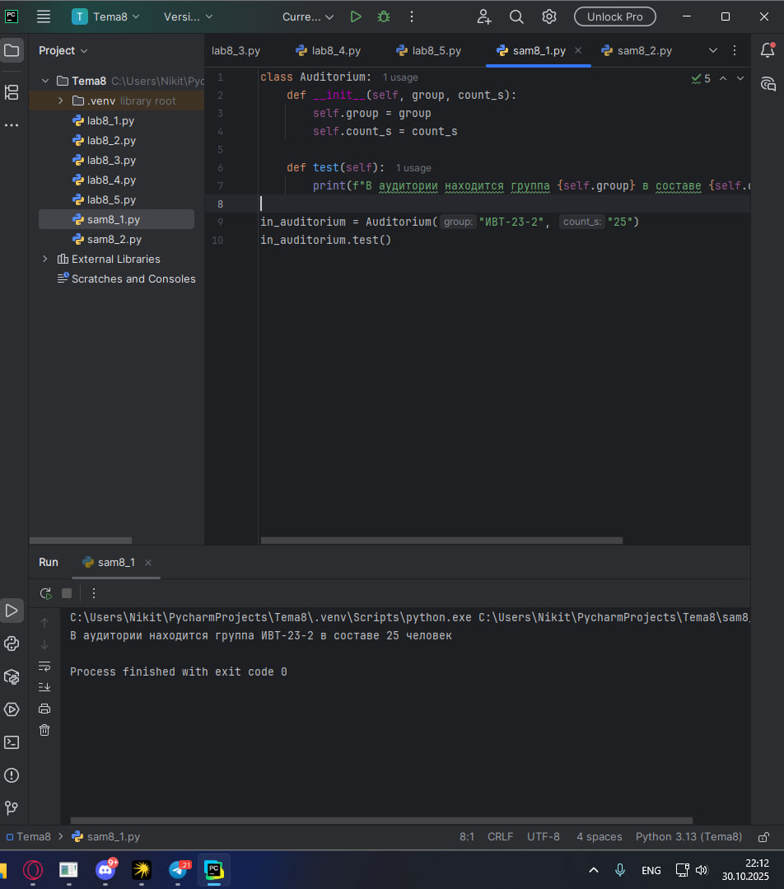
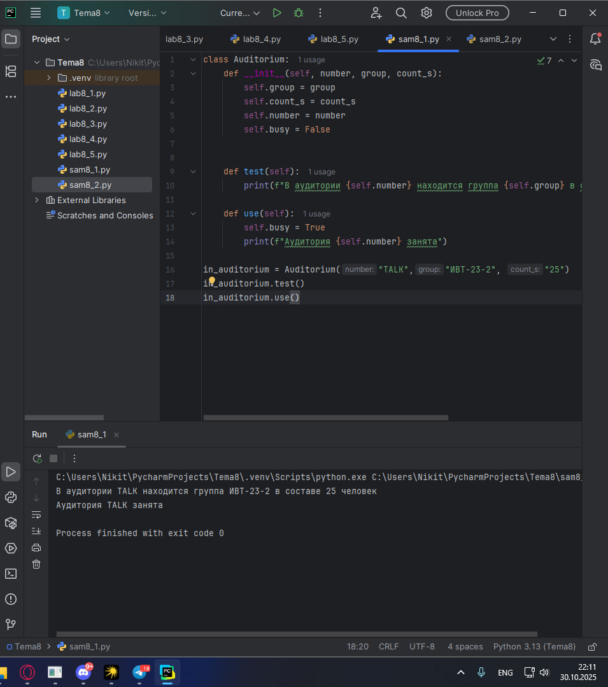
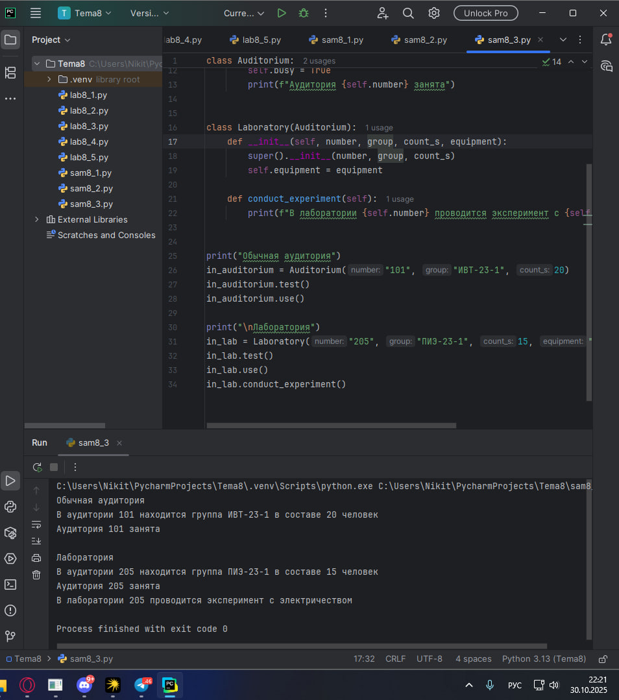
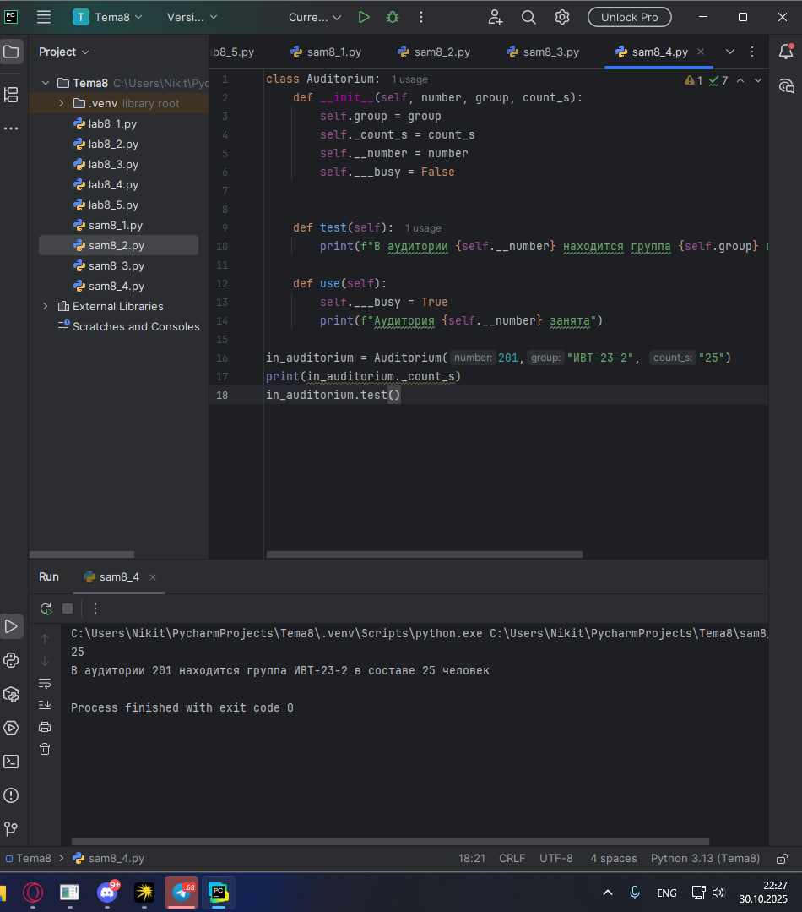
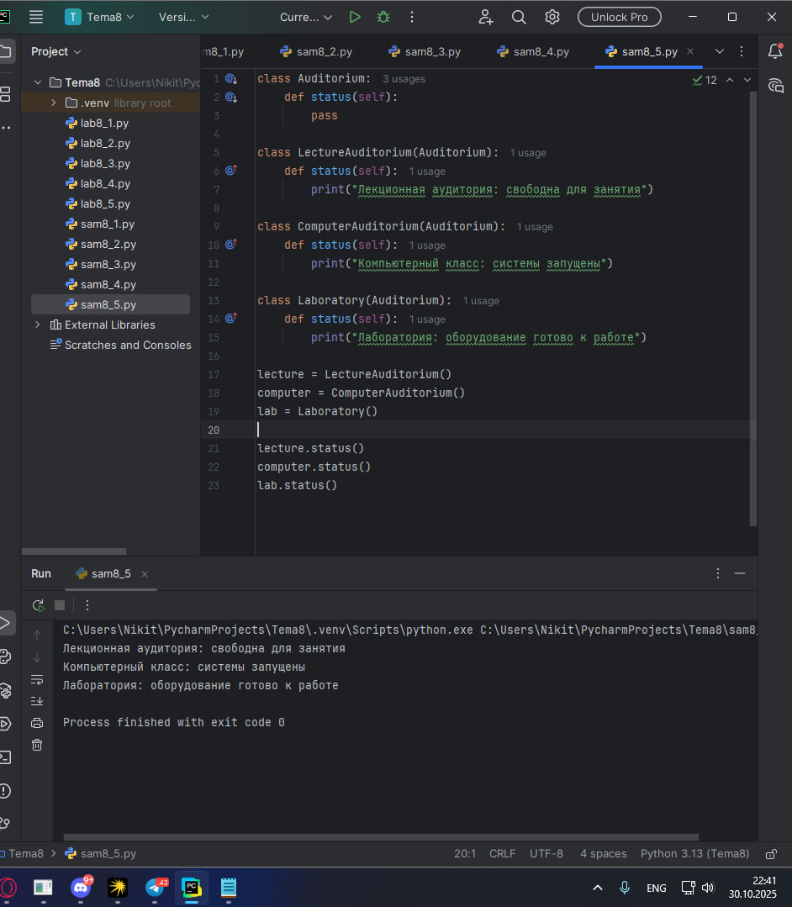

# Тема 8. Основы объектно-ориентированного программирования
Отчет по Теме #8 выполнил(а):
- Пономарев Никита Сергеевич
- ИВТ-23-2

| Задание | Лаб_раб | Сам_раб |
| ------ | ------ | ------ |
| Задание 1 | + | + |
| Задание 2 | + | + |
| Задание 3 | + | + |
| Задание 4 | + | + |
| Задание 5 | + | + |

знак "+" - задание выполнено; знак "-" - задание не выполнено;

Работу проверили:
- к.э.н., доцент Панов М.А.

## Лабораторная работа №1
### Создайте класс "Car" с атрибутами производитель и модель. Создайте объект этого класса. Напишите комментарии для кода, объясняющие его работу. Результатом выполнения задания будет листинг кода с комментариями.
```python
#Создание класса Car
class Car:
    #Метод инициализации класса
    def __init__(self, make, model):
        #Присваивание параметров make и model атрибутам экземпляра
        self.make = make
        self.model = model

#Создание экземпляра класса Car с производителем Toyota и моделью Corolla
my_car = Car("Toyota", "Corolla")
```
### Результат.


## Выводы
Создан базовый класс для представления автомобиля с основными характеристиками.

## Лабораторная работа №2
### Дополните код из первого задания, добавив в него атрибуты и методы класса, заставьте машину "поехать". Напишите комментарии для кода, объясняющие его работу. Результатом выполнения задания будет листинг кода с комментариями и получившийся вывод в консоль.
```python
class Car:
    def __init__(self, make, model):
        self.make = make
        self.model = model


    def drive(self):
        print(f"Driving the {self.make} {self.model}")

my_car = Car("Toyota", "Corolla")
my_car.drive()
```
### Результат.


## Выводы
Добавлен функционал в класс автомобиля с реализацией методов для имитации движения.

## Лабораторная работа №3
### Создайте новый класс "ElectricCar" с методом "charge" и атрибутом емкость батареи. Реализуйте его наследование от класса, созданного в первом задании. Заставьте машину поехать, а потом заряжаться. Напишите комментарии для кода, объясняющие его работу. Результатом выполнения задания будет листинг кода с комментариями и получившийся вывод в консоль.
```python
class Car:
    def __init__(self, make, model):
        self.make = make
        self.model = model

    def drive(self):
        print(f"Driving the {self.make} {self.model}")

class ElectricCar(Car):
    def __init__(self, make, model, battery_capacity):
        super().__init__(make, model)
        self.battery_capacity = battery_capacity

    def charge(self):
        print(f"Charging the {self.make} {self.model} with {self.battery_capacity}")

my_electric_car = ElectricCar("Tesla", "Model S", 75)
my_electric_car.drive()
my_electric_car.charge()
```
### Результат.


## Выводы
Реализовано наследование для создания специализированного класса электромобиля.

## Лабораторная работа №4
### Реализуйте инкапсуляцию для класса, созданного в первом задании. Создайте защищенный атрибут производителя и приватный атрибут модели. Вызовите защищенный атрибут и заставьте машину поехать. Напишите комментарии для кода, объясняющие его работу. Результатом выполнения задания будет листинг кода с комментариями и получившийся вывод в консоль.
```python
class Car:
    def __init__(self, make, model):
        self._make = make
        self.__model = model

    def drive(self):
        print(f"Driving the {self._make} {self.__model}")

my_car = Car("Toyota", "Corolla")

print(my_car._make)
my_car.drive()
```
### Результат.


## Выводы
Применены принципы инкапсуляции для ограничения доступа к атрибутам класса.

## Лабораторная работа №5
### Реализуйте полиморфизм создав основной (общий) класс "Shape", а также еще два класса "Rectangle" и "Circle". Внутри последних двух классов реализуйте методы для подсчета площади фигуры. После этого создайте массив с фигурами, поместите туда круг и прямоугольник, затем при помощи цикла выведите их площади. Напишите комментарии для кода, объясняющие его работу. Результатом выполнения задания будет листинг кода с комментариями и получившийся вывод в консоль.
```python
class Shape:
    def area(self):
        pass

class Rectangle(Shape):
    def __init__(self, width, height):
        self.width = width
        self.height = height

    def area(self):
        return self.width * self.height

class Circle(Shape):
    def __init__(self, radius):
        self.radius = radius

    def area(self):
        return 3.14 * self.radius * self.radius

arr = [Rectangle(5, 8), Circle(4)]
for elem in arr:
    print(elem.area())
```
### Результат.


## Выводы
Продемонстрирован принцип полиморфизма через переопределение методов в классах-наследниках.

## Самостоятельная работа №1
### Самостоятельно создайте класс и его объект. Они должны отличаться, от тех, что указаны в теоретическом материале (методичке) и лабораторных заданиях. Результатом выполнения задания будет листинг кода и получившийся вывод консоли.
```python
class Auditorium:
    def __init__(self, group, count_s):
        self.group = group
        self.count_s = count_s

    def test(self):
        print(f"В аудитории находится группа {self.group} в составе {self.count_s} человек")

in_auditorium = Auditorium("ИВТ-23-2", "25")
in_auditorium.test()
```
### Результат.


## Выводы
Разработан пользовательский класс с уникальной структурой атрибутов.

## Самостоятельная работа №2
### Самостоятельно создайте атрибуты и методы для ранее созданного класса. Они должны отличаться, от тех, что указаны в теоретическом материале (методичке) и лабораторных заданиях. Результатом выполнения задания будет листинг кода и получившийся вывод консоли.
```python
class Auditorium:
    def __init__(self, number, group, count_s):
        self.group = group
        self.count_s = count_s
        self.number = number
        self.busy = False


    def test(self):
        print(f"В аудитории {self.number} находится группа {self.group} в составе {self.count_s} человек")

    def use(self):
        self.busy = True
        print(f"Аудитория {self.number} занята")

in_auditorium = Auditorium("TALK","ИВТ-23-2", "25")
in_auditorium.test()
in_auditorium.use()
```
### Результат.


## Выводы
Дополнен функционал класса специализированными методами для решения конкретных задач.

## Самостоятельная работа №3
### Самостоятельно реализуйте наследование, продолжая работать с ранее созданным классом. Оно должно отличаться, от того, что указано в теоретическом материале (методичке) и лабораторных заданиях. Результатом выполнения задания будет листинг кода и получившийся вывод консоли.
```python
class Auditorium:
    def __init__(self, number, group, count_s):
        self.group = group
        self.count_s = count_s
        self.number = number
        self.busy = False

    def test(self):
        print(f"В аудитории {self.number} находится группа {self.group} в составе {self.count_s} человек")

    def use(self):
        self.busy = True
        print(f"Аудитория {self.number} занята")


class Laboratory(Auditorium):
    def __init__(self, number, group, count_s, equipment):
        super().__init__(number, group, count_s)
        self.equipment = equipment

    def conduct_experiment(self):
        print(f"В лаборатории {self.number} проводится эксперимент с {self.equipment}")


print("Обычная аудитория")
in_auditorium = Auditorium("101", "ИВТ-23-1", 20)
in_auditorium.test()
in_auditorium.use()

print("\nЛаборатория")
in_lab = Laboratory("205", "ПИЭ-23-1", 15, "электричеством")
in_lab.test()
in_lab.use()
in_lab.conduct_experiment()
```
### Результат.


## Выводы
Создана иерархия классов с наследованием и расширением функциональности.

## Самостоятельная работа №4
### Самостоятельно реализуйте инкапсуляцию, продолжая работать с ранее созданным классом. Она должна отличаться, от того, что указана в теоретическом материале (методичке) и лабораторных заданиях. Результатом выполнения задания будет листинг кода и получившийся вывод консоли.
```python
class Auditorium:
    def __init__(self, number, group, count_s):
        self.group = group
        self._count_s = count_s
        self.__number = number
        self.___busy = False


    def test(self):
        print(f"В аудитории {self.__number} находится группа {self.group} в составе {self._count_s} человек")

    def use(self):
        self.___busy = True
        print(f"Аудитория {self.__number} занята")

in_auditorium = Auditorium(201,"ИВТ-23-2", "25")
print(in_auditorium._count_s)
in_auditorium.test()
```
### Результат.


## Выводы
Реализована система контроля доступа к данным через механизмы инкапсуляции.

## Самостоятельная работа №5
### Самостоятельно реализуйте полиморфизм. Он должен отличаться, от того, что указан в теоретическом материале (методичке) и лабораторных заданиях. Результатом выполнения задания будет листинг кода и получившийся вывод консоли.
```python
class Auditorium:
    def status(self):
        pass

class LectureAuditorium(Auditorium):
    def status(self):
        print("Лекционная аудитория: свободна для занятия")

class ComputerAuditorium(Auditorium):
    def status(self):
        print("Компьютерный класс: системы запущены")

class Laboratory(Auditorium):
    def status(self):
        print("Лаборатория: оборудование готово к работе")

lecture = LectureAuditorium()
computer = ComputerAuditorium()
lab = Laboratory()

lecture.status()
computer.status()
lab.status()
```
### Результат.


## Выводы
Продемонстрирована возможность единообразной работы с объектами разных классов через полиморфные методы.

## Общие выводы по теме
Освоены фундаментальные принципы объектно-ориентированного программирования. Изучены механизмы создания классов, наследования, инкапсуляции и полиморфизма. Приобретены практические навыки проектирования объектных моделей для решения различных задач.