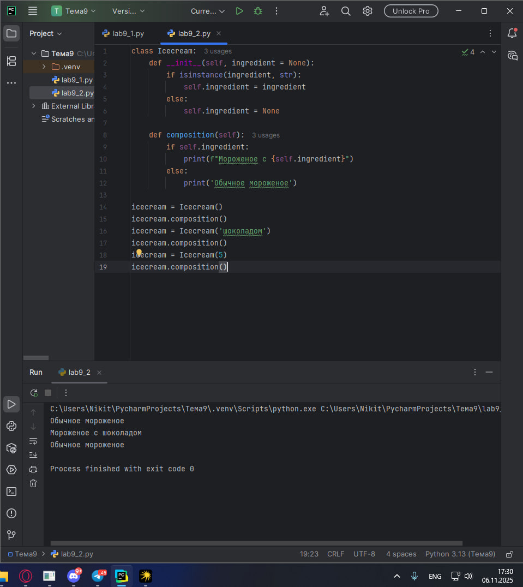
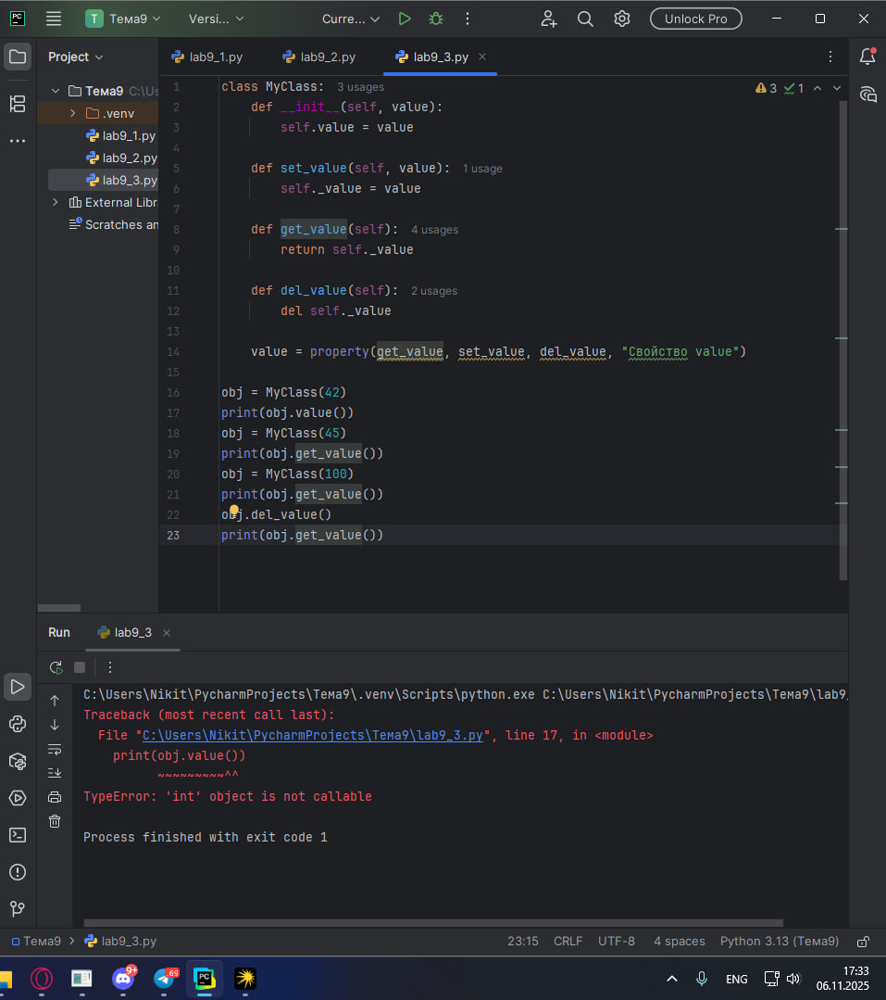
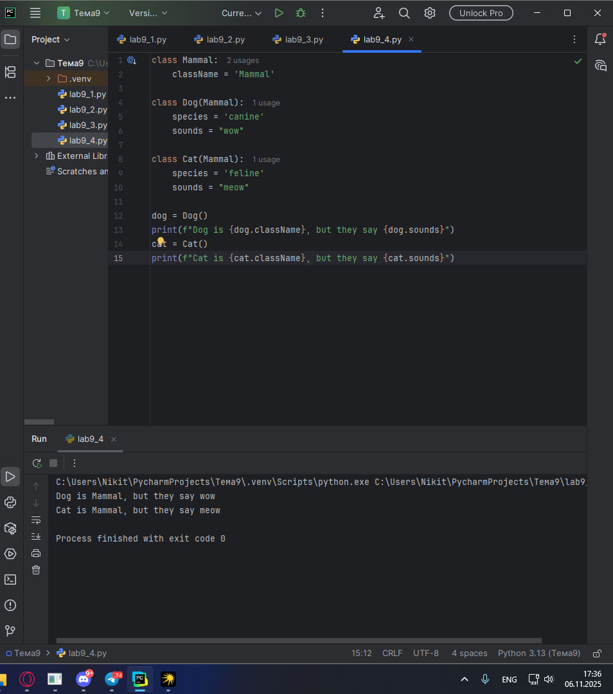
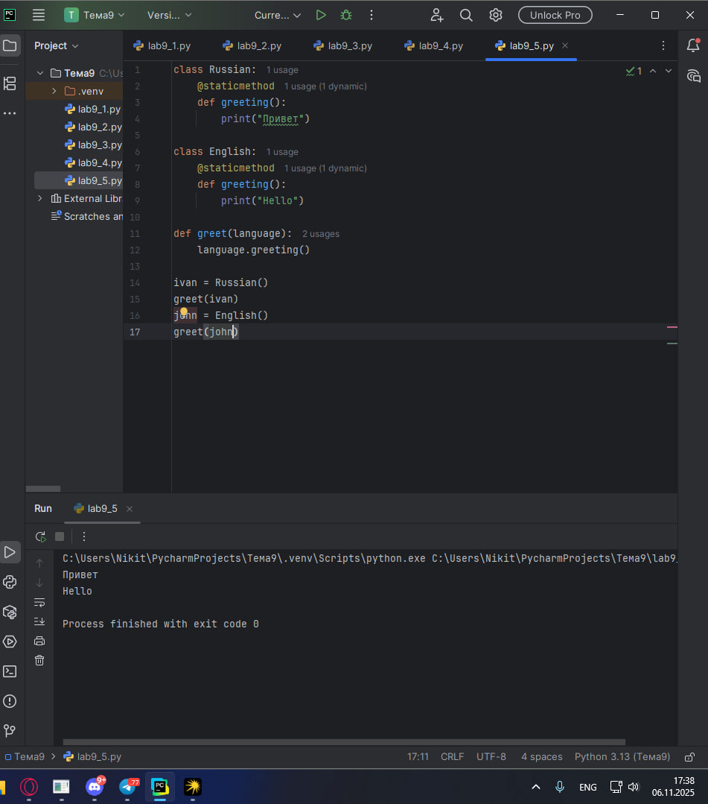
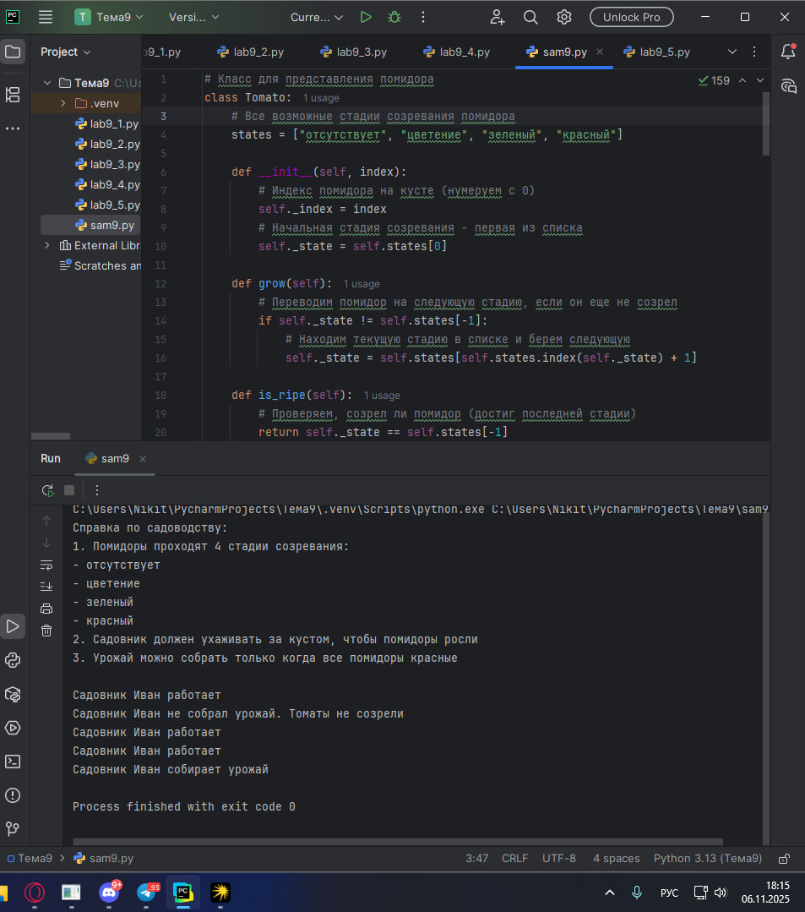

# Тема 9. ООП на Python: концепции, принципы и примеры реализации
Отчет по Теме #9 выполнил(а):
- Пономарев Никита Сергеевич
- ИВТ-23-2

| Задание | Лаб_раб | Сам_раб |
| ------ | ------ | ------ |
| Задание 1 | + | + |
| Задание 2 | + |  |
| Задание 3 | + |  |
| Задание 4 | + |  |
| Задание 5 | + |  |

знак "+" - задание выполнено; знак "-" - задание не выполнено;

Работу проверили:
- к.э.н., доцент Панов М.А.

## Лабораторная работа №1
### Допустим, что вы решили оригинально и немного странно познакомится с человеком. Для этого у вас должен быть написан свой класс на Python, который будет проверять угадал ваше имя человек или нет. Для этого создайте класс, указав в свойствах только имя. Дальше создайте функцию __init__(), а в ней сделайте проверку на то угадал человек ваше имя или нет. Также можете проверить что будет, если в этой функции указав атрибут, который не указан в вашем классе, например, попробуйте вызвать фамилию.
```python
class Ivan:
    __slots__ = ['name']

    def __init__(self, name):
        if name == 'Иван':
            self.name = f"Да, я {name}"
        else:
            self.name = f"Я не {name}, а Иван"

person1 = Ivan('Алексей')
person2 = Ivan('Иван')
print(person1.name)
print(person2.name)

person2.surname = 'Петров'
```
### Результат.


## Выводы
Создан класс с ограничением атрибутов через __slots__ и валидацией входных данных в конструкторе.

## Лабораторная работа №2
### Вам дали важное задание, написать продавцу мороженого программу, которая будет писать добавили ли топпинг в мороженое и цену после возможного изменения. Для этого вам нужно написать класс, в котором будет определяться изменили ли состав мороженого или нет. В этом классе  реализуйте  метод,  выводящий  на  печать  «Мороженое  с {ТОППИНГ}» в случае наличия добавки, а иначе отобразится следующая фраза: «Обычное мороженое». При этом программа должна воспринимать как топпинг только атрибуты типа string.
```python
class Icecream:
    def __init__(self, ingredient = None):
        if isinstance(ingredient, str):
            self.ingredient = ingredient
        else:
            self.ingredient = None

    def composition(self):
        if self.ingredient:
            print(f"Мороженое с {self.ingredient}")
        else:
            print('Обычное мороженое')

icecream = Icecream()
icecream.composition()
icecream = Icecream('шоколадом')
icecream.composition()
icecream = Icecream(5)
icecream.composition()
```
### Результат.


## Выводы
Реализован класс с проверкой типа данных и условным выводом информации о составе продукта.

## Лабораторная работа №3
### Петя – начинающий программист и на занятиях ему сказали реализовать икапсу…что-то. А вы хороший друг Пети и ко всему прочему прекрасно знаете, что икапсу…что-то – это инкапсуляция, поэтому решаете помочь вашему другу с написанием класса с инкапсуляцией. Ваш класс будет не просто инкапсуляцией, а классом с сеттером, геттером и деструктором. После написания класса вам необходимо продемонстрировать что все написанные вами функции работают. Также вам необходимо объяснить Пете почему на скриншоте ниже в консоли выводится ошибка.
```python
class MyClass:
    def __init__(self, value):
        self.value = value

    def set_value(self, value):
        self._value = value

    def get_value(self):
        return self._value

    def del_value(self):
        del self._value

    value = property(get_value, set_value, del_value, "Свойство value")

obj = MyClass(42)
print(obj.value())
obj = MyClass(45)
print(obj.get_value())
obj = MyClass(100)
print(obj.get_value())
obj.del_value()
print(obj.get_value())
```
### Результат.


## Выводы
Продемонстрированы принципы инкапсуляции с реализацией методов управления атрибутами и обработкой исключений.

## Лабораторная работа №4
### Вам прекрасно известно, что кошки и собаки являются млекопитающими, но компьютер этого не понимает, поэтому вам нужно написать три класса: Кошки, Собаки, Млекопитающие. И при помощи "наследования" объяснить компьютеру что кошки и собаки – это млекопитающие. Также добавьте какой-нибудь свой атрибут для кошек и собак, чтобы показать, что они чем-то отличаются друг от друга.
```python
class Mammal:
    className = 'Mammal'

class Dog(Mammal):
    species = 'canine'
    sounds = "wow"

class Cat(Mammal):
    species = 'feline'
    sounds = "meow"

dog = Dog()
print(f"Dog is {dog.className}, but they say {dog.sounds}")
cat = Cat()
print(f"Cat is {cat.className}, but they say {cat.sounds}")
```
### Результат.


## Выводы
Создана иерархия классов с наследованием и специализированными атрибутами для различных видов животных.

## Лабораторная работа №5
### На разных языках здороваются по-разному, но суть остается одинаковой, люди друг с другом здороваются. Давайте вместе с вами реализуем программу с полиморфизмом, которая будет описывать всю суть первого предложения задачи. Для этого мы можем выбрать два языка, например, русский и английский и написать для них отдельные классы, в которых будет в виде атрибута слово, которым здороваются на этих языках. А также напишем функцию, которая будет выводить информацию о том, как на этих языках здороваются. Заметьте, что для решения поставленной задачи мы использовали декоратор @staticmethod, поскольку нам не нужны обязательные параметры-ссылки вроде self.
```python
class Russian:
    @staticmethod
    def greeting():
        print("Привет")

class English:
    @staticmethod
    def greeting():
        print("Hello")

def greet(language):
    language.greeting()

ivan = Russian()
greet(ivan)
john = English()
greet(john)
```
### Результат.


## Выводы
Реализован полиморфизм через статические методы и унифицированный интерфейс для работы с разными классами.

## Самостоятельная работа №1
### Задание Садовник и помидоры.
Классовая структура:

Есть Помидор со следующими характеристиками:

•	Индекс

•	Стадия созревания (стадии: отсутствует, цветение, зеленый, красный)

Помидор может:

•	Расти (переходить на следующую стадию созревания)

•	Предоставлять информацию о своей зрелости

Есть Куст с помидорами, который:

•	Содержит список томатов, которые на нем растут

А также может:

•	Расти вместе с томатами

•	Предоставлять информацию о зрелости всех томатов

•	Предоставлять урожай

И также есть Садовник, который имеет:

•	Имя

•	Растение, за которым он ухаживает

Он может:

•	Ухаживать за растением

•	Собирать с него урожай

Задание:

Класс Tomato:
1)	Создайте класс Tomato
2)	Создайте статическое свойство states, которое будет содержать все стадии созревания помидора
3)	Создайте метод	init	(), внутри которого будут определены два динамических свойства: _index (передается параметром) и _state (принимает первое значение из словаря states). После написания этого блока кода в комментарии к нему укажите какими являются эти два свойства
4)	Создайте метод grow(), который будет переводить томат на следующую стадию созревания
5)	Создайте метод is_ripe(), который будет проверять, что томат созрел

Класс TomatoBush:
1)	Создайте класс TomatoBush
2)	Определите метод	init	(), который будет принимать в качестве параметра количество томатов и на его основе будет создавать список объектов класса Tomato. Данный список будет храниться внутри динамического свойства tomatoes
3)	Создайте метод grow_all(), который будет переводить все объекты из списка томатов на следующий этап созревания
4)	Создайте метод all_are_ripe(), который будет возвращать True, если все томаты из списка стали спелыми.
5)	Создайте метод give_away_all(), который будет чистить список томатов после сбора урожая

Класс Gardener:
1)	Создайте класс Gardener
2)	Создайте метод	init	(), внутри которого будут определены два динамических свойства: name (передается параметром, является публичным) и _plant (принимает объект класса TomatoBush). После написания этого блока кода в комментарии к нему укажите какими являются эти два свойства
3)	Создайте метод work(), который заставляет садовника работать, что позволяет растению становиться более зрелым
4)	Создайте метод harvest(), который проверяет, все ли плоды созрели. Если все, то садовник собирает урожай. Если нет, то метод печатает предупреждение
5)	Создайте статический метод knowledge_base(), который выведет в консоль справку по садоводству

Тесты:
1)	Вызовите справку по садоводству
2)	Создайте объекты классов TomatoBush и Gardener
3)	Используя объект класса Gardener, поухаживайте за кустом с помидорами
4)	Попробуйте собрать урожай, когда томаты еще не дозрели. Продолжайте ухаживать за ними 
5)	Соберите урожай

Результатом работы вашей программы будет листинг кода с подробными комментариями и скриншоты выполенния всех тестов.
```python
# Класс для представления помидора
class Tomato:
    # Все возможные стадии созревания помидора
    states = ["отсутствует", "цветение", "зеленый", "красный"]

    def __init__(self, index):
        # Индекс помидора на кусте (нумеруем с 0)
        self._index = index
        # Начальная стадия созревания - первая из списка
        self._state = self.states[0]

    def grow(self):
        # Переводим помидор на следующую стадию, если он еще не созрел
        if self._state != self.states[-1]:
            # Находим текущую стадию в списке и берем следующую
            self._state = self.states[self.states.index(self._state) + 1]

    def is_ripe(self):
        # Проверяем, созрел ли помидор (достиг последней стадии)
        return self._state == self.states[-1]


# Класс для представления куста с помидорами
class TomatoBush:
    def __init__(self, num):
        # Создаем список помидоров на кусте
        # num - количество помидоров на кусте
        self.tomatoes = [Tomato(i) for i in range(num)]

    def grow_all(self):
        # Растим все помидоры на кусте
        for tomato in self.tomatoes:
            tomato.grow()

    def all_are_ripe(self):
        # Проверяем, все ли помидоры на кусте созрели
        # all() возвращает True только если все элементы True
        return all(tomato.is_ripe() for tomato in self.tomatoes)

    def give_away_all(self):
        # Собираем урожай - очищаем список помидоров
        self.tomatoes.clear()


# Класс для представления садовника
class Gardener:
    def __init__(self, name, plant):
        # Имя садовника
        self.name = name
        # Растение, за которым ухаживает садовник
        self._plant = plant

    def work(self):
        # Садовник работает - ухаживает за растением
        print(f"Садовник {self.name} работает")
        self._plant.grow_all()

    def harvest(self):
        # Сбор урожая
        if self._plant.all_are_ripe():
            # Если все помидоры созрели - собираем их
            self._plant.give_away_all()
            print(f"Садовник {self.name} собирает урожай")
        else:
            # Если не все созрели - выводим сообщение
            print(f"Садовник {self.name} не собрал урожай. Томаты не созрели")

    @staticmethod
    def knowledge_base():
        # Статический метод - выводит справочную информацию
        print("Cправка по садоводству:")
        print("1. Помидоры проходят 4 стадии созревания:")
        print("- отсутствует")
        print("- цветение")
        print("- зеленый")
        print("- красный")
        print("2. Садовник должен ухаживать за кустом, чтобы помидоры росли")
        print("3. Урожай можно собрать только когда все помидоры красные\n")


# Тестирование программы
if __name__ == "__main__":
    # Выводим справку по садоводству
    Gardener.knowledge_base()

    # Создаем куст с 3 помидорами
    bush = TomatoBush(3)
    # Создаем садовника с именем Иван для ухода за кустом
    gardener = Gardener("Иван", bush)

    # Последовательность действий:
    # 1. Садовник ухаживает за кустом первый раз
    gardener.work()
    # 2. Пытается собрать урожай (еще рано)
    gardener.harvest()
    # 3. Продолжает ухаживать
    gardener.work()
    # 4. Еще раз ухаживает
    gardener.work()
    # 5. Собирает урожай (теперь все помидоры созрели)
    gardener.harvest()
```
### Результат.


## Выводы
Разработана комплексная объектная модель для симуляции процесса выращивания и сбора урожая томатов.

## Общие выводы по теме
Освоены продвинутые аспекты объектно-ориентированного программирования в Python. Изучены механизмы ограничения атрибутов, управления доступом к данным, построения иерархий классов и реализации полиморфного поведения. Приобретены навыки проектирования сложных объектных систем для решения практических задач.